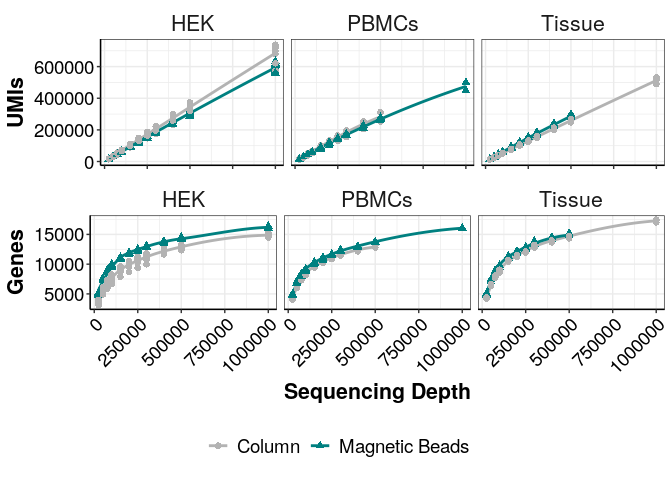
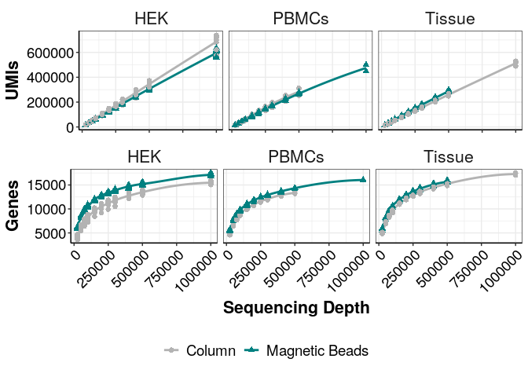
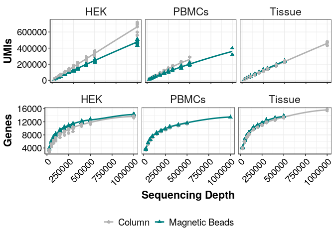

## Purpose:

Figure 2 - sensitivity plots

# Protocol:

### 1\. Load the following packages:

``` r
library(tidyverse)
library(ggsignif)
library(ggplotify)
library(ggrepel)
library(edgeR)
library(genefilter)
library(grid)
library(gridExtra)
library(ggsci)
library(UpSetR)
library(cowplot)
```

### 2\. Load following functions:

``` r
### all necessary custom functions are in the following script
source(paste0(here::here(),"/0_Scripts/custom_functions.R"))

theme_pub <- theme_bw() + theme(plot.title = element_text(hjust = 0.5, size=18, face="bold"),
                                     axis.text = element_text(colour="black", size=14), 
                                     axis.title=element_text(size=16,face="bold"), 
                                     legend.text=element_text(size=14),
                                     legend.position="right",
                                     axis.line.x = element_line(colour = "black"), 
                                     axis.line.y = element_line(colour = "black"),
                                     strip.background=element_blank(), 
                                     strip.text=element_text(size=16))  

#prevent scientific notation
options(scipen=999)

fig_path<-paste0(here::here(),"/1_RNA_isolation/")
```

## Mito, Ribo, lncRNA

### 3\. Gtype

``` r
gtype_human <- data.frame( species="human", getbiotype("hsapiens_gene_ensembl",species="human"))

gtype_mouse <- data.frame( species="mouse", getbiotype("mmusculus_gene_ensembl",species="mouse"))
```

## Sensitivity Plots

### 5\. Load Data

``` r
inf <- read.csv(paste0(fig_path,"sample_info.csv"), header = T, stringsAsFactors = F)

inf$Sample <- as.character(inf$Sample)

inf<-inf %>% 
  mutate(Condition=case_when(Condition=="Incubation + ProtK"~"Magnetic Beads",
                             TRUE~Condition),
         XC=if_else(Celltype=="HEK",BC,XC))

counts_hek <- readRDS(paste0(fig_path,"Bulk_opt_lysis_test_2_HEK.dgecounts.rds"))
counts_pbmc <- readRDS(paste0(fig_path,"Bulk_opt_lysis_PBMCs.dgecounts.rds"))
counts_tissue <- readRDS(paste0(fig_path,"Bulk_opt_lysis_Tissue.dgecounts.rds"))

#hek
coding_genes_hek<-rownames(counts_hek$umicount$inex$all)[!(rownames(counts_hek$umicount$inex$all)%in%gtype_human$Gencode)]

hek_inex_ds_df<-collapse_downsampled_counts(zumismat = counts_hek,type="inex",frac.samples = 0.25,genes=coding_genes_hek, umi = T)
hek_inex_ds_df_unfilt<-collapse_downsampled_counts(zumismat = counts_hek,type="inex",frac.samples = 0.0,genes=coding_genes_hek, umi = T)
hek_exon_ds_df<-collapse_downsampled_counts(zumismat = counts_hek,type="exon",frac.samples = 0.25,genes=coding_genes_hek, umi = T)


#pbmc
coding_genes_pbmc<-rownames(counts_pbmc$umicount$inex$all)[!(rownames(counts_pbmc$umicount$inex$all)%in%gtype_human$Gencode)]

pbmc_inex_ds_df<-collapse_downsampled_counts(zumismat = counts_pbmc,type="inex",frac.samples = 0.25,genes=coding_genes_pbmc, umi = T)
pbmc_inex_ds_df_unfilt<-collapse_downsampled_counts(zumismat = counts_pbmc,type="inex",frac.samples = 0.0,genes=coding_genes_pbmc, umi = T)
pbmc_exon_ds_df<-collapse_downsampled_counts(zumismat = counts_pbmc,type="exon",frac.samples = 0.25,genes=coding_genes_pbmc, umi = T)

#tissue
coding_genes_tissue <-rownames(counts_tissue$umicount$inex$all)[!(rownames(counts_tissue$umicount$inex$all)%in%gtype_mouse$Gencode)]

tissue_inex_ds_df<-collapse_downsampled_counts(zumismat = counts_tissue,type="inex",frac.samples = 0.25,genes=coding_genes_tissue, umi = T)
tissue_inex_ds_df_unfilt<-collapse_downsampled_counts(zumismat = counts_tissue,type="inex",frac.samples = 0.0,genes=coding_genes_tissue, umi = T)
tissue_exon_ds_df<-collapse_downsampled_counts(zumismat = counts_tissue,type="exon",frac.samples = 0.25,genes=coding_genes_tissue, umi = T)

#combine all
inex_ds_df <- dplyr::bind_rows(hek_inex_ds_df, pbmc_inex_ds_df, tissue_inex_ds_df)
inex_ds_df_unfilt <- dplyr::bind_rows(hek_inex_ds_df_unfilt, pbmc_inex_ds_df_unfilt, tissue_inex_ds_df_unfilt)
exon_ds_df <- dplyr::bind_rows(hek_exon_ds_df, pbmc_exon_ds_df, tissue_exon_ds_df)

#add info
inex_ds_df <- dplyr::inner_join(inex_ds_df, inf, by= "XC")
inex_ds_df_unfilt <- dplyr::inner_join(inex_ds_df_unfilt, inf, by= "XC")
exon_ds_df <- dplyr::inner_join(exon_ds_df, inf, by= "XC")

#keep Column and Magnetic Beads only
inex_ds_df <- inex_ds_df[inex_ds_df$Condition %in% c( "Magnetic Beads", "Column"),]
inex_ds_df_unfilt <- inex_ds_df_unfilt[inex_ds_df_unfilt$Condition %in% c( "Magnetic Beads", "Column"),]
exon_ds_df <- exon_ds_df[exon_ds_df$Condition %in% c( "Magnetic Beads", "Column"),]

#remove deep seq with only few samples
inex_ds_df <- inex_ds_df[inex_ds_df$depth != 2000000,]
inex_ds_df_unfilt <- inex_ds_df_unfilt[inex_ds_df_unfilt$depth != 2000000,]
exon_ds_df <- exon_ds_df[exon_ds_df$depth != 2000000,]
```

### 6\. Figure 2D - Sensitivity, inex, filtered

``` r
a1 <- ggplot(data = inex_ds_df, aes(x = depth, y = UMIs, color = Condition, group = Condition))+
  geom_smooth(method = "loess", se = F)+
  geom_point(size =2, aes(shape=Condition))+
  facet_grid(~Celltype)+
  #scale_x_continuous(breaks=seq(0,1000000,250000)) +
  xlab("Sequencing Depth")+
  theme_pub+
  scale_color_manual(values = c("gray70","#008080"))+
  theme(axis.text.x = element_text(angle = 45, hjust = 1))+
  theme(legend.position="none",
        axis.title.x=element_blank(),
        axis.text.x=element_blank())


b1 <- ggplot(data = inex_ds_df, aes(x = depth, y = Genes, color = Condition, group = Condition))+
  geom_smooth(method = "loess", se = F)+
  geom_point(size =2, aes(shape=Condition))+
  facet_grid(~Celltype)+
  xlab("Sequencing Depth")+
  theme_pub+
  scale_color_manual(values = c("gray70","#008080"))+
  theme(axis.text.x = element_text(angle = 45, hjust = 1),
        legend.position = "bottom",
        legend.title = element_blank())

legend <- cowplot::get_legend(b1)
fig2d <- cowplot::plot_grid(a1, b1 + theme(legend.position = "none"),
  ncol = 1,
  nrow = 2, 
  rel_heights = c(3,4)
)
fig2d <- cowplot::plot_grid(fig2d, legend,
  ncol = 1,
  nrow = 2,
  rel_heights = c(6,1)
)
fig2d
```

<!-- -->

### 7\. Figure S2 - Sensitivity, inex, unfiltered

``` r
a2 <- ggplot(data = inex_ds_df_unfilt, aes(x = depth, y = UMIs, color = Condition, group = Condition))+
  geom_smooth(method = "loess", se = F)+
  geom_point(size =2, aes(shape=Condition))+
  facet_grid(~Celltype)+
  xlab("Sequencing Depth")+
  theme_pub+
  scale_color_manual(values = c("gray70","#008080"))+
  theme(axis.text.x = element_text(angle = 45, hjust = 1))+
  theme(legend.position="none",
        axis.title.x=element_blank(),
        axis.text.x=element_blank())


b2 <- ggplot(data = inex_ds_df_unfilt, aes(x = depth, y = Genes, color = Condition, group = Condition))+
  geom_smooth(method = "loess", se = F)+
  geom_point(size =2, aes(shape=Condition))+
  facet_grid(~Celltype)+
  xlab("Sequencing Depth")+
  theme_pub+
  scale_color_manual(values = c("gray70","#008080"))+
  theme(axis.text.x = element_text(angle = 45, hjust = 1),
        legend.position = "bottom",
        legend.title = element_blank())

legend2 <- cowplot::get_legend(b2)
figS2_unfilt <- cowplot::plot_grid(a2, b2 + theme(legend.position = "none"),
  ncol = 1,
  nrow = 2, 
  rel_heights = c(3,4)
)
figS2_unfilt <- cowplot::plot_grid(figS2_unfilt, legend2,
  ncol = 1,
  nrow = 2,
  rel_heights = c(6,1)
)
figS2_unfilt
```

<!-- -->

### 8\. Figure S2 - Sensitivity, exonic, filtered

``` r
a3 <- ggplot(data = exon_ds_df, aes(x = depth, y = UMIs, color = Condition, group = Condition))+
  geom_smooth(method = "loess", se = F)+
  geom_point(size =2, aes(shape=Condition))+
  facet_grid(~Celltype)+
  xlab("Sequencing Depth")+
  theme_pub+
  scale_color_manual(values = c("gray70","#008080"))+
  theme(axis.text.x = element_text(angle = 45, hjust = 1))+
  theme(legend.position="none",
        axis.title.x=element_blank(),
        axis.text.x=element_blank())


b3 <- ggplot(data = exon_ds_df, aes(x = depth, y = Genes, color = Condition, group = Condition))+
  geom_smooth(method = "loess", se = F)+
  geom_point(size =2, aes(shape=Condition))+
  facet_grid(~Celltype)+
  xlab("Sequencing Depth")+
  theme_pub+
  scale_color_manual(values = c("gray70","#008080"))+
  theme(axis.text.x = element_text(angle = 45, hjust = 1),
        legend.position = "bottom",
        legend.title = element_blank())

legend3 <- cowplot::get_legend(b3)
figS2_ex <- cowplot::plot_grid(a3, b3 + theme(legend.position = "none"),
  ncol = 1,
  nrow = 2, 
  rel_heights = c(3,4)
)
figS2_ex <- cowplot::plot_grid(figS2_ex, legend3,
  ncol = 1,
  nrow = 2,
  rel_heights = c(6,1)
)
figS2_ex
```

<!-- -->

### 9\. Fig S2 - UpsetR Hek

``` r
#HEK
hek_inf_b <- (inf %>% filter(Condition == "Magnetic Beads") %>% filter(Celltype == "HEK"))$XC
hek_inf_c <- (inf %>% filter(Condition == "Column") %>% filter(Celltype == "HEK"))$XC
hek_inex_umi_500 <- as.matrix(counts_hek$umicount$inex$downsampling$downsampled_500000) %>% remove_Geneversion()
hek_upsetR_df <- hek_inex_umi_500[whichgenes_reproducible(hek_inex_umi_500,1,0.25), ]

hek_upsetR_df <- bind_cols(as.data.frame(rowSums(hek_upsetR_df[,colnames(hek_upsetR_df) %in% hek_inf_c])),
                        as.data.frame(rowSums(hek_upsetR_df[,colnames(hek_upsetR_df) %in% hek_inf_b])),
                        as.data.frame(rownames(hek_upsetR_df)))
colnames(hek_upsetR_df) <- c("Column",
                          "Magnetic_Beads",
                          "ENSEMBL")

hek_upsetR_df <- hek_upsetR_df %>%
  mutate('Column' = ifelse(Column > 0, paste(ENSEMBL), NA),
         'Magnetic_Beads' = ifelse(Magnetic_Beads > 0, paste(ENSEMBL), NA)) %>%
  dplyr::select(-ENSEMBL) %>%
  filter_all(any_vars(!is.na(.)))

upset_hek <- upset(fromList(hek_upsetR_df), order.by = "freq",
                 main.bar.color = "#1c1f4c", 
                 sets.bar.color = "#1c1f4c", 
                 mainbar.y.label = "Gene Intersections", 
                 sets.x.label="Genes per Condition",
                 show.numbers = F, 
                 text.scale = c(1.5, 1.5, 1.5, 1.3, 1.5, 1.5), 
                 point.size = 3.5,
                 mainbar.y.max = 20000)

hek_sum_df<-table(fromList(hek_upsetR_df)$Column,fromList(hek_upsetR_df)$Magnetic_Beads) %>% 
  as.data.frame() %>% 
  mutate(type=if_else(Var1==Var2,"shared","unique")) %>% 
  group_by(type) %>% 
  summarize(count=sum(Freq)) %>% 
  t() %>% 
  as.data.frame() %>% 
  filter(c(F,T)) %>% 
  mutate(total=as.integer(V1)+as.integer(V2),
         sample="HEK")
#pbmcs
pbmc_inf_b <- (inf %>% filter(Condition == "Magnetic Beads") %>% filter(Celltype == "PBMCs"))$XC
pbmc_inf_c <- (inf %>% filter(Condition == "Column") %>% filter(Celltype == "PBMCs"))$XC
pbmc_inex_umi_500 <- as.matrix(counts_pbmc$umicount$inex$downsampling$downsampled_500000) %>% remove_Geneversion()
pbmc_upsetR_df <- pbmc_inex_umi_500[whichgenes_reproducible(pbmc_inex_umi_500,1,0.25), ]

pbmc_upsetR_df <- bind_cols(as.data.frame(rowSums(pbmc_upsetR_df[,colnames(pbmc_upsetR_df) %in% pbmc_inf_c])),
                        as.data.frame(rowSums(pbmc_upsetR_df[,colnames(pbmc_upsetR_df) %in% pbmc_inf_b])),
                        as.data.frame(rownames(pbmc_upsetR_df)))
colnames(pbmc_upsetR_df) <- c("Column",
                          "Magnetic_Beads",
                          "ENSEMBL")

pbmc_upsetR_df <- pbmc_upsetR_df %>%
  mutate('Column' = ifelse(Column > 0, paste(ENSEMBL), NA),
         'Magnetic_Beads' = ifelse(Magnetic_Beads > 0, paste(ENSEMBL), NA)) %>%
  dplyr::select(-ENSEMBL) %>%
  filter_all(any_vars(!is.na(.)))

upset_pbmc <- upset(fromList(pbmc_upsetR_df), order.by = "freq",
                 main.bar.color = "#037272", 
                 sets.bar.color = "#037272", 
                 mainbar.y.label = "Gene Intersections", 
                 sets.x.label="Genes per Condition",
                 show.numbers = F, 
                 text.scale = c(1.5, 1.5, 1.5, 1.3, 1.5, 1.5), 
                 point.size = 3.5,
                 mainbar.y.max = 20000)

pbmc_sum_df<-table(fromList(pbmc_upsetR_df)$Column,fromList(pbmc_upsetR_df)$Magnetic_Beads) %>% 
  as.data.frame() %>% 
  mutate(type=if_else(Var1==Var2,"shared","unique")) %>% 
  group_by(type) %>% 
  summarize(count=sum(Freq)) %>% 
  t() %>% 
  as.data.frame() %>% 
  filter(c(F,T)) %>% 
  mutate(total=as.integer(V1)+as.integer(V2),
         sample="PBMC")

#tissue
tissue_inf_b <- (inf %>% filter(Condition == "Magnetic Beads") %>% filter(Celltype == "Tissue"))$XC
tissue_inf_c <- (inf %>% filter(Condition == "Column") %>% filter(Celltype == "Tissue"))$XC
tissue_inex_umi_500 <- as.matrix(counts_tissue$umicount$inex$downsampling$downsampled_500000) %>% remove_Geneversion()
tissue_upsetR_df <- tissue_inex_umi_500[whichgenes_reproducible(tissue_inex_umi_500,1,0.25), ]

tissue_upsetR_df <- bind_cols(as.data.frame(rowSums(tissue_upsetR_df[,colnames(tissue_upsetR_df) %in% tissue_inf_c])),
                        as.data.frame(rowSums(tissue_upsetR_df[,colnames(tissue_upsetR_df) %in% tissue_inf_b])),
                        as.data.frame(rownames(tissue_upsetR_df)))
colnames(tissue_upsetR_df) <- c("Column",
                          "Magnetic_Beads",
                          "ENSEMBL")

tissue_upsetR_df <- tissue_upsetR_df %>%
  mutate('Column' = ifelse(Column > 0, paste(ENSEMBL), NA),
         'Magnetic_Beads' = ifelse(Magnetic_Beads > 0, paste(ENSEMBL), NA)) %>%
  dplyr::select(-ENSEMBL) %>%
  filter_all(any_vars(!is.na(.)))

upset_tissue <- upset(fromList(tissue_upsetR_df), order.by = "freq",
                 main.bar.color = "#fec20f", 
                 sets.bar.color = "#fec20f", 
                 mainbar.y.label = "Gene Intersections", 
                 sets.x.label="Genes per Condition",
                 show.numbers = F, 
                 text.scale = c(1.5, 1.5, 1.5, 1.3, 1.5, 1.5), 
                 point.size = 3.5,
                 mainbar.y.max = 20000)

tissue_sum_df<-table(fromList(tissue_upsetR_df)$Column,fromList(tissue_upsetR_df)$Magnetic_Beads) %>% 
  as.data.frame() %>% 
  mutate(type=if_else(Var1==Var2,"shared","unique")) %>% 
  group_by(type) %>% 
  summarize(count=sum(Freq)) %>% 
  t() %>% 
  as.data.frame() %>% 
  filter(c(F,T)) %>% 
  mutate(total=as.integer(V1)+as.integer(V2),
         sample="Tissue")

bind_rows(hek_sum_df,pbmc_sum_df,tissue_sum_df) %>% 
  mutate(frac_unique=as.integer(V2)/total,
         frac_shared=1-frac_unique)
```

    ##      V1    V2 total sample frac_unique frac_shared
    ## 1 18747   489 19236    HEK  0.02542109   0.9745789
    ## 2 16289  2793 19082   PBMC  0.14636831   0.8536317
    ## 3 16341  1479 17820 Tissue  0.08299663   0.9170034

``` r
figS2_upset <-cowplot::plot_grid(as.grob(upset_hek), as.grob(upset_pbmc), as.grob(upset_tissue), 
                 rows = 1, 
                 labels = c("HEK Cells", "PBMCs", "Tissue"),
                 label_x = 0.5)
```
