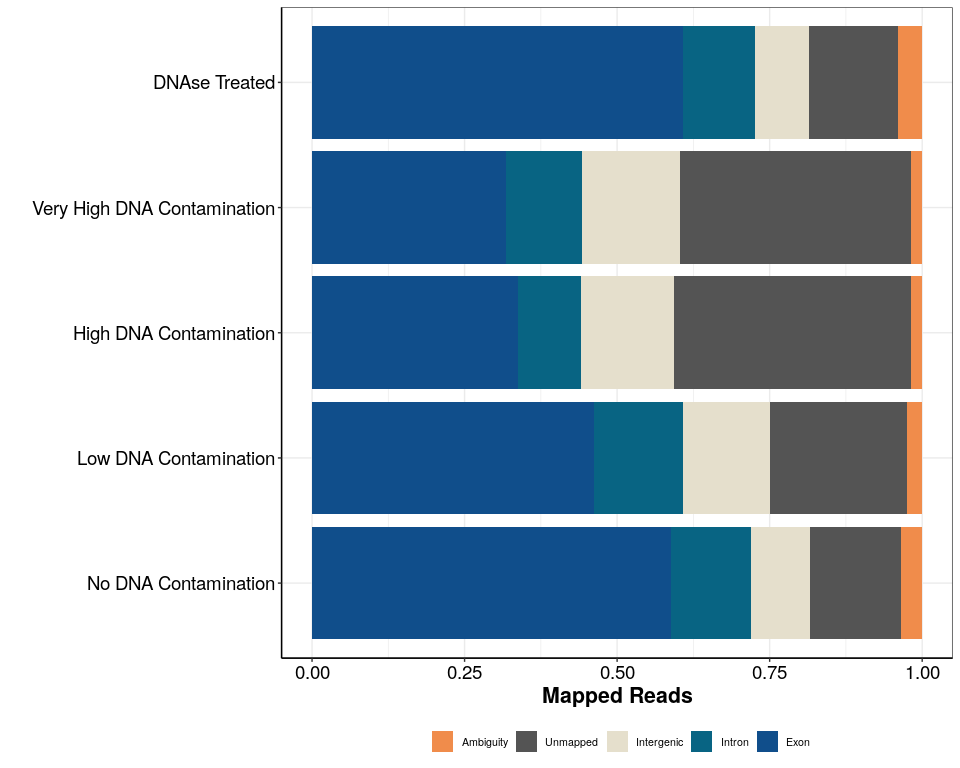
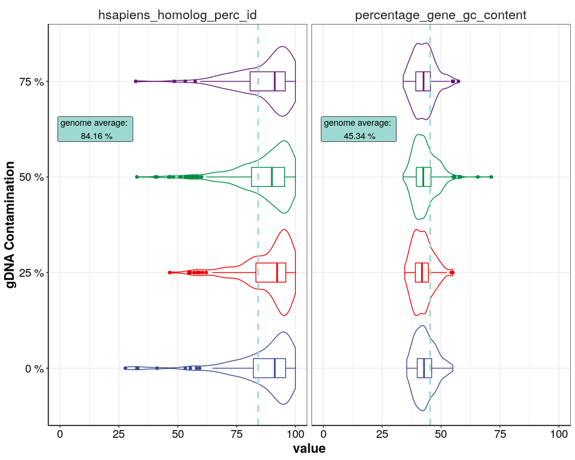
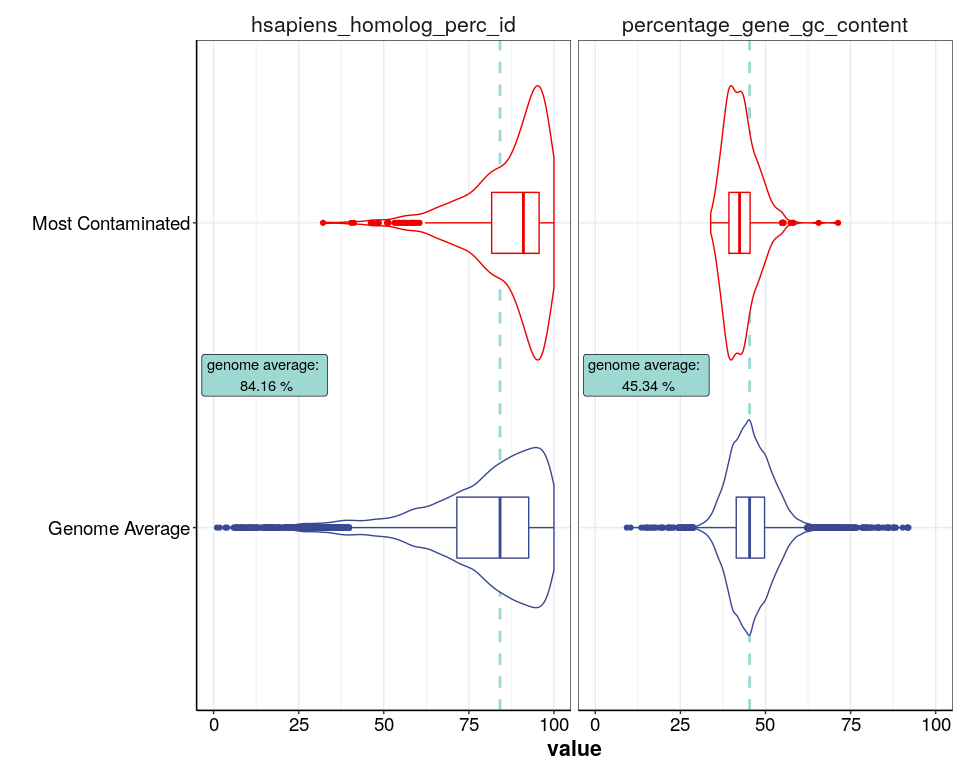
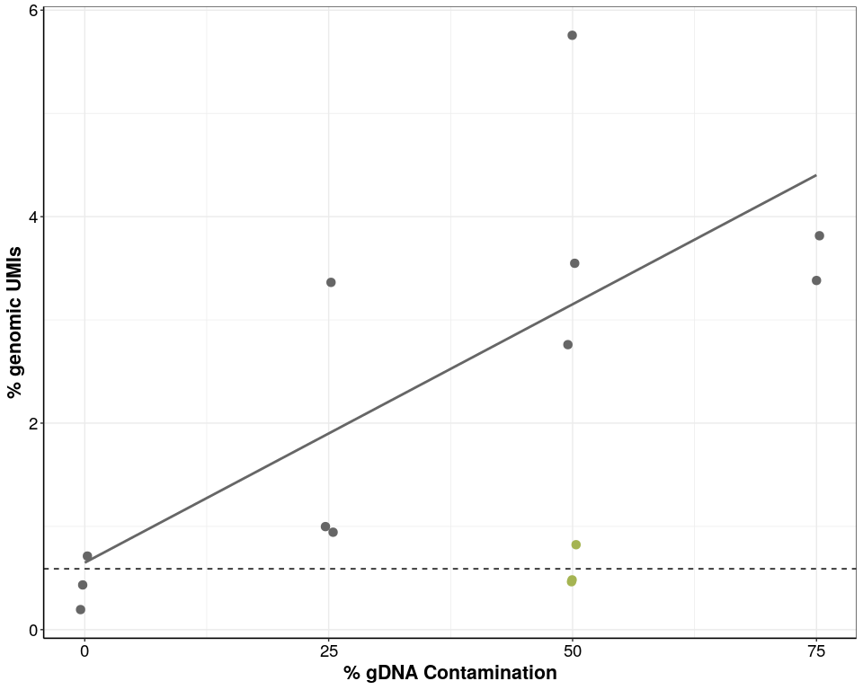
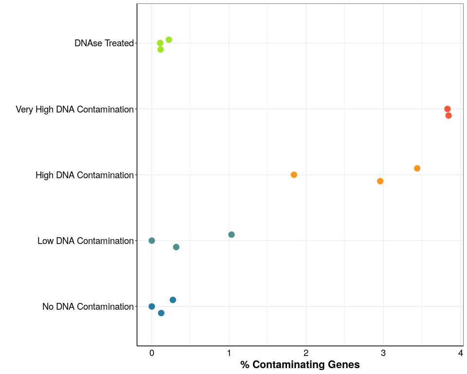
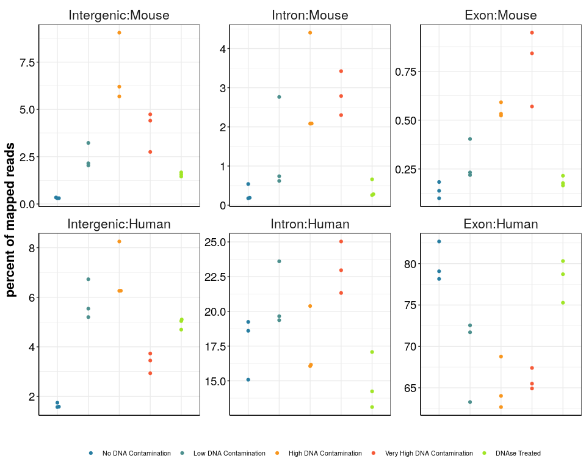
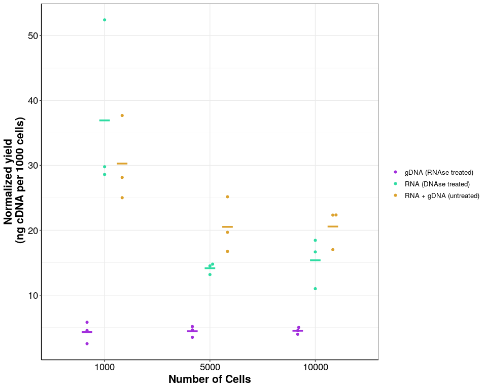

## Purpose:

Estimate the rate of gDNA priming in prime-seq. To generate an easily
measurable readout we mixed gDNA from one species and RNA from another
species in known ratios. This way we can deduce the rate of misspriming
from the mapping to Species 1 or 2.

#### 1. Load the following packages and data

``` r
library(tidyverse)
library(ggsci)
library(ggbeeswarm)
library(cowplot)
## theme

### all necessary custom functions are in the following script
source(paste0(here::here(),"/0_Scripts/custom_functions.R"))

theme_pub <- theme_bw() + theme(
                                     plot.title = element_text(hjust = 0.5, size=18, face="bold"),
                                     axis.text = element_text(colour="black", size=14), 
                                     axis.title=element_text(size=16,face="bold"), 
                                     legend.text=element_text(size=14),
                                     legend.position="right",
                                     axis.line.x = element_line(colour = "black"), 
                                     axis.line.y = element_line(colour = "black"),
                                     strip.background=element_blank(), 
                                     strip.text=element_text(size=16))  

theme_set(theme_pub)

#### Colours
mapping_cols<- c("dodgerblue4","#086483","#F08C4B","#E5DFCC","#abd1f2","#eeccec","orangered1","grey33","dodgerblue4")
names(mapping_cols)<-c("Exon","Intron","Ambiguity","Intergenic","Intergenic:Human","Intergenic:Mouse","Unassigned","Unmapped","Assigned")


Contamination_cols<-c("#277da1",
                      "#4d908e",
                      "#f8961e",
                      "#f65a38",
                      "#a1e527",
                      "#577590")
names(Contamination_cols)<-c("No DNA Contamination",
                             "Low DNA Contamination",
                             "High DNA Contamination",
                             "Very High DNA Contamination",
                             "DNAse Treated",
                             "No RNA")

DNAse_cols<-c("#666666",
              "#A5B452")
names(DNAse_cols)<-c("no",
                     "yes")

mouseman_cols<-c("#d641aa",
                 "#802866",
                 "#319eda",
                 "#286687",
                 "#abd1f2",
                 "#eeccec")
names(mouseman_cols)<-c("Intron:Mouse",
                        "Exon:Mouse",
                        "Intron:Human",
                        "Exon:Human",
                        "Intergenic:Human",
                        "Intergenic:Mouse")


fig_path<-"/data/share/htp/prime-seq_Paper/Fig_gdna_priming/"
```

``` r
sample_info<-read.csv(paste0(fig_path,"gDNA_priming_info.csv"),stringsAsFactors = F)
## make unique cellbcs
sample_info$XC2<-paste0(sample_info$XC,"_",sample_info$Replicate)
sample_info<-sample_info %>% 
  mutate(Condition=case_when(Condition=="2RNA_0DNA"~"No DNA Contamination",
              Condition=="1.5RNA_0.5DNA"~"Low DNA Contamination",
              Condition=="2RNA_2DNA"~"High DNA Contamination",
              Condition=="0.5RNA_1.5DNA"~"Very High DNA Contamination",
              Condition=="2RNA_2DNA_DNAse"~"DNAse Treated",
              Condition=="0RNA_2DNA"~"No RNA")) %>% 
  mutate(Condition=factor(Condition,levels = c("No DNA Contamination","Low DNA Contamination","High DNA Contamination","Very High DNA Contamination","DNAse Treated","No RNA")))
```

#### 2. Check mapping fractions of the different samples

``` r
## make list of dfs
path <- "/data/share/htp/prime-seq_Paper/Fig_gdna_priming/zUMIs"

dirs<-list.dirs(path, recursive = F)

dirs<-dirs[c(2,4,6)]# select correct directories

feature_list<- list()

for (i in 1:length(dirs)){
  tmp<- strsplit(dirs[i], split = "/")[[1]][8]
  tmp<-gsub(x = tmp,pattern = "_noMulti",replacement = "")
  feature_list[[i]]<- read.table(paste0(dirs[i],
                                "/zUMIs_output/stats/Bulk_opt_gDNA_priming_",
                                tmp,
                                ".readspercell.txt"),
                                 sep= "\t",
                                 header=T)
  feature_list[[i]]$XC2<-paste0(feature_list[[i]]$RG,"_",strsplit(tmp,split = "rep")[[1]][2]) ## to make barcodes unique
  names(feature_list)[i]<-tmp
}


feature_df<-do.call("rbind", feature_list)

feature_df<-left_join(feature_df,sample_info)

feature_df$Replicate<-str_split_fixed(feature_df$XC2,pattern = "_",n=2)[,2]

feature_df<-feature_df %>% 
  filter(type!="User" & RG!="bad") %>% 
  mutate(type=factor(type,
                     levels = c("Ambiguity","Unmapped","Intergenic","Intron","Exon"))
                    ) 


p.map<-ggplot()+
  geom_bar(data=feature_df,aes(x=Condition,y=N,fill=type),stat="identity",
           position =position_fill())+
  coord_flip()+
  theme(strip.text = element_text(size=6))+
  ylab("Mapped Reads")+
  xlab("")+
  theme(legend.position = "bottom", legend.title = element_blank(),legend.text = element_text(size=8))+
  scale_fill_manual(values=mapping_cols,limits = force)
p.map
```

<!-- -->

``` r
summary_df<-feature_df %>% 
  dplyr::select(XC2,Condition,DNA,N,type) %>%  
  group_by(XC2) %>% 
  mutate(percent=N/sum(N)*100,
         total=sum(N)) %>% 
  group_by(Condition,type) %>% 
  summarize(mean_mapped=mean(percent)) %>% 
  pivot_wider(names_from = type,values_from = mean_mapped) 
```

#### 3. extract counts from the dge lists

``` r
#Code from JWB

## make list of dfs

#dirs<-list.dirs(path, recursive = F)


dge_list<- list()


for (i in 1:length(dirs)){
  tmp<- strsplit(dirs[i], split = "/")[[1]][8]
  tmp<-gsub(x = tmp,pattern = "_noMulti",replacement = "")
  dge_list[[i]]<- readRDS(paste0(dirs[i], "/zUMIs_output/expression/Bulk_opt_gDNA_priming_", tmp, ".dgecounts.rds"))
  names(dge_list)[i]<-tmp
}

### UMI counts
exon_list<- list()
for (i in 1:length(dge_list)){
  exon_list[[i]]<- as.matrix(dge_list[[i]]$umicount$exon$downsampling$downsampled_10000)
  colnames(exon_list[[i]])<-paste0(colnames(exon_list[[i]]),"_",i)
  names(exon_list)[i]<-names(dge_list)[i]
}

intron_list<- list()
for (i in 1:length(dge_list)){
  intron_list[[i]]<- as.matrix(dge_list[[i]]$umicount$intron$downsampling$downsampled_10000)
  colnames(intron_list[[i]])<-colnames(intron_list[[i]])<-paste0(colnames(intron_list[[i]]),"_",i)
  names(intron_list)[i]<-names(dge_list)[i]
}

## human only
ENSG_list_ex<- list()
for (i in 1:length(exon_list)){
  ENSG_list_ex[[i]]<- exon_list[[i]][grep("ENSG",row.names(exon_list[[i]])),]
  names(ENSG_list_ex)[i]<-names(exon_list)[i]
}

ENSG_list_in<- list()
for (i in 1:length(intron_list)){
  ENSG_list_in[[i]]<- intron_list[[i]][grep("ENSG",row.names(intron_list[[i]])),]
  names(ENSG_list_in)[i]<-names(intron_list)[i]
}

## mouse only
ENSMUS_list_ex<- list()
for (i in 1:length(exon_list)){
  ENSMUS_list_ex[[i]]<- exon_list[[i]][grep("ENSMUS",row.names(exon_list[[i]])),]
  names(ENSMUS_list_ex)[i]<-names(exon_list)[i]
}

ENSMUS_list_in<- list()
for (i in 1:length(intron_list)){
  ENSMUS_list_in[[i]]<- intron_list[[i]][grep("ENSMUS",row.names(intron_list[[i]])),]
  names(ENSMUS_list_in)[i]<-names(intron_list)[i]
}


df_list<-list()

for (i in 1:length(ENSG_list_ex)){
  df_list[[i]]<- data.frame(XC2=colnames(ENSG_list_ex[[i]]),
                            nUMI_HS_ex=colSums(ENSG_list_ex[[i]]),
                            nGene_HS_ex=colSums(ENSG_list_ex[[i]]>1),
                            nUMI_MM_ex=colSums(ENSMUS_list_ex[[i]]),
                            nGene_MM_ex=colSums(ENSMUS_list_ex[[i]]>1), 
                            nUMI_HS_in=colSums(ENSG_list_in[[i]]),
                            nGene_HS_in=colSums(ENSG_list_in[[i]]>1),
                            nUMI_MM_in=colSums(ENSMUS_list_in[[i]]),
                            nGene_MM_in=colSums(ENSMUS_list_in[[i]]>1))
}

df<- dplyr::bind_rows(df_list)


df2<- dplyr::left_join(df, sample_info)
```

#### check most contaminated genes

``` r
mat_list<-list()
for (i in 1:3){

mat_list[[i]]<-rownames_to_column(as.data.frame(as.matrix(dge_list[[i]]$readcount$inex$all)),var="Gene_Id")

colnames(mat_list[[i]])[2:ncol(mat_list[[i]])]<-paste0(colnames(mat_list[[i]])[2:ncol(mat_list[[i]])],"_",i)  
  
}

full_mat<-plyr::join_all(mat_list)

full_mat[is.na(full_mat)]<-0

full_mat<-full_mat %>% 
  filter(grepl(x = Gene_Id,pattern = "ENSMUS")) %>% 
  column_to_rownames(var="Gene_Id") %>% 
  as.matrix() %>% 
  remove_Geneversion()

most_cont_10<-full_mat %>% 
  t() %>% 
  as.data.frame() %>% 
  rownames_to_column(var="XC2") %>% 
  left_join(sample_info) %>% 
  group_by(Condition) %>% 
  summarize(across(starts_with("ENSMUS"),.fns = sum)) %>% 
  pivot_longer(cols = starts_with("ENSMUS"),names_to = "ENSMUS",values_to = "sum_counts") %>% 
  group_by(Condition) %>% 
  slice_max(sum_counts,n=200) %>% 
  arrange(sum_counts,desc()) %>% 
  filter(sum_counts>0)

table(most_cont_10$Condition)
#> 
#>        No DNA Contamination       Low DNA Contamination 
#>                         163                         258 
#>      High DNA Contamination Very High DNA Contamination 
#>                         462                         207 
#>               DNAse Treated                      No RNA 
#>                         221                           0
```

#### gc, average identity to orthologue and biotype plots

``` r

ensembl_mouse <- biomaRt::useMart("ensembl", dataset ="mmusculus_gene_ensembl", host="uswest.ensembl.org") 

ensembl_2015 <- biomaRt::useMart("ensembl", "hsapiens_gene_ensembl", host="may2015.archive.ensembl.org")

dnds_data<-biomaRt::getBM(attributes = c("ensembl_gene_id",
                                          "hsapiens_homolog_perc_id",
                                          "percentage_gene_gc_content"), 
                   mart = ensembl_mouse) %>% 
  left_join(biomaRt::getBM(attributes = c("ensembl_gene_id",
                                 "gene_biotype"), 
                   mart = ensembl_mouse) ,
            by=c("ensembl_gene_id"="ensembl_gene_id")) %>% 
  left_join(biomaRt::getBM(attributes = c("mmusculus_homolog_dn",
                                         "mmusculus_homolog_ds",
                                         "ensembl_gene_id",
                                         "mmusculus_homolog_ensembl_gene"),
                          mart = ensembl_2015),
            by=c("ensembl_gene_id"="mmusculus_homolog_ensembl_gene")) %>% 
  mutate(dNdS=as.numeric(mmusculus_homolog_dn)/as.numeric(mmusculus_homolog_ds)) %>% 
  left_join(most_cont_10,by=c("ensembl_gene_id"="ENSMUS")) %>% 
  mutate(Condition=if_else(is.na(Condition),"Genome Average",as.character(Condition))) %>% 
  group_by(Condition) %>% 
  filter(!(duplicated(ensembl_gene_id))) %>% 
  mutate(gene_biotype2=case_when(grepl(gene_biotype,pattern="*pseudogene")~ "pseudogene",
                            grepl(gene_biotype,pattern="IG*")~ "protein coding",
                            grepl(gene_biotype,pattern="TR*")~ "protein coding",
                            grepl(gene_biotype,pattern="MT*")~ "MT",
                            grepl(gene_biotype,pattern="^s")~ "small RNA",
                            grepl(gene_biotype,pattern="ribozyme")~ "other",
                           gene_biotype=="misc_RNA"~ "other",
                           gene_biotype=="protein_coding"~ "protein coding",
                           T~gene_biotype)) %>% 
  mutate(Condition_cont=case_when(Condition=="No DNA Contamination" ~ "0 %",
                                  Condition=="Low DNA Contamination" ~ "25 %",
                                  Condition=="High DNA Contamination" ~ "50 %", 
                                  Condition=="Very High DNA Contamination" ~ "75 %", 
                                  Condition=="DNAse Treated" ~ "50 %", 
                                  Condition=="No RNA" ~ "100 %",
                                  Condition=="Genome Average"~"Genome Average")) %>% 
  mutate(Condition_new=case_when(Condition %in% c("DNAse Treated","No DNA Contamination")~"not_cont",
                                 Condition_cont!="Genome Average"~"Most Contaminated",
                                 T~Condition_cont))


genome_average<-dnds_data %>% 
  group_by(Condition) %>% 
  summarize(percentage_gene_gc_content=median(percentage_gene_gc_content),hsapiens_homolog_perc_id=median(hsapiens_homolog_perc_id,na.rm=T)) %>% 
  filter(Condition=="Genome Average") %>% 
  pivot_longer(cols=c(percentage_gene_gc_content,hsapiens_homolog_perc_id))

gene_info_cont<-dnds_data %>% 
  filter(Condition!="Genome Average") %>% 
  pivot_longer(cols=c(percentage_gene_gc_content,hsapiens_homolog_perc_id))

table(gene_info_cont$Condition)
#> 
#>               DNAse Treated      High DNA Contamination 
#>                         440                         918 
#>       Low DNA Contamination        No DNA Contamination 
#>                         512                         324 
#> Very High DNA Contamination 
#>                         408

ggplot(gene_info_cont) +
  geom_violin(aes(x=Condition_cont,y=value,col=Condition_cont),show.legend = F)+
  geom_boxplot(aes(x=Condition_cont,y=value,col=Condition_cont),show.legend = F,width=0.2)+
  geom_hline(data=genome_average,aes(yintercept = value),
             linetype="dashed",
             col="#9DD9D2",
             size=1)+
  geom_label(data=genome_average,aes(x=3.5,y=15,label=paste("genome average: \n",round(value,digits = 2),"%")),
             linetype="dashed",
             fill="#9DD9D2")+
  scale_y_continuous(limits=c(0,100))+
  coord_flip()+
  facet_wrap(~name)+
  scale_colour_aaas()+
  labs(x="gDNA Contamination")
```

<!-- -->

``` r
dnds_data$gene_biotype2 <-factor(dnds_data$gene_biotype2, levels = rev(
      c("protein coding",
        "lncRNA",
        "pseudogene",
        "rRNA",
        "MT",
        "small RNA",
        "miRNA",
        "not_annotated",
        "other")
    ))

ggplot(dnds_data)+
  geom_bar(aes(x=Condition_cont,fill=gene_biotype2),position="fill",show.legend =T)+
  coord_flip()+
  labs(fill="",
       x="",
       y="Percent of Genes")+
  scale_y_continuous(labels = scales::percent_format(accuracy = 0.1))+
  scale_fill_npg()+
  labs(x="gDNA Contamination")
```

<!-- -->

``` r
gene_info_cont<-dnds_data %>% 
  filter(Condition_new!="not_cont") %>% 
  pivot_longer(cols=c(percentage_gene_gc_content,hsapiens_homolog_perc_id))

ggplot(gene_info_cont) +
  geom_hline(data=genome_average,aes(yintercept = value),
             linetype="dashed",
             col="#9DD9D2",
             size=1)+
  geom_violin(aes(x=Condition_new,y=value,col=Condition_new),show.legend = F)+
  geom_boxplot(aes(x=Condition_new,y=value,col=Condition_new),show.legend = F,width=0.2)+
  geom_label(data=genome_average,aes(x=1.5,y=15,label=paste("genome average: \n",round(value,digits = 2),"%")),
             linetype="dashed",
             fill="#9DD9D2")+
  scale_y_continuous(limits=c(0,100))+
  coord_flip()+
  facet_wrap(~name)+
  scale_colour_aaas()+
  labs(x="")
```

<!-- -->

``` r
df2<-df2 %>% 
  group_by(Condition) %>% 
  mutate(contamination_umi=(nUMI_MM_ex+nUMI_MM_in)/(nUMI_MM_ex+nUMI_HS_ex+nUMI_HS_in+nUMI_MM_in)*100,
         contamination_gene=(nGene_MM_ex+nGene_MM_in)/(nGene_MM_ex+nGene_HS_ex+nGene_HS_in+nGene_MM_in)*100)


p.frac<-ggplot(data=df2,aes(y=contamination_umi,x=Condition,col=Condition))+
  geom_point(size=4,alpha = 0.8,show.legend = F)+
  #geom_errorbar(aes(x=Condition,ymin=mean_contamination_umi,ymax=mean_contamination_umi,group=Condition,width=0.5))+
  ylab("% Contaminating UMIs")+
  xlab("")+
  scale_colour_manual(values=Contamination_cols,limits = force)+
  coord_flip()


p.frac
```

<!-- -->

``` r
df2<-df2 %>% 
  mutate(Condition_cont=case_when(Condition=="No DNA Contamination" ~ 0,
                                  Condition=="Low DNA Contamination" ~ 25,
                                  Condition=="High DNA Contamination" ~ 50, 
                                  Condition=="Very High DNA Contamination" ~ 75, 
                                  Condition=="DNAse Treated" ~ 50, 
                                  Condition=="No RNA" ~ 100))

p.frac.new<-ggplot(data=df2,
                   aes(x=Condition_cont,y=contamination_umi,col=DNAse))+
  geom_jitter(size=3,width = 0.5,height = 0)+
  geom_smooth(aes(x=Condition_cont,y=contamination_umi,col=DNAse),
              method = "lm",
              se=F,
              show.legend = F)+
  labs(y="% genomic UMIs",x="% gDNA Contamination")+
  scale_x_continuous(breaks = c(0,25,50,75))+
  scale_colour_manual(values=DNAse_cols)+
  theme(legend.position = "none")+
  geom_hline(yintercept = mean(subset(df2,Condition=="DNAse Treated")$contamination_umi),
             linetype="dashed")

p.frac.new
```

<!-- -->

``` r
summary_df<-df2 %>% 
  group_by(Condition) %>% 
  summarize(mean_contamination_umi=mean(contamination_umi),
         mean_contamination_gene=mean(contamination_gene)) %>% 
  left_join(summary_df)

p.frac.g<-ggplot(data=df2,aes(y=contamination_gene,x=Condition,colour=Condition))+
  geom_quasirandom(size=4,width = 0.2)+
  #geom_errorbar(aes(x=Condition,ymin=mean_contamination_gene,ymax=mean_contamination_gene,group=Condition,width=0.5))+
  ylab("% Contaminating Genes")+
  xlab("")+
  scale_colour_manual(values=Contamination_cols,limits = force)+
  coord_flip()+
  theme(legend.position = "none",
        axis.ticks.x=element_blank())


p.frac.g
```

<!-- -->

#### 5. Features per condition

``` r
## make list of dfs
path = "/data/share/htp/prime-seq_Paper/Fig_gdna_priming/analysis/count_intergenic/"

files<-list.files(path, recursive = F)

project<-c("rep1","rep2","rep3")

feature_list<- list()

for (i in 1:length(project)){
  feature_list[[i]]<- read.table(paste0(path,project[i],".readspercell.txt"),
                                 sep= "\t",
                                 header=T)
  feature_list[[i]]$XC2<-paste0(feature_list[[i]]$RG,"_",strsplit(project[i],split = "rep")[[1]][2]) ## to make barcodes unique
  names(feature_list)[i]<-project[i]
}


feature_df<-do.call("rbind", feature_list)

feature_df<-inner_join(feature_df,sample_info)

feature_df$Replicate<-str_split_fixed(feature_df$XC2,pattern = "_",n=2)[,2]

feature_df2<-feature_df %>% 
  filter(type%in%c("Intergenic_human","Intergenic_mouse"),
         RG!="bad") %>% 
  dplyr::select(XC2,Condition,DNA,N,type) %>% 
  mutate(Type=case_when(type=="Intergenic_human"~"Intergenic:Human",
                        type=="Intergenic_mouse"~"Intergenic:Mouse"),
         nRead=N) %>% 
  dplyr::select(XC2,Condition,DNA,nRead,Type)

### Read counts

exon_list<- list()
for (i in 1:length(dge_list)){
  exon_list[[i]]<- as.matrix(dge_list[[i]]$readcount$exon$all)
  colnames(exon_list[[i]])<-paste0(colnames(exon_list[[i]]),"_",strsplit(project[i],split = "rep")[[1]][2])
  names(exon_list)[i]<-names(dge_list)[i]
}

intron_list<- list()
for (i in 1:length(dge_list)){
  intron_list[[i]]<- as.matrix(dge_list[[i]]$readcount$intron$all)
  colnames(intron_list[[i]])<-paste0(colnames(exon_list[[i]]),"_",strsplit(project[i],split = "rep")[[1]][2])
  names(intron_list)[i]<-names(dge_list)[i]
}

## human only
ENSG_list_ex<- list()
for (i in 1:length(exon_list)){
  ENSG_list_ex[[i]]<- exon_list[[i]][grep("ENSG",row.names(exon_list[[i]])),]
  names(ENSG_list_ex)[i]<-names(exon_list)[i]
}

ENSG_list_in<- list()
for (i in 1:length(intron_list)){
  ENSG_list_in[[i]]<- intron_list[[i]][grep("ENSG",row.names(intron_list[[i]])),]
  names(ENSG_list_in)[i]<-names(intron_list)[i]
}

## mouse only
ENSMUS_list_ex<- list()
for (i in 1:length(exon_list)){
  ENSMUS_list_ex[[i]]<- exon_list[[i]][grep("ENSMUS",row.names(exon_list[[i]])),]
  names(ENSMUS_list_ex)[i]<-names(exon_list)[i]
}

ENSMUS_list_in<- list()
for (i in 1:length(intron_list)){
  ENSMUS_list_in[[i]]<- intron_list[[i]][grep("ENSMUS",row.names(intron_list[[i]])),]
  names(ENSMUS_list_in)[i]<-names(intron_list)[i]
}


df_list<-list()

for (i in 1:length(ENSG_list_ex)){
  df_list[[i]]<- data.frame(XC2=colnames(ENSG_list_ex[[i]]),
                            nRead_HS_ex=colSums(ENSG_list_ex[[i]]),
                            nRead_MM_ex=colSums(ENSMUS_list_ex[[i]]),
                            nRead_HS_in=colSums(ENSG_list_in[[i]]),
                            nRead_MM_in=colSums(ENSMUS_list_in[[i]]))
}

df<- dplyr::bind_rows(df_list)


df2<- dplyr::left_join(df, sample_info)


  

df3<-df2 %>% 
  gather(key = "Type",value="nRead",c(2,3,4,5)) %>% 
  mutate(Type=case_when(
      Type=="nRead_HS_ex"~"Exon:Human",
      Type=="nRead_HS_in"~"Intron:Human",
      Type=="nRead_MM_ex"~"Exon:Mouse",
      Type=="nRead_MM_in"~"Intron:Mouse"),
      nRead=as.integer(nRead)) %>% 
  dplyr::select(XC2,Condition,DNA,nRead,Type) %>% 
  bind_rows(feature_df2) %>% 
  mutate(Type=factor(Type,
                     levels = c("Intergenic:Mouse","Intron:Mouse","Exon:Mouse","Intergenic:Human","Intron:Human","Exon:Human"))) 


p.nreads_inex<-ggplot()+
  geom_bar(data=df3,aes(x=Condition,y=nRead,fill=Type),stat="identity",position=position_fill())+
  coord_flip()+
  scale_fill_manual(values=mouseman_cols,limits = force)+
  ylab("Assigned Reads")+
  xlab("")+
  theme(legend.position = "bottom",
        legend.title = element_blank(),
        legend.text = element_text(size=8),
        axis.text.y=element_blank(),
        axis.ticks.y=element_blank())
p.nreads_inex
```

<!-- -->

``` r

df3 %>% 
  group_by(XC2) %>% 
  mutate(percent=nRead/sum(nRead)*100,
         total=sum(nRead)) %>% 
ggplot(aes(x=Condition,y=percent,colour=Condition))+
  geom_beeswarm(dodge.width = 0.5)+
  scale_colour_manual(values=Contamination_cols,limits = force)+
  facet_wrap(~Type,scales = "free")+
  xlab("")+
  ylab("percent of mapped reads")+
  theme(legend.position = "bottom", 
        legend.title = element_blank(),
        legend.text = element_text(size=8),
        axis.text.x = element_blank(),
        axis.ticks.x = element_blank())
```

<!-- -->

#### 6. DNAse test

``` r
dnase<-read.table("/data/share/lab/Picogreens/20180816_bulk_DNase_test_phong.txt",sep="\t",header=T)

p.dnase<-dnase %>% 
  mutate(norm_input=((conc*10)/input*1000),
         type=case_when(type=="Dnase"~ "RNA (DNAse treated)",
                        type=="Rnase"~ "gDNA (RNAse treated)",
                        type=="None"~ "RNA + gDNA (untreated)")) -> table_nor

table_nor %>% 
  mutate(rep=rep(1:3,times=9)) %>% 
  dplyr::select(-conc) %>% 
  pivot_wider(values_from = norm_input,names_from = type) %>% 
  write_excel_csv("/data/share/htp/prime-seq_Paper/Fig_gdna_priming/analysis/R_Project/Normalized_gDNApriming_experiment.csv")

 p.dnase<- ggplot(data=table_nor,aes(x=factor(input),y=norm_input))+
  geom_beeswarm(aes(colour=type),dodge.width = 0.5)+
  stat_summary(aes(col=type),fun = mean,geom="crossbar",width=0.3,position=position_dodge(width = 0.5),show.legend = F)+
  xlab("Number of Cells")+
  ylab("Normalized yield\n (ng cDNA per 1000 cells)")+
  scale_color_manual(values=c("#a22edc","#2edca2", "#dca22e"))+
  theme(legend.position = "right", legend.title = element_blank(),legend.text = element_text(size=10))

p.dnase
```

<!-- -->

Supplementary Paper figure

``` r

ggsave(p.dnase,filename = "DNAse_concentration_test.pdf",path = fig_path,device = "pdf",units = "mm",width = 200,height = 100)

p.map2<-p.map+theme(legend.position = "bottom",plot.margin = margin(0.2, 0.3, 1, 0, "cm"))+
  guides(fill=guide_legend(direction = "horizontal",reverse = T,nrow=3))

p.nreads_inex2<-p.nreads_inex+theme(plot.margin = margin(0.2, 0.35, 1, 0, "cm"))+
  guides(fill=guide_legend(direction = "horizontal",reverse = T,nrow=3))

p.frac2<-p.frac+theme(plot.margin = margin(0.2, 0.3, 5, 0, "cm"))

lower<-plot_grid(p.map2,p.nreads_inex2,p.frac2,ncol=3,rel_widths = c(0.5,0.27,0.25),labels=c("C","D","E"))


ggsave(lower,filename = "Suppl_fig_gdna_lower.pdf",path = fig_path,device = "pdf",units = "mm",width = 300,height = 135)

#individual Figures
ggsave(p.map2,filename = "Assigned_features.pdf",path = fig_path,device = "pdf",units = "mm",width = 145,height = 120)

ggsave(p.nreads_inex2,path = fig_path,filename = "Mapped_features.pdf",device = "pdf",units = "mm",width = 80,height = 120)

ggsave(p.frac.new,path = fig_path,filename = "Contaminating_UMIs.pdf",device = "pdf",units = "mm",width = 100,height = 80)
```

## `R` Session Info

``` r
sessionInfo()
#> R version 4.1.0 (2021-05-18)
#> Platform: x86_64-pc-linux-gnu (64-bit)
#> Running under: Devuan GNU/Linux 3 (beowulf)
#> 
#> Matrix products: default
#> BLAS:   /usr/lib/x86_64-linux-gnu/openblas/libblas.so.3
#> LAPACK: /usr/lib/x86_64-linux-gnu/libopenblasp-r0.3.5.so
#> 
#> locale:
#>  [1] LC_CTYPE=en_US.UTF-8       LC_NUMERIC=C              
#>  [3] LC_TIME=en_US.UTF-8        LC_COLLATE=en_US.UTF-8    
#>  [5] LC_MONETARY=en_US.UTF-8    LC_MESSAGES=en_US.UTF-8   
#>  [7] LC_PAPER=en_US.UTF-8       LC_NAME=C                 
#>  [9] LC_ADDRESS=C               LC_TELEPHONE=C            
#> [11] LC_MEASUREMENT=en_US.UTF-8 LC_IDENTIFICATION=C       
#> 
#> attached base packages:
#> [1] stats     graphics  grDevices utils     datasets  methods   base     
#> 
#> other attached packages:
#>  [1] Matrix_1.3-4     cowplot_1.1.1    ggbeeswarm_0.6.0 ggsci_2.9       
#>  [5] forcats_0.5.1    stringr_1.4.0    dplyr_1.0.7      purrr_0.3.4     
#>  [9] readr_2.1.0      tidyr_1.1.4      tibble_3.1.6     ggplot2_3.3.5   
#> [13] tidyverse_1.3.1 
#> 
#> loaded via a namespace (and not attached):
#>  [1] nlme_3.1-153           bitops_1.0-7           fs_1.5.0              
#>  [4] lubridate_1.8.0        bit64_4.0.5            filelock_1.0.2        
#>  [7] progress_1.2.2         httr_1.4.2             GenomeInfoDb_1.28.4   
#> [10] rprojroot_2.0.2        tools_4.1.0            backports_1.4.0       
#> [13] utf8_1.2.2             R6_2.5.1               vipor_0.4.5           
#> [16] mgcv_1.8-38            DBI_1.1.1              BiocGenerics_0.38.0   
#> [19] colorspace_2.0-2       withr_2.4.2            prettyunits_1.1.1     
#> [22] tidyselect_1.1.1       curl_4.3.2             bit_4.0.4             
#> [25] compiler_4.1.0         textshaping_0.3.6      cli_3.1.0             
#> [28] rvest_1.0.2            Biobase_2.52.0         xml2_1.3.2            
#> [31] labeling_0.4.2         scales_1.1.1           rappdirs_0.3.3        
#> [34] systemfonts_1.0.3      digest_0.6.28          rmarkdown_2.11        
#> [37] XVector_0.32.0         pkgconfig_2.0.3        htmltools_0.5.2       
#> [40] dbplyr_2.1.1           fastmap_1.1.0          highr_0.9             
#> [43] rlang_0.4.12           readxl_1.3.1           rstudioapi_0.13       
#> [46] RSQLite_2.2.8          farver_2.1.0           generics_0.1.1        
#> [49] jsonlite_1.7.2         vroom_1.5.6            RCurl_1.98-1.5        
#> [52] magrittr_2.0.1         GenomeInfoDbData_1.2.6 Rcpp_1.0.7            
#> [55] munsell_0.5.0          S4Vectors_0.30.2       fansi_0.5.0           
#> [58] lifecycle_1.0.1        stringi_1.7.4          yaml_2.2.1            
#> [61] zlibbioc_1.38.0        BiocFileCache_2.0.0    plyr_1.8.6            
#> [64] grid_4.1.0             blob_1.2.2             parallel_4.1.0        
#> [67] crayon_1.4.2           lattice_0.20-45        splines_4.1.0         
#> [70] Biostrings_2.60.2      haven_2.4.3            hms_1.1.1             
#> [73] KEGGREST_1.32.0        knitr_1.36             pillar_1.6.4          
#> [76] biomaRt_2.48.3         stats4_4.1.0           reprex_2.0.1          
#> [79] XML_3.99-0.8           glue_1.5.0             evaluate_0.14         
#> [82] modelr_0.1.8           png_0.1-7              vctrs_0.3.8           
#> [85] tzdb_0.2.0             cellranger_1.1.0       gtable_0.3.0          
#> [88] assertthat_0.2.1       cachem_1.0.6           xfun_0.28             
#> [91] broom_0.7.10           ragg_1.2.0             AnnotationDbi_1.54.1  
#> [94] beeswarm_0.4.0         memoise_2.0.1          IRanges_2.26.0        
#> [97] ellipsis_0.3.2         here_1.0.1
```
