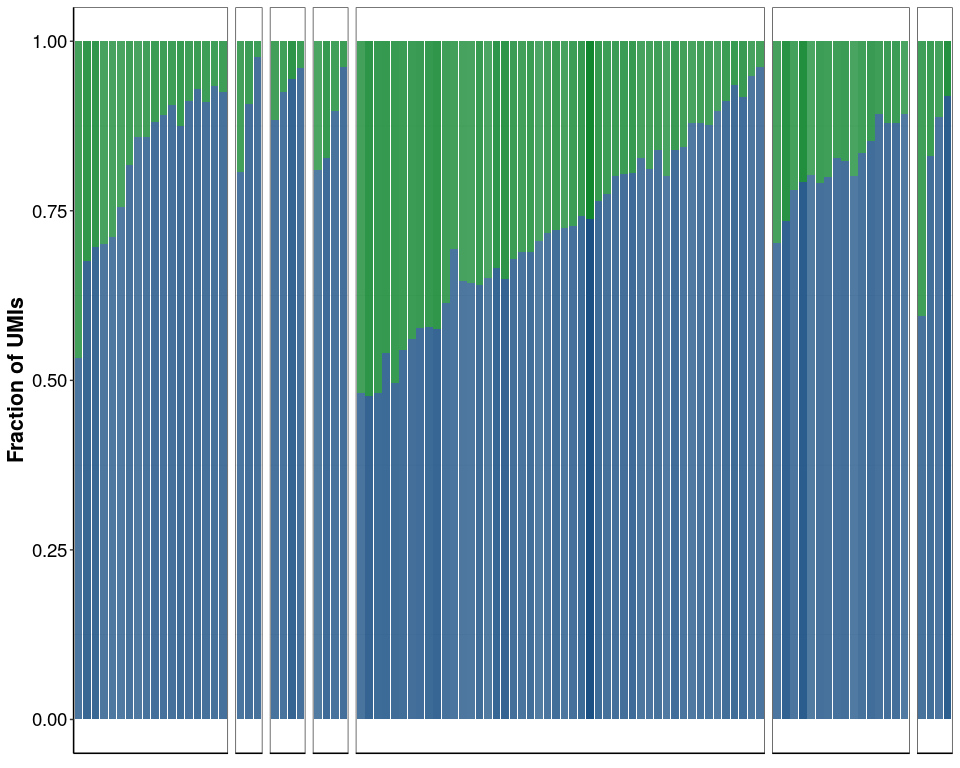
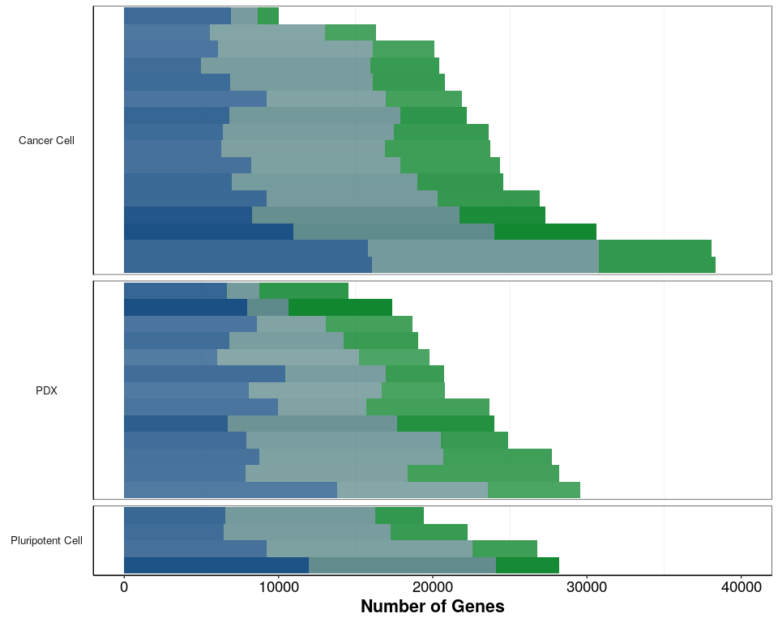
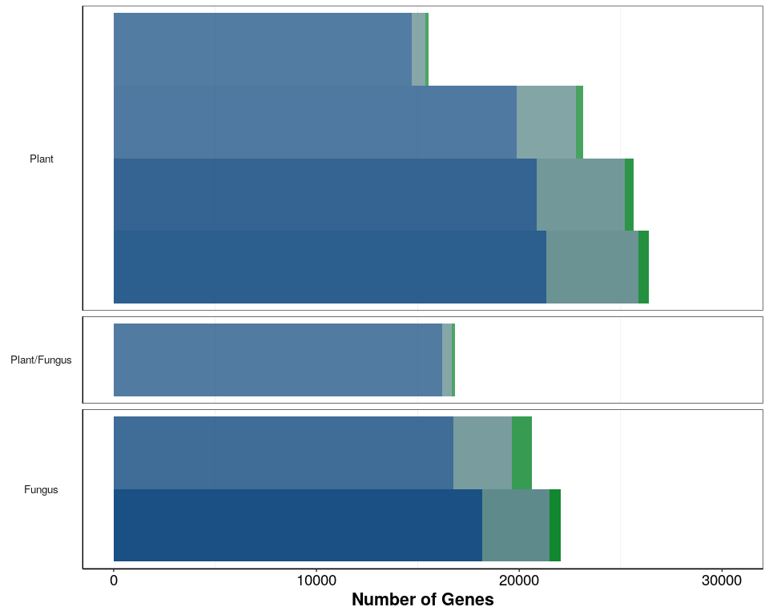

## Purpose:

Robustness of the prime-seq protocol

#### 1. Load the following packages:

``` r
library(tidyverse)
library(ggsignif)
library(ggplotify)
library(ggrepel)
library(ggbeeswarm)
library(edgeR)
library(genefilter)
library(grid)
library(gridExtra)
library(ggsci)
library(UpSetR)
library(cowplot)
```

``` r
### all necessary custom functions are in the following script
source(paste0(here::here(),"/0_Scripts/custom_functions.R"))

theme_pub <- theme_bw() + theme(
                                     plot.title = element_text(hjust = 0.5, size=18, face="bold"),
                                     axis.text = element_text(colour="black", size=14), 
                                     axis.title=element_text(size=16,face="bold"), 
                                     legend.text=element_text(size=14),
                                     legend.position="right",
                                     axis.line.x = element_line(colour = "black"), 
                                     axis.line.y = element_line(colour = "black"),
                                     strip.background=element_blank(), 
                                     strip.text=element_text(size=16))  

theme_set(theme_pub)

#prevent scientific notation
options(scipen=999)

fig_path <- paste0(here::here(),"/1_prime_seq_development/")
```

#### 2. Main - Sensitivity figure number of umis

``` r
prime_df <- read.csv(paste0(fig_path,"prime_seq_projects.csv"), header = T, stringsAsFactors = T, sep = ",")
prime_df_long <- pivot_longer(prime_df, 
                              c(UMI_Exonic, UMI_Intronic), 
                              values_to = "Number_UMIs", 
                              names_to = "Feature")

#relevel factors
prime_df_long$Sample_Type<-factor(prime_df_long$Sample_Type,
                                levels=c("Nervous", "Cardiopulmonary", 
                                         "Digestive", 
                                         "Urinary", 
                                         "Immune","Cancer Cell",
                                         "Pluripotent Cell"))
prime_df_long$Feature<-factor(prime_df_long$Feature,
                                levels=rev(c("UMI_Exonic", "UMI_Intronic")))

# plot
a1 <- ggplot(prime_df_long, aes(x = reorder(Project, -frac_inex_umi), y = Number_UMIs, fill = Feature, alpha = as.numeric(Average_reads_per_sample)))+
    geom_bar(stat="identity", position = "fill")+
    facet_grid(~Sample_Type, scales="free", space = "free", switch = "x") +
    ylab("Fraction of UMIs") +
    scale_fill_manual(labels = c("Intron", "Exon"), 
                      values = c("#118730", "#1a5084"))+
    scale_alpha_continuous(range = c(0.75, 1), guide = FALSE)+
    guides(fill = guide_legend(reverse=T))+
    theme_pub+
    theme(legend.position="none", 
          axis.title.x = element_blank(), 
          axis.text.x = element_blank(),
          strip.text.x = element_blank(),
          strip.placement = "outside",
          panel.grid.major = element_blank(), 
          panel.grid.minor.x = element_blank(),
          axis.ticks.x = element_blank()) 

a1
```

<!-- -->

``` r
ggsave(paste0(fig_path,"/a1.pdf"), a1, width = 10, height = 2.5, units = "in")
```

#### 3. Supp - Sensitivity figure number of genes

``` r
prime_df <- read.csv(paste0(fig_path,"prime_seq_projects_gene_num.csv"), header = T, stringsAsFactors = T, sep = ",")
prime_df_long <- pivot_longer(prime_df, 
                              c(Genes_Exon_Only, Genes_Intron_Only, Genes_Both), 
                              values_to = "Number_Genes", 
                              names_to = "Feature")

#relevel factors
prime_df_long$Sample_Type<-factor(prime_df_long$Sample_Type,
                                levels=c("Nervous", "Cardiopulmonary", 
                                         "Digestive", 
                                         "Urinary","Reproductive", 
                                         "Musculoskeletal","Immune","Cancer Cell",
                                         "PDX",
                                         "Pluripotent Cell","Plant", 
                                         "Plant/Fungus","Fungus"))
prime_df_long$Feature<-factor(prime_df_long$Feature,
                                levels=rev(c("Genes_Exon_Only", "Genes_Both", 
                                         "Genes_Intron_Only")))

# plot
a <- ggplot(prime_df_long[prime_df_long$Category == "A",], aes(x = reorder(Project, -Number_Genes), y = Number_Genes, fill = Feature, alpha = as.numeric(Average_reads_per_sample)))+
    geom_bar(stat="identity", width = 1)+
    facet_grid(Sample_Type~., scales="free", space = "free", switch = "y") +
    ylab("Number of Genes") +
    coord_flip() +
    ylim(0,30500)+
    scale_fill_manual(labels = c("Intron", "Both", "Exon"), 
                      values = c("#118730", "#5F8A8B", "#1a5084"))+
    scale_alpha_continuous(range = c(0.75, 1), guide = FALSE)+
    guides(fill = guide_legend(reverse=T))+
    theme_pub+
    theme(legend.position="none", 
          axis.title.y = element_blank(), 
          axis.text.y = element_blank(),
          strip.text.y.left = element_text(angle = 0, size = 10),
          strip.placement = "outside",
          panel.grid.major = element_blank(), 
          panel.grid.minor.y = element_blank(),
          axis.ticks.y = element_blank()) 
a
```

<!-- -->

``` r
b <- ggplot(prime_df_long[prime_df_long$Category == "B",], aes(x = reorder(Project, -Number_Genes), y = Number_Genes, fill = Feature, alpha = as.numeric(Average_reads_per_sample)))+
    geom_bar(stat="identity", width = 1)+
    facet_grid(Sample_Type~., scales="free", space = "free", switch = "y") +
    ylab("Number of Genes") +
    coord_flip() +
    ylim(0,40000)+
    scale_fill_manual(labels = c("Intron", "Both", "Exon"), 
                      values = c("#118730", "#5F8A8B", "#1a5084"))+
    scale_alpha_continuous(range = c(0.75, 1), guide = FALSE)+
    guides(fill = guide_legend(reverse=T))+
    theme_pub+
    theme(legend.position="none", 
          axis.title.y = element_blank(), 
          axis.text.y = element_blank(),
          strip.text.y.left = element_text(angle = 0, size = 10),
          strip.placement = "outside",
          panel.grid.major = element_blank(), 
          panel.grid.minor.y = element_blank(),
          axis.ticks.y = element_blank()) 
b
```

<!-- -->

``` r
c <- ggplot(prime_df_long[prime_df_long$Category == "C",], aes(x = reorder(Project, -Number_Genes), y = Number_Genes, fill = Feature, alpha = as.numeric(Average_reads_per_sample)))+
    geom_bar(stat="identity", width = 1)+
    facet_grid(Sample_Type~., scales="free", space = "free", switch = "y") +
    ylab("Number of Genes") +
    coord_flip() +
    ylim(0,30500)+
    scale_fill_manual(labels = c("Intron", "Both", "Exon"), 
                      values = c("#118730", "#5F8A8B", "#1a5084"))+
    scale_alpha_continuous(range = c(0.75, 1), guide = FALSE)+
    guides(fill = guide_legend(reverse=T))+
    theme_pub+
    theme(legend.position="none", 
          axis.title.y = element_blank(), 
          axis.text.y = element_blank(),
          strip.text.y.left = element_text(angle = 0, size = 10),
          strip.placement = "outside",
          panel.grid.major = element_blank(), 
          panel.grid.minor.y = element_blank(),
          axis.ticks.y = element_blank()) 

c
```

<!-- -->

``` r
ggsave(paste0(fig_path,"/a.pdf"), a, width = 8, height = 11, units = "in")

ggsave(paste0(fig_path,"/b.pdf"), b, width = 8, height = 5.97, units = "in")

ggsave(paste0(fig_path,"/c.pdf"), c, width = 7.9, height = 2, units = "in")
```
