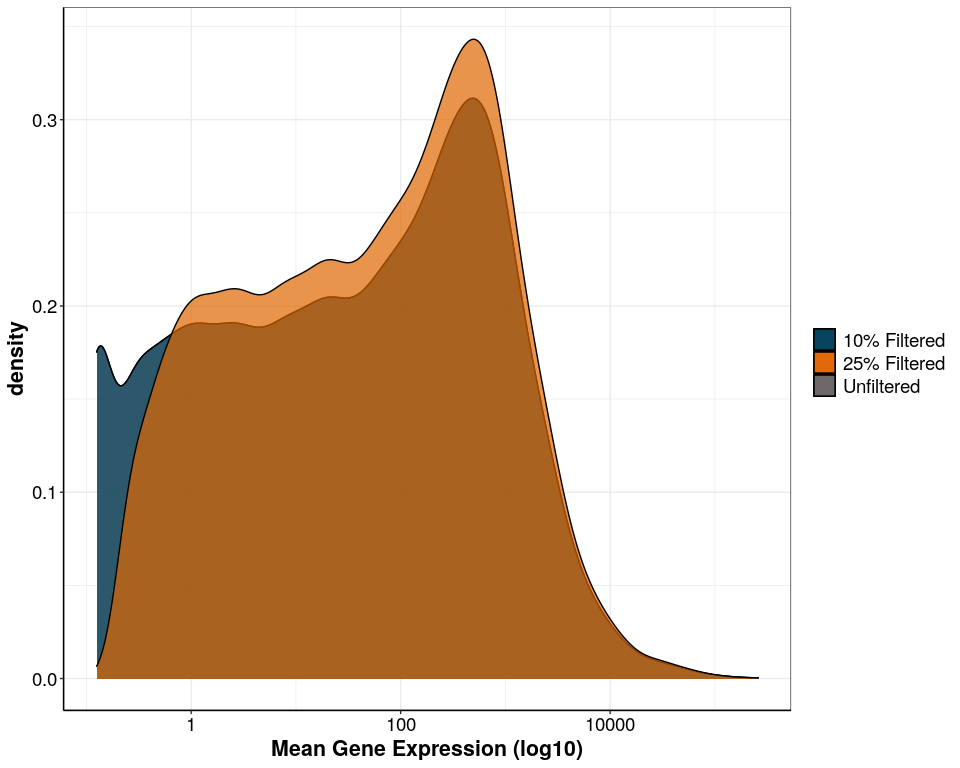
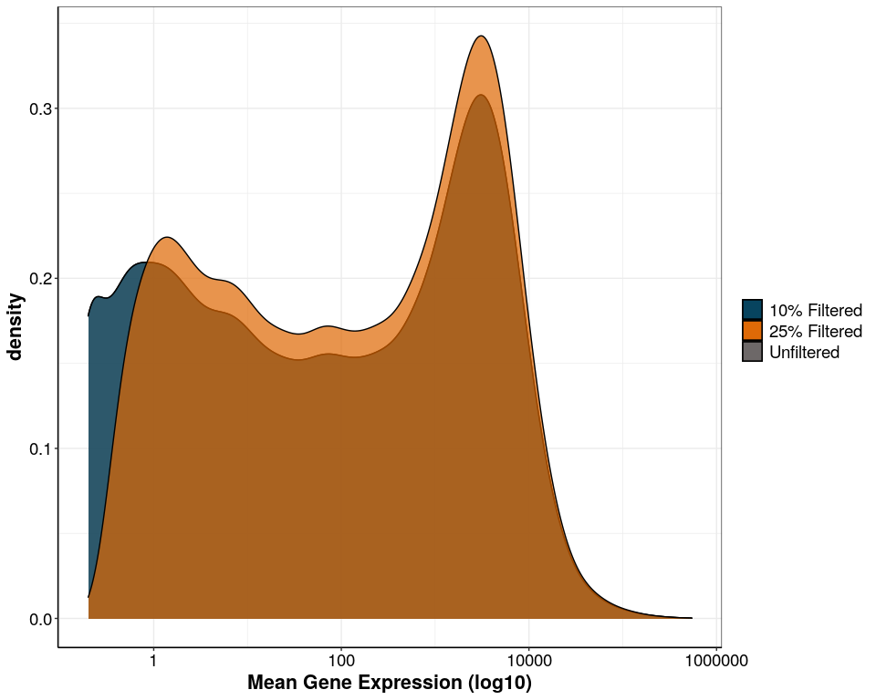
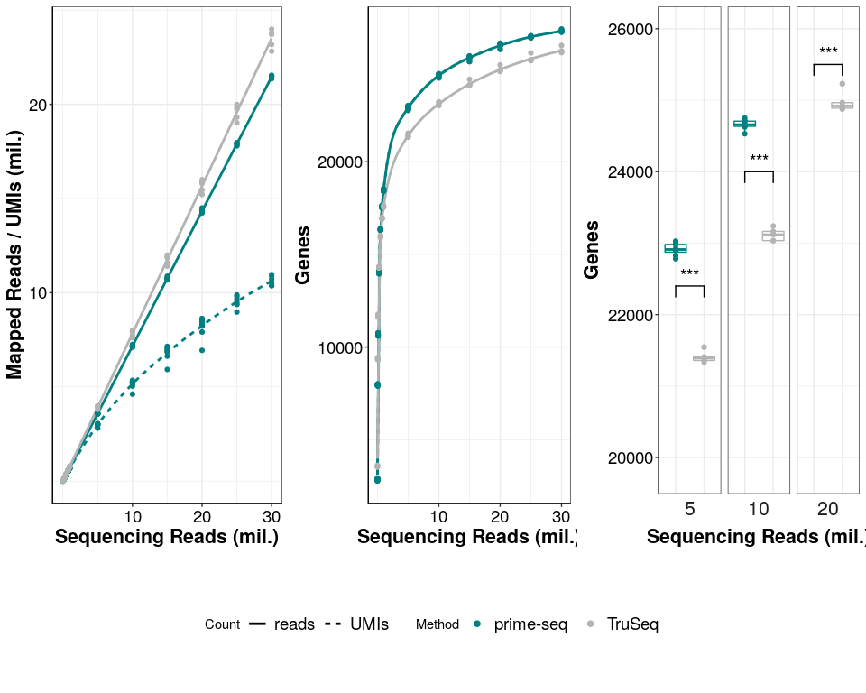
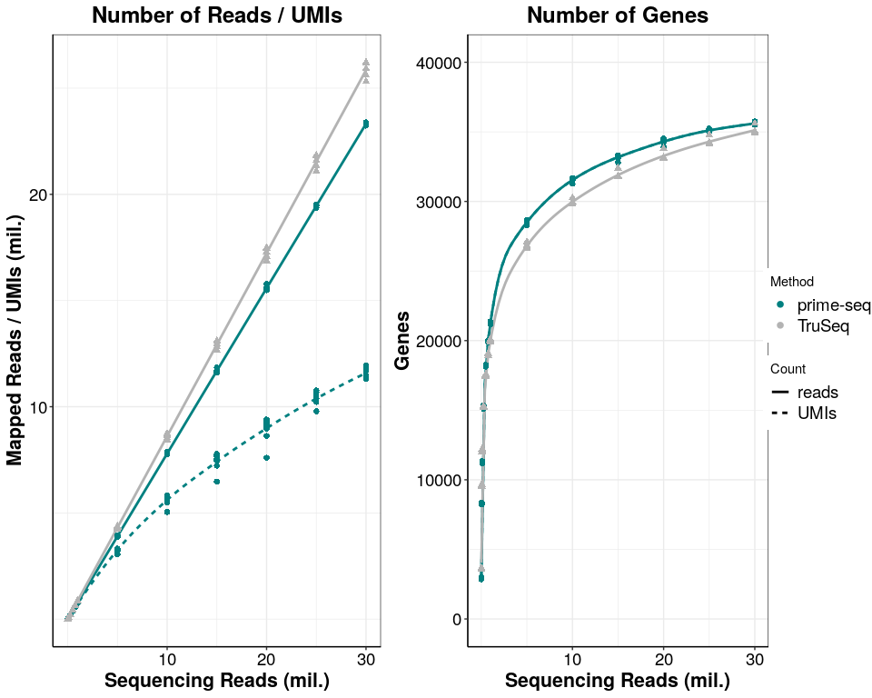
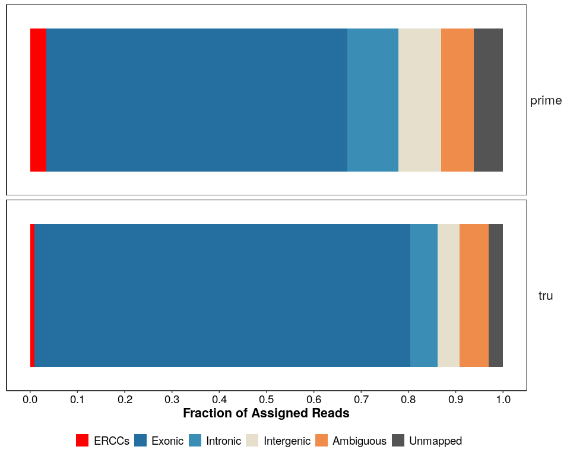

## Purpose:

Figure 3 - MAQC Comparison - Sensitivity plots

### 1. Load the following packages:

``` r
library(tidyverse)
library(ggsignif)
library(ggrepel)
library(edgeR)
library(genefilter)
library(grid)
library(gridExtra)
library(ggsci)
library(UpSetR)
library(cowplot)
library(biomaRt)
```

### 2. Load following functions:

``` r
### all necessary custom functions are in the following script
source(paste0(here::here(),"/0_Scripts/custom_functions.R"))

theme_pub <- theme_bw() + theme(
                                     plot.title = element_text(hjust = 0.5, size=18, face="bold"),
                                     axis.text = element_text(colour="black", size=14), 
                                     axis.title=element_text(size=16,face="bold"), 
                                     legend.text=element_text(size=14),
                                     legend.position="right",
                                     axis.line.x = element_line(colour = "black"), 
                                     axis.line.y = element_line(colour = "black"),
                                     strip.background=element_blank(), 
                                     strip.text=element_text(size=16))  

theme_set(theme_pub)

#prevent scientific notation
options(scipen=999)

fig_path <- paste0(here::here(),"/2_power_simulation/")
```

``` r
gtype_human <- data.frame( species="human", getbiotype("hsapiens_gene_ensembl",species="human"))
```

## Sensitivity

### 3. Load Data

``` r
counts_prime <- readRDS(paste0(fig_path,"prime-seq.dgecounts.rds"))
counts_tru <- readRDS(paste0(fig_path,"SEQC_PE.dgecounts.rds"))
    
inf <- read.csv(paste0(fig_path,"/sample_info.csv"), header = T, stringsAsFactors = F)

# subset only coding genes
coding_genes_prime<-rownames(counts_prime$umicount$inex$all)[!(rownames(counts_prime$umicount$inex$all)%in%gtype_human$Gencode)]
coding_genes_prime_reads<-rownames(counts_prime$readcount$inex$all)[!(rownames(counts_prime$readcount$inex$all)%in%gtype_human$Gencode)]
coding_genes_tru<-rownames(counts_tru$readcount$inex$all)[!(rownames(counts_tru$readcount$inex$all)%in%gtype_human$Gencode)]

# include mRNA, ERCCs, lncRNAs, mito, rRNA
genes_prime<-rownames(counts_prime$umicount$inex$all)
genes_prime_reads<-rownames(counts_prime$readcount$inex$all)
genes_tru<-rownames(counts_tru$readcount$inex$all)

# coding
inex_ds_df_prime <-collapse_downsampled_counts(zumismat = counts_prime,type="inex",frac.samples = 0.25,genes=coding_genes_prime,umi = T)
inex_ds_df_prime_reads <-collapse_downsampled_counts(zumismat = counts_prime,type="inex",frac.samples = 0.25,genes=coding_genes_prime_reads,umi = F)
inex_ds_df_tru <-collapse_downsampled_counts(zumismat = counts_tru,type="inex",frac.samples = 0.25,genes=coding_genes_tru, umi = F)

# include non-coding
inex_ds_df_nc_prime <-collapse_downsampled_counts(zumismat = counts_prime,type="inex",frac.samples = 0.25,genes=genes_prime,umi = T)
inex_ds_df_nc_prime_reads <-collapse_downsampled_counts(zumismat = counts_prime,type="inex",frac.samples = 0.25,genes=genes_prime_reads,umi = F)
inex_ds_df_nc_tru <-collapse_downsampled_counts(zumismat = counts_tru,type="inex",frac.samples = 0.25,genes=genes_tru, umi = F)

# plot mean gene expression
plot_mean_gene_prime <- mean_gene_exp(data = counts_prime, genes = coding_genes_prime_reads, UMI = F)
plot_mean_gene_prime
```

<!-- -->

``` r
plot_mean_gene_tru <- mean_gene_exp(data = counts_tru, genes = coding_genes_tru, UMI = F)
plot_mean_gene_tru
```

<!-- -->

### 4. Number of inex umis/reads and genes per sample per downsampling

``` r
# add data column
inex_ds_df_prime$data <- "prime-seq (UMIs)"
inex_ds_df_prime_reads$data <- "prime-seq"
inex_ds_df_tru$data <- "TruSeq"

inex_ds_df_nc_prime$data <- "prime-seq (UMIs)"
inex_ds_df_nc_prime_reads$data <- "prime-seq"
inex_ds_df_nc_tru$data <- "TruSeq"

# add method column
inex_ds_df_prime$method <- "prime-seq"
inex_ds_df_prime_reads$method <- "prime-seq"
inex_ds_df_tru$method <- "TruSeq"

inex_ds_df_nc_prime$method <- "prime-seq"
inex_ds_df_nc_prime_reads$method <- "prime-seq"
inex_ds_df_nc_tru$method <- "TruSeq"

# add UMI column
inex_ds_df_prime$readorumi <- "UMIs"
inex_ds_df_prime_reads$readorumi <- "reads"
inex_ds_df_tru$readorumi <- "reads"

inex_ds_df_nc_prime$readorumi <- "UMIs"
inex_ds_df_nc_prime_reads$readorumi <- "reads"
inex_ds_df_nc_tru$readorumi <- "reads"

# join df
ds_df <- bind_rows(inex_ds_df_prime, inex_ds_df_prime_reads, inex_ds_df_tru)
ds_df_nc <- bind_rows(inex_ds_df_nc_prime, inex_ds_df_nc_prime_reads, inex_ds_df_nc_tru)


# main plot -- only coding
a1 <- ggplot(data = ds_df, aes(x= depth, y = UMIs, color = method, group = data))+
  geom_smooth(method = "loess", se = F, aes(linetype=readorumi))+
  geom_point()+
  xlab("Sequencing Reads (mil.)")+
  ylab("Mapped Reads / UMIs (mil.)")+
  ylim(0,30000000)+
  scale_x_continuous(breaks = c(10000000,20000000,30000000), labels = c(10,20,30))+
  scale_y_continuous(breaks = c(10000000,20000000,30000000), labels = c(10,20,30))+
  theme_pub+
  scale_color_manual(values = c("#008080","gray70"),limits= force)+
  theme(legend.position="none")

b1 <- ggplot(data = ds_df, aes(x= depth, y = Genes, color = method, group = data))+
  geom_smooth(method = "gam", se = F, aes(linetype=readorumi))+
  geom_point()+
  xlab("Sequencing Reads (mil.)")+
  ylab("Genes")+
  scale_x_continuous(breaks = c(10000000,20000000,30000000), labels = c(10,20,30))+
  theme_pub+
  scale_color_manual(values = c("#008080","gray70"),limits= force)+
  theme(legend.position="none")

#calculate p values
ds_df_5 <- ds_df[ds_df$depth == 5000000 & ds_df$readorumi == "reads",] 
anno_5 <- t.test(ds_df_5[ds_df_5$method == "prime-seq", "Genes"], 
               ds_df_5[ds_df_5$method == "TruSeq", "Genes"])$p.value
ds_df_10 <- ds_df[ds_df$depth == 10000000 & ds_df$readorumi == "reads",] 
anno_10 <- t.test(ds_df_10[ds_df_10$method == "prime-seq", "Genes"], 
               ds_df_10[ds_df_10$method == "TruSeq", "Genes"])$p.value
ds_df_20 <- ds_df[ds_df$depth == 20000000 & ds_df$readorumi == "reads",] 
anno_20 <- t.test(ds_df_20[ds_df_20$method == "prime-seq", "Genes"], 
               ds_df_20[ds_df_20$method == "TruSeq", "Genes"])$p.value

#subset df for common seq depths
ds_df_common <-ds_df[ds_df$depth %in% c(5000000, 10000000, 20000000) & ds_df$readorumi == "reads",]

ds_df_common$depth[ds_df_common$depth == "5000000"] <- "5"
ds_df_common$depth[ds_df_common$depth == "10000000"] <- "10"
ds_df_common$depth[ds_df_common$depth == "20000000"] <- "20"

ds_df_common$depth <- factor(ds_df_common$depth, levels = c("5", "10", "20"))

annotation_df <- data.frame(depth=c("5", "10", "20"), 
                            start=c("prime-seq", "prime-seq", "prime-seq"), 
                            end=c("TruSeq", "TruSeq","TruSeq"),
                            label=c("***", "***", "***"),
                            y=c(22400,24000,25500),stringsAsFactors = T)

c1 <- ggplot(data = ds_df_common, aes(x= method, y = Genes))+
  facet_wrap(~depth, strip.position = "bottom")+
  geom_boxplot(aes(color = method))+
  geom_point(aes(color=method))+
  ylab("Genes")+
  xlab("Sequencing Reads (mil.)")+
  ylim(19800,26000)+
  geom_signif(data=annotation_df, aes(xmin=start, xmax=end, annotations=label, y_position=y),textsize = 5, vjust = 0, manual=TRUE)+
  theme_pub+
  scale_color_manual(values = c("#008080","gray70"),limits= force)+
  theme(legend.position="none",
        axis.text.x = element_blank(),
        axis.ticks.x = element_blank(),
        axis.line.x = element_blank())
  

sensitivity_legend <- ggplot(data = ds_df, aes(x= depth, y = Genes, color = method, group = data))+
  geom_smooth(method = "gam", se = F, aes(linetype=readorumi), color="black")+
  geom_point(size =2, aes(shape=method))+
  labs(color = "Method", linetype = "Count")+
  guides(shape = F)+
  theme_pub+
  scale_color_manual(values = c("#008080","gray70"),limits= force)+
  theme(legend.position = "bottom")

sensitivity_legend <- cowplot::get_legend(sensitivity_legend)

sensitivity_plots <- cowplot::plot_grid(a1, b1, c1,
  ncol = 3,
  nrow = 1
)
sensitivity_main <- cowplot::plot_grid(sensitivity_plots, sensitivity_legend,
  ncol = 1,
  nrow = 2,
  rel_heights = c(4,1)
)

sensitivity_main
```

<!-- -->

``` r
ggsave(sensitivity_main,
       device = "pdf",
       path = fig_path,
       width = 300,
       height=110,
       units = "mm",
       filename = "Fig3a.pdf"
       )

# supp plot -- includes non-coding

sa1 <- ggplot(data = ds_df_nc, aes(x= depth, y = UMIs, color = method, group = data))+
  geom_smooth(method = "loess", se = F, aes(linetype=readorumi))+
  geom_point(size =2, aes(shape=method))+
  xlab("Sequencing Reads (mil.)")+
  ylab("Mapped Reads / UMIs (mil.)")+
  ylim(0,30000000)+
  scale_x_continuous(breaks = c(10000000,20000000,30000000), labels = c(10,20,30))+
  scale_y_continuous(breaks = c(10000000,20000000,30000000), labels = c(10,20,30))+
  ggtitle("Number of Reads / UMIs")+
  theme_pub+
  scale_color_manual(values = c("#008080","gray70"),limits= force)+
  theme(legend.position="none")

sb1 <- ggplot(data = ds_df_nc, aes(x= depth, y = Genes, color = method, group = data))+
  geom_smooth(method = "gam", se = F, aes(linetype=readorumi))+
  geom_point(size =2, aes(shape=method))+
  xlab("Sequencing Reads (mil.)")+
  ylab("Genes")+
  ylim(0,40000)+
  scale_x_continuous(breaks = c(10000000,20000000,30000000), labels = c(10,20,30))+
  ggtitle("Number of Genes")+
  theme_pub+
  scale_color_manual(values = c("#008080","gray70"),limits= force)+
  theme(legend.position="none")

supp_sensitivity_legend <- ggplot(data = ds_df_nc, aes(x= depth, y = Genes, color = method, group = data))+
  geom_smooth(method = "gam", se = F, aes(linetype=readorumi), color="black")+
  geom_point(size =2, aes(shape=method))+
  labs(color = "Method", linetype = "Count")+
  guides(shape = F)+
  theme_pub+
  scale_color_manual(values = c("#008080","gray70"),limits= force)

supp_sensitivity_legend <- cowplot::get_legend(supp_sensitivity_legend)

supp_sensitivity <- cowplot::plot_grid(sa1, sb1, supp_sensitivity_legend,
  ncol = 3,
  nrow = 1,
  rel_widths = c(4,4,1)
)

supp_sensitivity
```

<!-- -->

## Features

### 5. Load and Process Data

``` r
#read files
readspercell_prime <- read.table("/data/share/htp/prime-seq_Paper/Fig_maqc_comparison/zUMIs/prime-seq/zUMIs_output/stats/prime-seq.readspercell.txt", header = T)
readspercell_tru <- read.table("/data/share/htp/prime-seq_Paper/Fig_maqc_comparison/zUMIs/SEQC_PE/zUMIs_output/stats/SEQC_PE.readspercell.txt", header = T)

colnames(readspercell_prime)[1] <- "BC" 
colnames(readspercell_tru)[1] <- "BC" 

#add info
readspercell_prime <- inner_join(readspercell_prime, inf, by = "BC")
readspercell_tru <- inner_join(readspercell_tru, inf, by = "BC")

#combine the tables
readspercell <- bind_rows(readspercell_prime, readspercell_tru)

## barplot
#calculate number of reads per method for type
Assigned <- readspercell %>% dplyr::group_by(Method) %>% dplyr::summarize(Assigned=sum(N)) %>% as.data.frame()
Unmapped <- readspercell %>% dplyr::group_by(Method) %>% filter(type == "Unmapped") %>% dplyr::summarize(Unmapped=sum(N)) %>% as.data.frame()
Ambiguous <- readspercell %>% dplyr::group_by(Method) %>% filter(type == "Ambiguity") %>% dplyr::summarize(Ambiguous=sum(N)) %>% as.data.frame()
Intergenic <- readspercell %>% dplyr::group_by(Method) %>% filter(type == "Intergenic") %>% dplyr::summarize(Intergenic=sum(N)) %>% as.data.frame()
Intronic <- readspercell %>% dplyr::group_by(Method) %>% filter(type == "Intron") %>% dplyr::summarize(Intronic=sum(N)) %>% as.data.frame()
Exonic <- readspercell %>% dplyr::group_by(Method) %>% filter(type == "Exon") %>% dplyr::summarize(Exonic=sum(N)) %>% as.data.frame()
ERCCs <- readspercell %>% dplyr::group_by(Method) %>% filter(type == "User") %>% dplyr::summarize(ERCCs=sum(N)) %>% as.data.frame()

#join data frames
dfs <- list(Assigned, Unmapped, Ambiguous, Intergenic, Intronic, Exonic, ERCCs)

readspermethod <- plyr::join_all(dfs, by = "Method")


#make long
readspermethod_long <- pivot_longer(readspermethod, cols = 3:8)

#change factor levels
readspermethod_long$name<-factor(readspermethod_long$name, levels= rev(c("ERCCs", "Exonic","Intronic", "Intergenic", "Ambiguous","Unmapped")))


## boxplot 
readspercell_total <- readspercell %>% dplyr::group_by(BC) %>% dplyr::summarize(Total=sum(N)) %>% as.data.frame()

readspercell <- left_join(readspercell, readspercell_total, by = "BC")
readspercell$fraction <- (readspercell$N / readspercell$Total)*100

readspercell$type[readspercell$type == "Ambiguity"] <- "Ambiguous"
readspercell$type[readspercell$type == "Intron"] <- "Intronic"
readspercell$type[readspercell$type == "Exon"] <- "Exonic"
readspercell$type[readspercell$type == "User"] <- "ERCCs"

readspercell$type<-factor(readspercell$type, levels= c("ERCCs", "Exonic","Intronic", "Intergenic", "Ambiguous","Unmapped"))
```

### 6. Generate Feature Plots

``` r
#feature bar plot
feat_cols<-c("#F08C4B", "#E5DFCC", "#3A8DB5", "#556f44", "#9dc183", "#4D8C57", "#256EA0","dodgerblue4", "red", "#545454")

names(feat_cols)<-c("Ambiguous","Intergenic","Intronic","Ribosomal","Mitochondrial","lncRNA","Exonic","Intragenic", "ERCCs", "Unmapped")

plot_feat_bar <- ggplot(readspermethod_long, aes(x=Method, y=value, fill=name))+
    geom_bar(stat="identity", position = "fill")+
    facet_grid(Method~., scales="free") +
    ylab("Fraction of Assigned Reads") +
    scale_y_continuous(breaks=seq(0,1,0.1)) +
    coord_flip() +
    scale_fill_manual(values = feat_cols,limits= force)+
    guides(fill = guide_legend(nrow =1, reverse=T))+
    theme_pub+
    theme(legend.title = element_blank(), 
          legend.position="bottom", 
          axis.title.y = element_blank(), 
          axis.text.y = element_blank(),
          strip.text.y = element_text(angle = 360),
          panel.grid.major = element_blank(), 
          panel.grid.minor = element_blank(),
          axis.ticks.y = element_blank()) 

plot_feat_bar
```

<!-- -->

``` r
ggsave(plot_feat_bar,
       device = "pdf",
       path = fig_path,
       width = 217,
       height=82,
       units = "mm",
       filename = "Fig3_supp_feat.pdf"
       )
```

## `R` Session Info

``` r
sessionInfo()
#> R version 4.1.0 (2021-05-18)
#> Platform: x86_64-pc-linux-gnu (64-bit)
#> Running under: Devuan GNU/Linux 3 (beowulf)
#> 
#> Matrix products: default
#> BLAS:   /usr/lib/x86_64-linux-gnu/openblas/libblas.so.3
#> LAPACK: /usr/lib/x86_64-linux-gnu/libopenblasp-r0.3.5.so
#> 
#> locale:
#>  [1] LC_CTYPE=en_US.UTF-8       LC_NUMERIC=C              
#>  [3] LC_TIME=en_US.UTF-8        LC_COLLATE=en_US.UTF-8    
#>  [5] LC_MONETARY=en_US.UTF-8    LC_MESSAGES=en_US.UTF-8   
#>  [7] LC_PAPER=en_US.UTF-8       LC_NAME=C                 
#>  [9] LC_ADDRESS=C               LC_TELEPHONE=C            
#> [11] LC_MEASUREMENT=en_US.UTF-8 LC_IDENTIFICATION=C       
#> 
#> attached base packages:
#> [1] grid      stats     graphics  grDevices utils     datasets  methods  
#> [8] base     
#> 
#> other attached packages:
#>  [1] biomaRt_2.48.3    cowplot_1.1.1     UpSetR_1.4.0      ggsci_2.9        
#>  [5] gridExtra_2.3     genefilter_1.74.1 edgeR_3.34.1      limma_3.48.3     
#>  [9] ggrepel_0.9.1     ggsignif_0.6.3    forcats_0.5.1     stringr_1.4.0    
#> [13] dplyr_1.0.7       purrr_0.3.4       readr_2.1.0       tidyr_1.1.4      
#> [17] tibble_3.1.6      ggplot2_3.3.5     tidyverse_1.3.1  
#> 
#> loaded via a namespace (and not attached):
#>   [1] colorspace_2.0-2       ellipsis_0.3.2         rprojroot_2.0.2       
#>   [4] XVector_0.32.0         fs_1.5.0               rstudioapi_0.13       
#>   [7] farver_2.1.0           bit64_4.0.5            AnnotationDbi_1.54.1  
#>  [10] fansi_0.5.0            lubridate_1.8.0        xml2_1.3.2            
#>  [13] splines_4.1.0          cachem_1.0.6           knitr_1.36            
#>  [16] jsonlite_1.7.2         broom_0.7.10           annotate_1.70.0       
#>  [19] cluster_2.1.2          dbplyr_2.1.1           png_0.1-7             
#>  [22] compiler_4.1.0         httr_1.4.2             backports_1.4.0       
#>  [25] assertthat_0.2.1       Matrix_1.3-4           fastmap_1.1.0         
#>  [28] cli_3.1.0              htmltools_0.5.2        prettyunits_1.1.1     
#>  [31] tools_4.1.0            gtable_0.3.0           glue_1.5.0            
#>  [34] GenomeInfoDbData_1.2.6 rappdirs_0.3.3         Rcpp_1.0.7            
#>  [37] Biobase_2.52.0         cellranger_1.1.0       vctrs_0.3.8           
#>  [40] Biostrings_2.60.2      nlme_3.1-153           xfun_0.28             
#>  [43] rvest_1.0.2            lifecycle_1.0.1        XML_3.99-0.8          
#>  [46] zlibbioc_1.38.0        MASS_7.3-54            scales_1.1.1          
#>  [49] ragg_1.2.0             hms_1.1.1              parallel_4.1.0        
#>  [52] yaml_2.2.1             curl_4.3.2             memoise_2.0.1         
#>  [55] stringi_1.7.4          RSQLite_2.2.8          highr_0.9             
#>  [58] S4Vectors_0.30.2       permute_0.9-5          BiocGenerics_0.38.0   
#>  [61] filelock_1.0.2         GenomeInfoDb_1.28.4    systemfonts_1.0.3     
#>  [64] rlang_0.4.12           pkgconfig_2.0.3        bitops_1.0-7          
#>  [67] evaluate_0.14          lattice_0.20-45        labeling_0.4.2        
#>  [70] bit_4.0.4              tidyselect_1.1.1       here_1.0.1            
#>  [73] plyr_1.8.6             magrittr_2.0.1         R6_2.5.1              
#>  [76] IRanges_2.26.0         generics_0.1.1         DBI_1.1.1             
#>  [79] pillar_1.6.4           haven_2.4.3            withr_2.4.2           
#>  [82] mgcv_1.8-38            survival_3.2-13        KEGGREST_1.32.0       
#>  [85] RCurl_1.98-1.5         modelr_0.1.8           crayon_1.4.2          
#>  [88] utf8_1.2.2             BiocFileCache_2.0.0    tzdb_0.2.0            
#>  [91] rmarkdown_2.11         progress_1.2.2         locfit_1.5-9.4        
#>  [94] readxl_1.3.1           blob_1.2.2             vegan_2.5-7           
#>  [97] reprex_2.0.1           digest_0.6.28          xtable_1.8-4          
#> [100] textshaping_0.3.6      stats4_4.1.0           munsell_0.5.0
```
