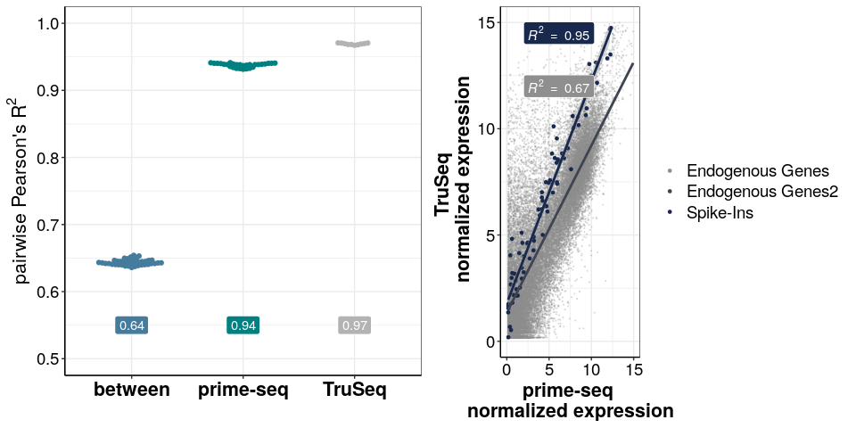
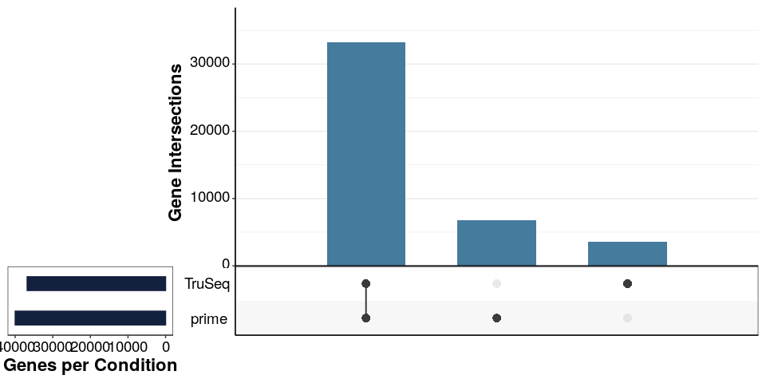
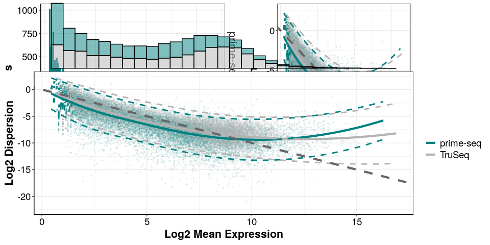

## Purpose:

Showing correlations of samples within and between methods as well as
comparability of dat sets.

### 1. Load the following packages:

``` r
library(ggplot2)
library(cowplot)
library(tidyverse)
library(corrplot)
library(RColorBrewer)
library(ggbeeswarm)
library(UpSetR)
library(ggplotify)
```

``` r
### all necessary custom functions are in the following scripts
source(paste0(here::here(),"/0_Scripts/custom_functions.R"))

theme_pub <- theme_bw() + theme(plot.title = element_text(hjust = 0.5, 
                                                          size=18, face="bold"),
                                     axis.text = element_text(colour="black", size=14), 
                                     axis.title=element_text(size=16,face="bold"), 
                                     legend.text=element_text(size=14),
                                     legend.position="right",
                                     axis.line.x = element_line(colour = "black"), 
                                     axis.line.y = element_line(colour = "black"),
                                     strip.background=element_blank(), 
                                     strip.text=element_text(size=16))  
theme_set(theme_pub)


fig_path <- paste0(here::here(),"/2_power_simulation/")


## colours

method_cols<-c("#008080","gray70","#457b9d")
names(method_cols)<-c("prime-seq","TruSeq","between")

endo_cols<-c("#19294D","#8F8F8F","#3E4451")
names(endo_cols)<-c("Spike-Ins","Endogenous Genes","Endogenous Genes2")
```

### 2. Load the data

``` r
## tru_seq

tru_inex<-readRDS(paste0(fig_path,"/SEQC_PE.dgecounts.rds"))$readcount$inex$downsampling$downsampled_20000000 %>% as.matrix()

tru_ercc<-tru_inex[grep(rownames(tru_inex),pattern="ERCC*"),]
tru_inex<-tru_inex[grep(rownames(tru_inex),pattern="ERCC*",invert = T),]
tru_inex<-remove_Geneversion(as.matrix(tru_inex))
tru_inex<-tru_inex[whichgenes_reproducible(tru_inex,exprcutoff = 1,reproducecutoff = 0.25),]
tru_inex<-rbind(tru_inex,tru_ercc)

## prime_seq

# Reads
prime_inex_reads<-readRDS(paste0(fig_path,"/prime-seq.dgecounts.rds"))$readcount$inex$downsampling$downsampled_20000000 %>% as.matrix()


prime_ercc_reads<-prime_inex_reads[grep(rownames(prime_inex_reads),pattern="ERCC*"),]
prime_inex_reads<-prime_inex_reads[grep(rownames(prime_inex_reads),pattern="ERCC*",invert = T),]
prime_inex_reads<-remove_Geneversion(as.matrix(prime_inex_reads))
prime_inex_reads<-prime_inex_reads[whichgenes_reproducible(prime_inex_reads,exprcutoff = 1,reproducecutoff = 0.25),]
prime_inex_reads<-rbind(prime_inex_reads,prime_ercc_reads)


# UMIs
prime_inex<-readRDS(paste0(fig_path,"/prime-seq.dgecounts.rds"))$umicount$inex$downsampling$downsampled_20000000 %>% as.matrix()

prime_ercc<-prime_inex[grep(rownames(prime_inex),pattern="ERCC*"),]
prime_inex<-prime_inex[grep(rownames(prime_inex),pattern="ERCC*",invert = T),]
prime_inex<-remove_Geneversion(as.matrix(prime_inex))
prime_inex<-prime_inex[whichgenes_reproducible(prime_inex,exprcutoff = 1,reproducecutoff = 0.25),]
prime_inex<-rbind(prime_inex,prime_ercc)


### Combining dataframes
comb_inex<-merge(tru_inex,prime_inex,by="row.names",all=F)

comb_inex_reads<-merge(tru_inex,prime_inex_reads,by="row.names",all=F)


comb_inex<-comb_inex %>% 
  column_to_rownames(var = "Row.names") %>% 
  as.matrix()


comb_inex_reads<-comb_inex_reads %>% 
  column_to_rownames(var = "Row.names") %>% 
  as.matrix()


### make info
info<-data.frame(BC=c(colnames(prime_inex),colnames(tru_inex)),
                 method=rep(c("prime-seq","TruSeq"),c(8,5)))
```

### 3. Normalize

``` r
library(DESeq2)
des_reads <- DESeqDataSetFromMatrix( countData = comb_inex_reads,
                               colData = info,
                               design = ~ 0 + method)

des_reads<-DESeq2::varianceStabilizingTransformation(des_reads)

norm_reads<-assay(des_reads)

library(DESeq2)
des_umi <- DESeqDataSetFromMatrix( countData = comb_inex,
                               colData = info,
                               design = ~ 0 + method)

des_umi<-DESeq2::varianceStabilizingTransformation(des_umi)

norm_umi<-assay(des_umi)
```

### 4. Pairwise correlations within and between methods

``` r
log_mat<-norm_umi

log_mat_reads<-norm_reads

lt <- cor(log_mat,method = "pearson")

lt <-lt^2
  
lt[lower.tri(lt)]<-""
diag(lt)<-""

cor_df<-lt %>% 
  reshape2::melt(value.name = "cor",varnames=c("BC", "BC2")) %>%
  filter(cor!="") %>% 
  left_join(info) %>% 
  select(-BC) %>% 
  left_join(info,by=c("BC2"="BC")) %>% 
  select(-BC2) %>% 
  mutate(type=if_else(method.x==method.y,"within","between"),
         method_col=if_else(type=="between","between",method.x)) %>% 
  mutate(cor=as.numeric(cor),
         rr=as.numeric(cor))

mean_df<-cor_df %>% 
  group_by(method_col) %>% 
  summarise(cor=round(median(cor),digits = 2))

sample_cor_umi<-ggplot(cor_df,aes(x=method_col,y=cor,colour=method_col))+
  geom_beeswarm()+
  geom_label(data=mean_df,aes(label=cor,y=0.55,fill=method_col),colour="white")+
  scale_colour_manual(values = method_cols)+
  scale_fill_manual(values = method_cols)+
  labs(x="",y=bquote("pairwise Pearson's R"^2))+
  theme(legend.position = "none",
        axis.text.x=element_text(size=16,face="bold"))+
  scale_y_continuous(limits = c(0.5,1))
```

### 5. Correlate mean expression

``` r

mean_exp_umi<-log_mat%>% 
  as.data.frame() %>% 
  rownames_to_column(var="Gene") %>% 
  pivot_longer(names_to = "BC",values_to="count",cols=-Gene) %>% 
  left_join(info) %>% 
  group_by(method,Gene) %>% 
  dplyr::summarize(mean_exp=mean(count)) %>% 
  mutate(spike_in=if_else(Gene %in% grep(Gene,pattern="ERCC*",
                                         value = T),
                          "Spike-Ins","Endogenous Genes")) %>% 
  pivot_wider(names_from = "method",values_from="mean_exp") %>% 
  as.data.frame()

mean_exp_umi<-mean_exp_umi %>% 
  mutate(spike_label=if_else(spike_in=="Endogenous Genes","Endogenous Genes2",spike_in))

endo<-subset(mean_exp_umi,spike_in=="Endogenous Genes")
spike<-subset(mean_exp_umi,spike_in!="Endogenous Genes")

gene_cor_umi<-ggplot()+
  geom_point(data=endo,
             aes(y=`prime-seq`,
                 x=`TruSeq`,
                 colour=spike_in),
             alpha=0.2,
             size=0.2)+
  geom_point(data=spike,
             aes(y=`prime-seq`,
                 x=`TruSeq`,
                 colour=spike_in),
             alpha=1,
             size=1)+
  geom_smooth(data=mean_exp_umi,
              aes(y=`prime-seq`,
                  x=`TruSeq`,
                  colour=spike_label),
              method = "lm",
              show.legend = F)+
  ggpubr::stat_cor(data=mean_exp_umi,
                   aes(y=`prime-seq`,
                       x=`TruSeq`,
                       fill=spike_in,
                       label=paste(..rr.label..)),
                   method = "pearson",
                   geom = "label",
                   colour="white",
                   label.x = c(2),
                   label.y=c(12,14.5),
              show.legend = F)+
  theme(axis.line.y = element_line(),
        legend.position="right")+
  scale_colour_manual(values=endo_cols,limits= force )+
  scale_fill_manual(values=endo_cols)+
  xlab("prime-seq \n normalized expression ")+
  ylab("TruSeq \n normalized expression")+
  labs(colour="")+
  ylim(0,15)+
  xlim(0,15)


gene_cor_umi
```

<!-- -->

``` r
plot_grid(sample_cor_umi,gene_cor_umi,nrow=1)
```

<!-- -->

### 6. upsetR plot of genes expressen in TruSeq and prime-seq

``` r
comb_inex_full<-merge(tru_inex,prime_inex,by="row.names",all=T)

upset_df<-data.frame(prime=rowSums(comb_inex_full[,colnames(comb_inex_full)%in%subset(info,method=="prime-seq")$BC]),
                        TruSeq=rowSums(comb_inex_full[,colnames(comb_inex_full)%in%subset(info,method=="TruSeq")$BC]),
                        Gene=rownames(comb_inex_full))

upset_df <- upset_df %>%
  mutate(prime = ifelse(prime > 0, paste(Gene), NA),
         TruSeq = ifelse(TruSeq > 0, paste(Gene), NA)) %>%
  dplyr::select(-Gene) %>%
  filter_all(any_vars(!is.na(.)))

upset_comp <- upset(fromList(upset_df), order.by = "freq",
                 mainbar.y.label = "Gene Intersections", 
                 sets.x.label="Genes per Condition",
                 main.bar.color = "#457b9d", 
                 sets.bar.color = "#14213d", 
                 text.scale = c(2, 2, 2, 2, 2, 2),
                 point.size = 3.5,show.numbers = F)

upset_comp
```

<!-- -->

``` r
table(fromList(upset_df))
#>      TruSeq
#> prime     0     1
#>     0     0  3589
#>     1  6766 33230
```

### 7. Plot mean dispersion plot for both methods

``` r
load(paste0(fig_path,"/estparam_all.Rdata"))

mv_prime<-Get_Mean_Disp(estparam_gene_prime_inex)

mv_tru<-Get_Mean_Disp(estparam_gene_tru_inex)

meanvsdisp.dat<-rbind(mv_prime$meanvsdisp.dat,mv_tru$meanvsdisp.dat)
meanvsdisp.dat$method<-rep(c("prime-seq","TruSeq"),times=c(nrow(mv_prime$meanvsdisp.dat),nrow(mv_tru$meanvsdisp.dat)))

meanvsdisp.fdat<-rbind(mv_prime$meanvsdisp.fdat,mv_tru$meanvsdisp.fdat)
meanvsdisp.fdat$method<-rep(c("prime-seq","TruSeq"),times=c(nrow(mv_prime$meanvsdisp.fdat),nrow(mv_tru$meanvsdisp.fdat)))

cdisp<-c(mv_prime$cdisp,mv_tru$cdisp)

Fig_mean_disp <- ggplot(data=meanvsdisp.dat,
                                     aes(x=Mean,
                                         y=Dispersion,
                                         col=method)) +
  geom_point(size=0.5,alpha=0.1) +
  geom_line(data = meanvsdisp.fdat,
                      aes(x = Mean,
                           y = Dispersion,
                           col=method),
                      linetype=1,
                      size=1.5) +
  geom_line(data = meanvsdisp.fdat,
                       aes(x = Mean,
                           col=method),
              linetype=2,
              size=1) +
  geom_line(data = meanvsdisp.fdat,
                       aes(x = Mean,
                            y = Upper,
                           col=method),
                       linetype=2,
                       size=1) +
   geom_line(data = meanvsdisp.fdat,
                       aes(x = Mean,
                            y = Lower,
                           col=method),
                       linetype=2,
                       size=1) +
  geom_abline(intercept = 0,
                        slope = -1,
                        linetype = 2,
                        colour="grey40",
                        size=1.5) +
  scale_colour_manual(values=method_cols[1:2])+
  labs(x="Log2 Mean Expression",
        y="Log2 Dispersion",colour="")+
  theme(legend.position="bottom")+
  theme(legend.position = "right")
 
Fig_mean_disp_mar<-Fig_mean_disp+scale_x_continuous(limits = c(0,12))
Fig_mean_disp_mar<-ggExtra::ggMarginal(Fig_mean_disp_mar, type="histogram", 
                                       size=2,margins = "x",groupFill = T)

Fig_mean_disp_rev<-ggExtra::ggMarginal(Fig_mean_disp,
                                       type="histogram",
                                       size=2,
                                       margins = "x",
                                       groupFill = T)


Fig_mean_count<-ggplot(data=meanvsdisp.dat,aes(x=Mean))+
  geom_histogram(aes(fill=method),bins = 100)+
  scale_fill_manual(values=method_cols[1:2])+
  labs(x="Log2 Mean Expression",y="Number of Genes")+
  theme(legend.position = "none")+
  facet_grid(method~.)
  
Fig_3B<-plot_grid(Fig_mean_count,Fig_mean_disp,ncol=2)

Fig_3B

Fig_mean_disp_rev
```

<!-- -->

### 8. Save plots

``` r
# Exporting Individual Plots

ggsave(Fig_mean_disp_mar,
       device = "pdf",
       path = fig_path,
       width = 200,
       height=95,
       units = "mm",
       filename = "Fig3_Mean_disp.pdf"
       )

ggsave(Fig_mean_disp_mar,
       device = "png",
       path = fig_path,
       width = 200,
       height=95,
       units = "mm",
       filename = "Fig3_Mean_disp.png"
       )

ggsave(Fig_mean_disp_rev,
       device = "png",
       path = fig_path,
       width = 200,
       height=95,
       units = "mm",
       filename = "Fig3_Mean_disp_rev.png"
       )

ggsave(as.grob(upset_comp),
       device = "pdf",
       path = fig_path,
       width = 170,
       height= 130,
       units = "mm",
       filename = "Tru_prime_upset.pdf"
       )


ggsave(sample_cor_umi,
       device = "pdf",
       path = fig_path,
       width = 105,
       height= 90,
       units = "mm",
       filename = "Tru_prime_paircor.pdf"
       )


ggsave(gene_cor_umi,
       device = "png",
       path = fig_path,
       width = 210,
       height= 95,
       units = "mm",
       filename = "Tru_prime_cor.png"
       )
```

## `R` Session Info

``` r
sessionInfo()
#> R version 4.1.0 (2021-05-18)
#> Platform: x86_64-pc-linux-gnu (64-bit)
#> Running under: Devuan GNU/Linux 3 (beowulf)
#> 
#> Matrix products: default
#> BLAS:   /usr/lib/x86_64-linux-gnu/openblas/libblas.so.3
#> LAPACK: /usr/lib/x86_64-linux-gnu/libopenblasp-r0.3.5.so
#> 
#> locale:
#>  [1] LC_CTYPE=en_US.UTF-8       LC_NUMERIC=C              
#>  [3] LC_TIME=en_US.UTF-8        LC_COLLATE=en_US.UTF-8    
#>  [5] LC_MONETARY=en_US.UTF-8    LC_MESSAGES=en_US.UTF-8   
#>  [7] LC_PAPER=en_US.UTF-8       LC_NAME=C                 
#>  [9] LC_ADDRESS=C               LC_TELEPHONE=C            
#> [11] LC_MEASUREMENT=en_US.UTF-8 LC_IDENTIFICATION=C       
#> 
#> attached base packages:
#> [1] parallel  stats4    stats     graphics  grDevices utils     datasets 
#> [8] methods   base     
#> 
#> other attached packages:
#>  [1] DESeq2_1.32.0               SummarizedExperiment_1.22.0
#>  [3] Biobase_2.52.0              MatrixGenerics_1.4.3       
#>  [5] matrixStats_0.61.0          GenomicRanges_1.44.0       
#>  [7] GenomeInfoDb_1.28.4         IRanges_2.26.0             
#>  [9] S4Vectors_0.30.2            BiocGenerics_0.38.0        
#> [11] Matrix_1.3-4                ggplotify_0.1.0            
#> [13] UpSetR_1.4.0                ggbeeswarm_0.6.0           
#> [15] RColorBrewer_1.1-2          corrplot_0.92              
#> [17] forcats_0.5.1               stringr_1.4.0              
#> [19] dplyr_1.0.7                 purrr_0.3.4                
#> [21] readr_2.1.0                 tidyr_1.1.4                
#> [23] tibble_3.1.6                tidyverse_1.3.1            
#> [25] cowplot_1.1.1               ggplot2_3.3.5              
#> 
#> loaded via a namespace (and not attached):
#>   [1] readxl_1.3.1           backports_1.4.0        systemfonts_1.0.3     
#>   [4] plyr_1.8.6             splines_4.1.0          BiocParallel_1.26.2   
#>   [7] digest_0.6.28          yulab.utils_0.0.4      htmltools_0.5.2       
#>  [10] fansi_0.5.0            magrittr_2.0.1         memoise_2.0.1         
#>  [13] tzdb_0.2.0             Biostrings_2.60.2      annotate_1.70.0       
#>  [16] modelr_0.1.8           colorspace_2.0-2       blob_1.2.2            
#>  [19] rvest_1.0.2            textshaping_0.3.6      haven_2.4.3           
#>  [22] xfun_0.28              crayon_1.4.2           RCurl_1.98-1.5        
#>  [25] jsonlite_1.7.2         genefilter_1.74.1      survival_3.2-13       
#>  [28] glue_1.5.0             gtable_0.3.0           zlibbioc_1.38.0       
#>  [31] XVector_0.32.0         DelayedArray_0.18.0    car_3.0-12            
#>  [34] abind_1.4-5            scales_1.1.1           DBI_1.1.1             
#>  [37] rstatix_0.7.0          miniUI_0.1.1.1         Rcpp_1.0.7            
#>  [40] xtable_1.8-4           gridGraphics_0.5-1     bit_4.0.4             
#>  [43] mclust_5.4.8           httr_1.4.2             ellipsis_0.3.2        
#>  [46] pkgconfig_2.0.3        XML_3.99-0.8           farver_2.1.0          
#>  [49] dbplyr_2.1.1           locfit_1.5-9.4         utf8_1.2.2            
#>  [52] here_1.0.1             tidyselect_1.1.1       labeling_0.4.2        
#>  [55] rlang_0.4.12           reshape2_1.4.4         later_1.3.0           
#>  [58] AnnotationDbi_1.54.1   munsell_0.5.0          cellranger_1.1.0      
#>  [61] tools_4.1.0            cachem_1.0.6           cli_3.1.0             
#>  [64] generics_0.1.1         RSQLite_2.2.8          broom_0.7.10          
#>  [67] evaluate_0.14          fastmap_1.1.0          yaml_2.2.1            
#>  [70] ragg_1.2.0             knitr_1.36             bit64_4.0.5           
#>  [73] fs_1.5.0               KEGGREST_1.32.0        nlme_3.1-153          
#>  [76] mime_0.12              ggExtra_0.9            xml2_1.3.2            
#>  [79] compiler_4.1.0         rstudioapi_0.13        beeswarm_0.4.0        
#>  [82] png_0.1-7              msir_1.3.3             ggsignif_0.6.3        
#>  [85] reprex_2.0.1           geneplotter_1.70.0     stringi_1.7.4         
#>  [88] highr_0.9              lattice_0.20-45        vctrs_0.3.8           
#>  [91] pillar_1.6.4           lifecycle_1.0.1        bitops_1.0-7          
#>  [94] httpuv_1.6.3           R6_2.5.1               promises_1.2.0.1      
#>  [97] gridExtra_2.3          vipor_0.4.5            assertthat_0.2.1      
#> [100] rprojroot_2.0.2        withr_2.4.2            GenomeInfoDbData_1.2.6
#> [103] mgcv_1.8-38            hms_1.1.1              grid_4.1.0            
#> [106] rmarkdown_2.11         carData_3.0-4          ggpubr_0.4.0          
#> [109] shiny_1.7.1            lubridate_1.8.0
```
