## Purpose:

Test power to detect differentially expressed Genes for TruSeq as well
as prime-seq using powsimR

### 1. Load the following packages:

``` r
library(powsimR)
library(ggplot2)
library(stringr)
library(cowplot)
library(tibble)
library(dplyr)
library(tidyr)
library(readr)
library(strex)
```

### 2. Estimate parameters for prime-seq, TruSeq, exon and inex

#### 2.1 TruSeq

``` r
## TruSeq inex

tru_inex<-readRDS(paste0(fig_path,"/SEQC_PE.dgecounts.rds"))$readcount$inex$downsampling$downsampled_10000000 %>% as.matrix()

tru_ercc<-tru_inex[grep(rownames(tru_inex),pattern = "ERCC*"),]

ercc_fraction_tru<-colSums(tru_ercc)/colSums(tru_inex)

tru_inex<-tru_inex[grep(rownames(tru_inex),pattern = "ERCC*",invert = T),]

tru_inex<-remove_Geneversion(as.matrix(tru_inex))

tru_inex<-tru_inex[whichgenes_reproducible(tru_inex,exprcutoff = 1,reproducecutoff = 0.25),]

# estimation
# estparam_gene_tru_inex<- estimateParam(countData = tru_inex,Normalisation = "MR",
#                           RNAseq = "bulk", Protocol = 'Read',
#                           Distribution = 'NB',
#                           GeneFilter = 0.1, SampleFilter = 5,
#                           sigma = 1.96, NCores = NULL, verbose = TRUE)
# 
# plotting
#plotParam(estParamRes = estparam_gene_tru_inex, Annot = F)


## TruSeq exon

tru_exon<-readRDS(paste0(fig_path,"/SEQC_PE.dgecounts.rds"))$readcount$exon$downsampling$downsampled_10000000%>% as.matrix()

tru_exon<-tru_exon[grep(rownames(tru_exon),pattern = "ERCC*",invert = T),]

tru_exon<-remove_Geneversion(as.matrix(tru_exon))

tru_exon<-tru_exon[whichgenes_reproducible(tru_exon,exprcutoff = 1,reproducecutoff = 0.25),]

# estimation
# estparam_gene_tru_ex <- estimateParam(countData = tru_exon,Normalisation = "MR",
#                           RNAseq = "bulk", Protocol = 'Read',
#                           Distribution = 'NB',
#                           GeneFilter = 0.1, SampleFilter = 5,
#                           sigma = 1.96, NCores = NULL, verbose = TRUE)
# 
# plotting
#plotParam(estParamRes = estparam_gene_tru_ex, Annot = F)
```

#### 2.2 prime-seq

``` r
## prime-seq inex

prime_inex<-readRDS(paste0(fig_path,"prime-seq.dgecounts.rds"))$umicount$inex$downsampling$downsampled_10000000 %>% as.matrix()

prime_ercc<-prime_inex[grep(rownames(prime_inex),pattern = "ERCC*"),]
ercc_fraction_prime<-colSums(prime_ercc)/colSums(prime_inex)

prime_inex<-prime_inex[grep(rownames(prime_inex),pattern = "ERCC*",invert = T),]

prime_inex<-remove_Geneversion(as.matrix(prime_inex))

prime_inex<-prime_inex[whichgenes_reproducible(prime_inex,exprcutoff = 1,reproducecutoff = 0.25),]

# # estimation
# estparam_gene_prime_inex<- estimateParam(countData = prime_inex,Normalisation = "MR",
#                           RNAseq = "bulk", Protocol = 'UMI',
#                           Distribution = 'NB',
#                           GeneFilter = 0.1, SampleFilter = 5,
#                           sigma = 1.96, NCores = NULL, verbose = TRUE)
# 
# plotting
#plotParam(estParamRes = estparam_gene_prime_inex, Annot = F)


## prime-seq exon

prime_exon<-readRDS(paste0(fig_path,"prime-seq.dgecounts.rds"))$umicount$exon$downsampling$downsampled_10000000 %>% as.matrix()


prime_exon<-prime_exon[grep(rownames(prime_exon),pattern = "ERCC*",invert = T),]


prime_exon<-remove_Geneversion(as.matrix(prime_exon))

prime_exon<-prime_exon[whichgenes_reproducible(prime_exon,exprcutoff = 1,reproducecutoff = 0.25),]

# estimation
# estparam_gene_prime_ex <- estimateParam(countData = prime_exon,Normalisation = "MR",
#                           RNAseq = "bulk", Protocol = 'UMI',
#                           Distribution = 'NB',
#                           GeneFilter = 0.1, SampleFilter = 5,
#                           sigma = 1.96, NCores = NULL, verbose = TRUE)
# 
# plotting
#plotParam(estParamRes = estparam_gene_prime_ex, Annot = F)
```

##### Save Estimated Parameters

``` r
# save(estparam_gene_prime_ex,estparam_gene_prime_inex,estparam_gene_tru_ex,estparam_gene_tru_inex,prime_ercc,tru_ercc,ercc_fraction_prime,ercc_fraction_tru,
#      file=paste0(fig_path,"/estparam_all.Rdata"))

load(file=paste0(fig_path,"estparam_all.Rdata"))
```

#### 2.3 Estimate Spike parameters

``` r
library(DropletUtils)

ds<-mean(ercc_fraction_tru)/mean(ercc_fraction_prime)

prime_ercc_ds<-downsampleMatrix(prime_ercc,prop = ds)

vol_per_well<-(2.5/127.5)*5 ## 2.5 µl ERCCs 1:1000 in 127.5 µl total Vol times 5 µl per well

vol_UHRR_per_well <- (2.8*100/127.5)*(5-vol_per_well)

spike_info_prime<-Spike_calc(Mix = 1,Dilution = 1000,Volume = vol_per_well)%>% 
  arrange(SpikeID)

vol_per_well<-(50/2550)*10 ## 50 µl ERCCs 1:1 in 2550 µl total Vol times 10 µl per well

vol_UHRR_per_well <- (2800/2550)*(10 -vol_per_well) # in µg

spike_info_tru_dummy<-Spike_calc(Mix = 1,Dilution = 100,Volume = vol_per_well)%>% 
  arrange(SpikeID)

spike_info_tru<-Spike_calc(Mix = 1,Dilution = 1,Volume = vol_per_well)%>% 
  arrange(SpikeID)


prime_ercc_ds<-prime_ercc_ds %>%  as.matrix()

prime_ercc_ds<-prime_ercc_ds[rowSums(prime_ercc_ds)>0,]

spike_info_prime_red<-spike_info_prime[spike_info_prime$SpikeID %in% rownames(prime_ercc_ds),] 

# estimation
estparam_spike_prime <- estimateSpike(spikeData = prime_ercc_ds,
spikeInfo = spike_info_prime,
MeanFragLength = NULL,
batchData = NULL,
Normalisation = 'depth',
RNAseq = "bulk",
Protocol = "UMI")

tru_ercc<-tru_ercc %>%  as.matrix()

tru_ercc<-tru_ercc[rowSums(tru_ercc)>0,]

spike_info_tru_red<-spike_info_tru[spike_info_tru$SpikeID %in% rownames(tru_ercc),] 

estparam_spike_tru <- estimateSpike2(spikeData = tru_ercc,
spikeInfo = spike_info_tru_dummy,
MeanFragLength = NULL,
batchData = NULL,
Normalisation = 'depth',
RNAseq = "bulk",
Protocol = "Read",
Theta_start = 0.01)
```

#### Plot Spike-in correlation

``` r
# extract and combine dataframes

tru_spike_df<-get_Spike_plot_dfs(estSpike = estparam_spike_tru,cond="TruSeq",spike_info = spike_info_tru_red)
prime_spike_df<-get_Spike_plot_dfs(estparam_spike_prime,cond="prime-seq",spike_info = spike_info_prime_red)

spike_df_cal<-bind_rows(tru_spike_df$cal.info.dat,prime_spike_df$cal.info.dat)

ERCC_length_GC <- read_delim(paste0(fig_path,"/ERCC_length_GC.txt"), 
    "\t", escape_double = FALSE, trim_ws = TRUE)

spike_df_cal<-spike_df_cal %>% 
  group_by(cond,SampleID) %>% 
  mutate(sres=rstandard(lm(LExpectation~LSpikeInput)))

options(scipen=999)
  
spike_df_length_GC<-spike_df_cal %>% 
  left_join(ERCC_length_GC) %>% 
  group_by(cond,SpikeID) %>% 
  summarise(LSpikeInput=mean(LSpikeInput),
            LExpectation=mean(LExpectation),
            GC=mean(GC)*100,
            length=mean(Length),
            LError=mean(LError),
            Error=mean(Error),
            sres=mean(sres)) %>% 
  group_by(cond) %>% 
  mutate( bin_GC=cut_width(GC, width=5),
          bin_length=cut_width(length, width=200),
          bin_LSpikeInput=cut_width(LSpikeInput, width=1,labels=F))

cal.plot.gc <- ggplot(data = spike_df_length_GC,
                            aes(x=GC,y=sres)) +
  geom_point(aes(col=cond)) +
  geom_hline(yintercept = c(2,-2),linetype="dashed")+
  scale_color_manual(values=method_cols)+
  labs(y="Standardized Residuals",x=" % GC")+
  facet_grid(cond~.)+
  theme(legend.position = "none")

cal.plot.gc
```

<!-- -->

``` r
cal.plot.length <- ggplot(data = spike_df_length_GC,
                            aes(x=length,y=sres)) +
  geom_point(aes(col=cond)) +
  geom_hline(yintercept = c(2,-2),linetype="dashed")+
  scale_color_manual(values=method_cols)+
  labs(y="",x="ERCC length")+
  facet_grid(cond~.)+
  theme(legend.position = "none")
cal.plot.length
```

<!-- -->

``` r
cal.plot.input<- ggplot(data = spike_df_length_GC,
                            aes(x=bin_LSpikeInput,y=sres)) +
  geom_point(aes(col=cond)) +
  geom_hline(yintercept = c(2,-2),linetype="dashed")+
  scale_color_manual(values=method_cols)+
  facet_grid(cond~.)+
  labs(y="",x="relative ERCC frequency in Mix",colour="")+
  theme(legend.position = "none")
cal.plot.input
```

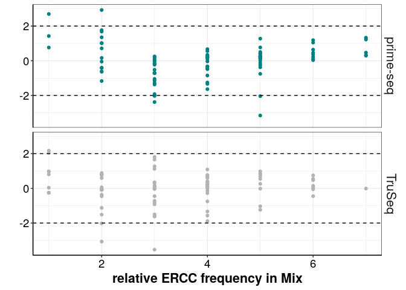<!-- -->

``` r
supp.Fig.ERCC<-plot_grid(cal.plot.gc,cal.plot.length,cal.plot.input,ncol=3,axis="tb",align = "h")

supp.Fig.ERCC
```

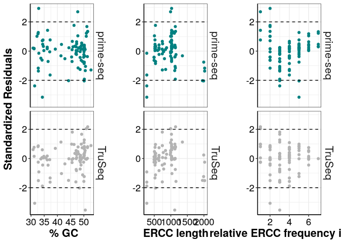<!-- -->

``` r
Fig.ercc <- ggplot(data = spike_df_cal,
                   aes(x=LSpikeInput,
                       y=LExpectation)) +
  geom_pointrange(data = spike_df_cal,
                  aes(ymax = LExpectation + LError,
ymin = LExpectation - LError)) +
geom_smooth(method=lm,formula=y~x,aes(colour=cond)) +
  scale_color_manual(values=method_cols)+
  scale_fill_manual(values=method_cols)+
  ggpubr::stat_cor(aes(fill=cond, label=paste(..rr.label..)),method = "pearson",geom = "label",colour="white",  label.x = c(1,4),label.y=4)+
annotation_logticks(sides = "bl") +
labs(y=expression(bold(paste(Log[10], " Estimated Expression", sep=""))),
x=expression(bold(paste(Log[10], " Spike-In Molecules"))),
colour="",fill="")+
facet_wrap(cond~.,scales="free_x")+
  theme(legend.position="none")

Fig.ercc
```

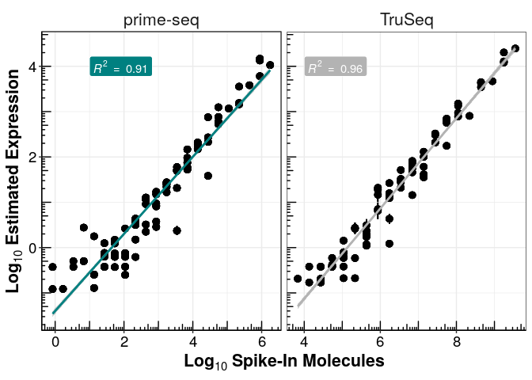<!-- -->

### 3. Power simulations

#### 3.1 Setup

``` r
## What LFC distribution is expected?

aml_types<-readRDS(paste0(fig_path,"/Normal_vs_MLL_rearranged.rds"))
aml_types$comp<-"AML types"

aml_passages<-readRDS(paste0(fig_path,"/Passage_bins_lfcs.rds"))
aml_passages$comp<-"AML passages"

ipsc_vs_NPC<-readRDS(paste0(fig_path,"/iPSC_vs_NPC_lfcs.rds"))
ipsc_vs_NPC$comp<-"cell types"

tru_vs_prime<-readRDS(paste0(fig_path,"/tru_vs_prime_lfcs.rds"))
tru_vs_prime$comp<-"Methods"

all_lfcs<-bind_rows(aml_types,aml_passages,ipsc_vs_NPC,tru_vs_prime)

percent_DE<-all_lfcs %>%
  group_by(comp) %>% 
  summarize(nDE=sum(padj<0.05),nGenes=n(),pDE=nDE/nGenes)

ggplot()+
  geom_density(data=all_lfcs,aes(log2FoldChange,colour=comp))
```

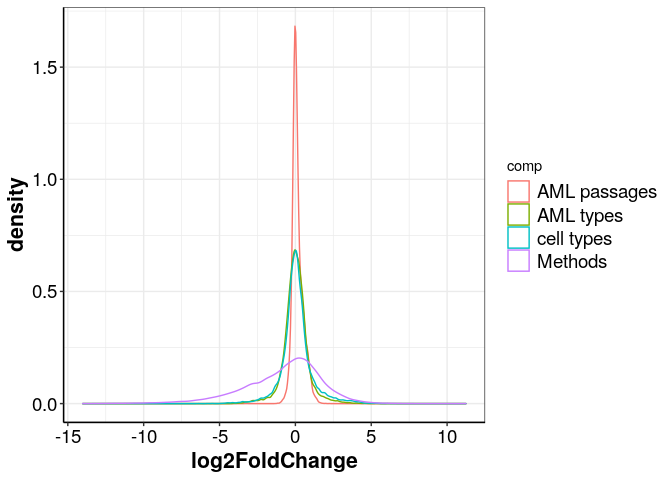<!-- -->

``` r
all_lfcs<-all_lfcs %>% 
  dplyr::select(log2FoldChange,comp)

p.lfc <- function(x) sample(c(-1.5,1.5), size=x,replace=T)*rgamma(x, shape = 1, rate = 2)

really_all_lfcs<-bind_rows(data.frame(log2FoldChange=p.lfc(20000),comp="powsimR input"),all_lfcs)

lfc_dists<-really_all_lfcs %>% 
filter(!(comp%in% c("AML passages","Methods"))) %>% 
ggplot()+
  geom_density(aes(log2FoldChange,colour=comp))+
  guides(colour=guide_legend(title = ""))
# 
# setupres_tru_inex <- Setup(ngenes = 30000, nsims = 20,
#                   p.DE = 0.10, pLFC = p.lfc,
#                   n1 = c(3, 6, 12, 24, 48), n2 = c(3, 6, 12, 24 ,48),
#                   Thinning = NULL, LibSize = 'equal',
#                   estParamRes = estparam_gene_tru_inex,
#                   estSpikeRes = NULL,
#                   DropGenes = FALSE,
#                   setup.seed = 5299, verbose = FALSE)
# 
# setupres_tru_ex <- Setup(ngenes = 30000, nsims = 20,
#                   p.DE = 0.10, pLFC = p.lfc,
#                    n1 = c(3, 6, 12, 24, 48), n2 = c(3, 6, 12, 24 ,48),
#                   Thinning = NULL, LibSize = 'equal',
#                   estParamRes = estparam_gene_tru_ex,
#                   estSpikeRes = NULL,
#                   DropGenes = FALSE,
#                   setup.seed = 5299, verbose = FALSE)
# 
# setupres_prime_inex <- Setup(ngenes = 30000, nsims = 20,
#                   p.DE = 0.10, pLFC = p.lfc,
#                    n1 = c(3, 6, 12, 24, 48), n2 = c(3, 6, 12, 24 ,48),
#                   Thinning = NULL, LibSize = 'equal',
#                   estParamRes = estparam_gene_prime_inex,
#                   estSpikeRes = NULL,
#                   DropGenes = FALSE,
#                   setup.seed = 5299, verbose = FALSE)
# 
# setupres_prime_ex <- Setup(ngenes = 30000, nsims = 20,
#                   p.DE = 0.10, pLFC = p.lfc,
#                    n1 = c(3, 6, 12, 24, 48), n2 = c(3, 6, 12, 24 ,48),
#                   Thinning = NULL, LibSize = 'equal',
#                   estParamRes = estparam_gene_prime_ex,
#                   estSpikeRes = NULL,
#                   DropGenes = FALSE,
#                   setup.seed = 5299, verbose = FALSE)
```

#### 3.2 Running DE simulations

``` r
# simres_tru_inex <- simulateDE(SetupRes = setupres_tru_inex,
#                      Prefilter = NULL, Imputation = NULL,
#                      Normalisation = 'MR',
#                      DEmethod = "limma-voom", DEFilter = FALSE,
#                      NCores = NULL, verbose = FALSE)
# 
# simres_tru_ex <- simulateDE(SetupRes = setupres_tru_ex,
#                      Prefilter = NULL, Imputation = NULL,
#                      Normalisation = 'MR',
#                      DEmethod = "limma-voom", DEFilter = FALSE,
#                      NCores = NULL, verbose = FALSE)
# 
# simres_prime_inex <- simulateDE(SetupRes = setupres_prime_inex,
#                      Prefilter = NULL, Imputation = NULL,
#                      Normalisation = 'MR',
#                      DEmethod = "limma-voom", DEFilter = FALSE,
#                      NCores = NULL, verbose = FALSE)
# 
# simres_prime_ex <- simulateDE(SetupRes = setupres_prime_ex,
#                      Prefilter = NULL, Imputation = NULL,
#                      Normalisation = 'MR',
#                      DEmethod = "limma-voom", DEFilter = FALSE,
#                      NCores = NULL, verbose = FALSE)
# 
# save(simres_prime_ex,simres_prime_inex,simres_tru_ex,simres_tru_inex,file=paste0(fig_path,"/simres_all_DE10.Rdata"))
```

### 4. Evaluate DE results

#### 4.1 Statified by mean expression

``` r
load(file=paste0(fig_path,"/simres_all_DE10.Rdata"))

#

delta_val<-1  # filter value for biologically important genes

evalderes_tru_inex<- evaluateDE(simRes = simres_tru_inex,
                     alpha.type = 'adjusted',
                     MTC = 'BH',
                     alpha.nominal = 0.05,
                     stratify.by = 'mean',
                     filter.by = 'mean',
                     strata.filtered = 1,
                     target.by = "lfc",
                     delta =delta_val,
                     Table=F)


# plotEvalDE(evalRes = evaldere_tru_inex, rate = 'marginal', quick = TRUE, Annot = F)
# plotEvalDE(evalRes = evaldere_tru_inex, rate = 'conditional', quick = TRUE, Annot = F)

evalderes_tru_ex<-evaluateDE(simRes = simres_tru_ex,
                     alpha.type = 'adjusted',
                     MTC = 'BH',
                     alpha.nominal = 0.05,
                     stratify.by = 'mean',
                     filter.by = 'mean',
                     strata.filtered = 1,
                     target.by = 'lfc',
                     delta = delta_val,
                     Table=F)


# plotEvalDE(evalRes = evalderes_tru_ex, rate = 'marginal', quick = TRUE, Annot = F)
# plotEvalDE(evalRes = evalderes_tru_ex, rate = 'conditional', quick = TRUE, Annot = F)

evalderes_prime_inex<- evaluateDE(simRes = simres_prime_inex,
                     alpha.type = 'adjusted',
                     MTC = 'BH',
                     alpha.nominal = 0.05,
                     stratify.by = 'mean',
                     filter.by = 'mean',
                     strata.filtered = 1,
                     target.by = 'lfc',
                     delta = delta_val,
                     Table=F)


# plotEvalDE(evalRes = evalderes_prime_inex, rate = 'marginal', quick = TRUE, Annot = F)
# plotEvalDE(evalRes = evalderes_prime_inex, rate = 'conditional', quick = TRUE, Annot = F)

evalderes_prime_ex<- evaluateDE(simRes = simres_prime_ex,
                     alpha.type = 'adjusted',
                     MTC = 'BH',
                     alpha.nominal = 0.05,
                     stratify.by = 'mean',
                     filter.by = 'mean',
                     strata.filtered = 1,
                     target.by = 'lfc',
                     delta = delta_val,
                     Table=F)


# plotEvalDE(evalRes = evalderes_prime_ex, rate = 'marginal', quick = TRUE, Annot = T)
# plotEvalDE(evalRes = evalderes_prime_ex, rate = 'conditional', quick = TRUE, Annot = T)
# 
```

#### Plot power (marginal)

``` r
## extract the relevant tables for plotting marginal rates FDR and TPR


df<-getEvalDE_df_marginal(evalderes_prime_ex,method = "prime-seq",count_type = "exon")

df<-bind_rows(df,getEvalDE_df_marginal(evalderes_prime_inex,method = "prime-seq",count_type = "inex"))

df<-bind_rows(df,getEvalDE_df_marginal(evalderes_tru_ex,method = "TruSeq",count_type = "exon"))

df<-bind_rows(df,getEvalDE_df_marginal(evalderes_tru_inex,method = "TruSeq",count_type = "inex"))

refval <- data.frame(L1 = c("FDR", "TPR"),
                     ref = c(evalderes_prime_ex$alpha.nominal, 0.8))


grid_lab<-c("Exon", "Exon + Intron")
names(grid_lab) <- c("exon", "inex")

df<-df %>% 
  separate(Var1,sep = " vs ",into=c("S1","S2"),remove = F,convert = T)

df_sub<-subset(df,L1 %in% c("FDR","TPR")& Var1 !="3 vs 3")

sup_fig_powsimr_mar_1<-ggplot(data = df_sub, aes(x = factor(S1),
                      y = value,
                      color = method)) +
       stat_summary(fun.data = "mean_se",
                     size = 0.3,) +
       stat_summary(aes(group = method),
                    fun = mean, geom="line")+
       scale_color_manual(values=method_cols,limits = force)+
       labs(x = "Samples per group", y = "Rate" , shape="") +
       scale_y_continuous(labels = scales::percent_format(accuracy = 0.1)) +
       facet_grid(L1~count_type,labeller = labeller(count_type=grid_lab),scales = "free_y")+
       geom_hline(data = refval,aes(yintercept = ref),
                            linetype="dashed",
                            color='black')

sup_fig_powsimr_mar_1
```

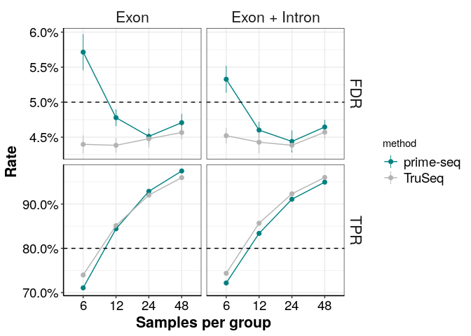<!-- -->

``` r
Fig_powsimr_mar<-ggplot(data = subset(df_sub,L1=="TPR"&count_type=="inex"), aes(x =factor(S1),
              y = value,
              color = method)) +
stat_summary(fun.data = "mean_se",
             size = 0.3,) +
stat_summary(aes(group = method),
            fun = mean, geom="line")+
scale_color_manual(values=method_cols,limits = force)+
labs(x = "Samples per group", y = "Marginal Power (TPR)" , shape="") +
scale_y_continuous(labels = scales::percent_format(accuracy = 0.1)) +
geom_hline(data = subset(refval,L1=="TPR"),aes(yintercept = ref),
                    linetype="dashed",
                    color='black')+
theme(legend.position = c(0.25, 0.8),
legend.background = element_blank())

Fig_powsimr_mar
```

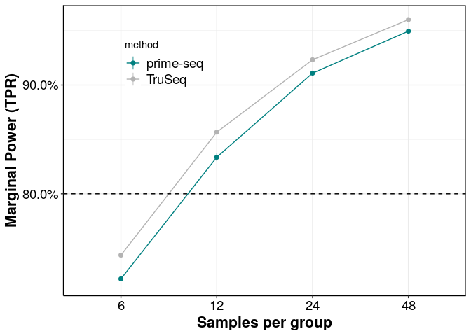<!-- -->

#### Plot power startified by mean expression

``` r
## get dfs and combine them

df_rates<-getEvalDE_list_conditional(evalderes_prime_ex,method = "prime-seq",count_type = "exon")$dat.stratified.long

stratum.name<-getEvalDE_list_conditional(evalderes_prime_ex,method = "prime-seq",count_type = "exon")$stratum.name

df_rates<-bind_rows(df_rates,getEvalDE_list_conditional(evalderes_prime_inex,method = "prime-seq",count_type = "inex")$dat.stratified.long)

df_rates<-bind_rows(df_rates,getEvalDE_list_conditional(evalderes_tru_ex,method = "TruSeq",count_type = "exon")$dat.stratified.long)

df_rates<-bind_rows(df_rates,getEvalDE_list_conditional(evalderes_tru_inex,method = "TruSeq",count_type = "inex")$dat.stratified.long)

## subset to avoid complete overplotting


df_rates<-df_rates %>% 
  group_by(method,count_type) %>% 
  #separate(Var1, into = c('start','end'),sep = ',') %>% View()
  mutate(Var1=case_when(Var1==unique(Var1)[1]~0.1,
                        Var1==unique(Var1)[2]~0.2,
                        Var1==unique(Var1)[3]~0.3,
                        Var1==unique(Var1)[4]~0.4,
                        Var1==unique(Var1)[5]~0.5,
                        Var1==unique(Var1)[6]~0.6,
                        Var1==unique(Var1)[7]~0.7,
                        Var1==unique(Var1)[8]~0.8,
                        Var1==unique(Var1)[9]~0.9,
                        Var1==unique(Var1)[10]~1),
         Var2=as.factor(sapply(str_extract_numbers(as.character(Var2)),function(x) x[1])))


rate_cols<-c("#02401B","#81A88D","#972D15","#ddb967","#d0e37f","grey70")
names(rate_cols)<-unique(df_rates$Var2)
sub<-unique(df_rates$Var2)[2:5]

df_rates_sub<-subset(df_rates,Var2%in%sub&L1 %in% c("FDR","TPR"))


Fig.cond.inex<-ggplot(data=subset(df_rates_sub,L1=="TPR"&count_type=="inex"),
     aes(x = Var1,
         y = value,
         linetype = method,
         color=Var2)) +
stat_summary(aes(x = Var1,
                 y = value,
                 group = paste(Var2,method),
                 color = Var2),
             fun = mean, geom="line") +
geom_hline(data = subset(refval,L1=="TPR"),
           aes(yintercept = ref),
           linetype="dashed",
           color='black') +
labs(x=paste0("Percentile Log2 Mean Expression"),y="Rate",colour="") +
scale_y_continuous(labels = scales::percent_format(accuracy = 1),limits = c(0,1)) +
facet_grid(L1~., scales = 'free_y')+
scale_color_manual(values=rate_cols,limits = force)+
scale_x_continuous(breaks = seq(0.1,1,0.2))
Fig.cond.inex
```

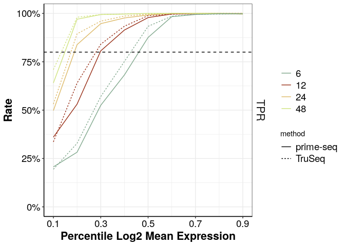<!-- -->

``` r
Supp_Fig.cond.inex_fdr<-ggplot(data=subset(df_rates_sub,L1=="FDR"&count_type=="inex"),
     aes(x = Var1,
         y = value,
         linetype = method,
         color=Var2)) +
stat_summary(aes(x = Var1,
                 y = value,
                 group = paste(Var2,method),
                 color = Var2),
             fun = mean, geom="line") +
geom_hline(data = subset(refval,L1=="FDR"),
           aes(yintercept = ref),
           linetype="dashed",
           color='black') +
labs(x=paste0("Percentile Log2 Mean Expression"),y="FDR",colour="") +
scale_y_continuous(labels = scales::percent_format(accuracy = 1),limits = c(0,1)) +
facet_grid(L1~., scales = 'free_y')+
scale_color_manual(values=rate_cols,limits = force)+
scale_x_continuous(breaks = seq(0.1,1,0.2))

Supp_Fig.cond.inex_fdr
```

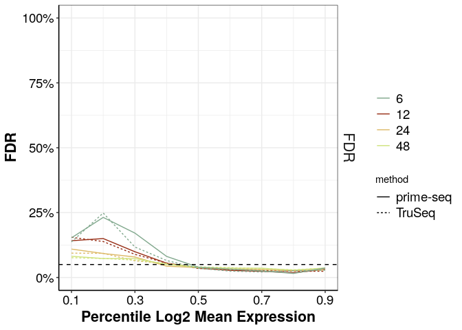<!-- -->

``` r
sup.fig.cond.ex<-ggplot(data=subset(df_rates_sub,count_type=="exon"),
       aes(x = Var1,
           y = value,
           linetype = method,
           color=Var2)) +
  stat_summary(aes(x = Var1,
                   y = value,
                   group = paste(Var2,method),
                   color = Var2),
               fun = mean, geom="line") +
  geom_hline(data = refval,
             aes(yintercept = ref),
             linetype="dashed",
             color='black') +
  labs(x=paste0("Percentile Log2 Mean Expression"),y="Rate",colour="") +
  scale_y_continuous(labels = scales::percent_format(accuracy = 1),limits = c(0,1)) +
  facet_grid(L1~., scales = 'free_y')+
  scale_color_manual(values=rate_cols,limits = force)+
scale_x_continuous(breaks = seq(0.1,1,0.2))
sup.fig.cond.ex
```

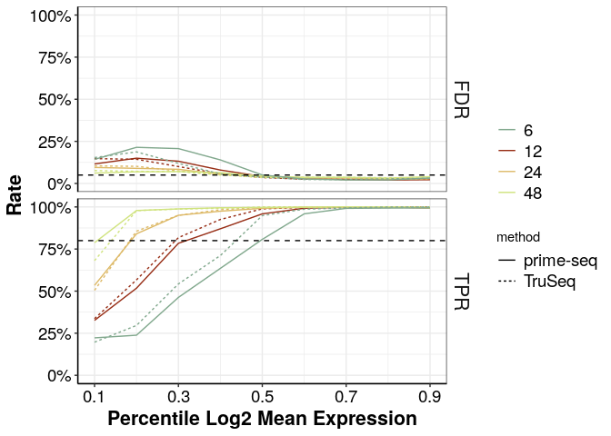<!-- -->

##### number of genes per stratum

``` r
df_genes<-getEvalDE_list_conditional(evalderes_prime_inex,method = "prime-seq",count_type = "inex")$dat.genes.calc

df_genes<-bind_rows(df_genes,getEvalDE_list_conditional(evalderes_tru_inex,method = "TruSeq",count_type = "inex")$dat.genes.calc)

df_genes_sum<-df_genes %>% 
  group_by(method,count_type) %>% 
  separate(col = "Var1",sep = ",",into = c("lower","upper"),remove=F) %>% 
  mutate(lower=as.double(str_extract_numbers(lower,decimals = T,negs = T)),
         upper=as.double(str_extract_numbers(upper,decimals = T,negs = T)),
         upper=if_else(is.na(upper),Inf,upper),
         stratum=1:n()) %>% 
  group_by(stratum) %>% 
  mutate(lower=min(lower),
         upper=max(upper),
         stratum=paste0(lower,"-",upper))

ngenes_mean<-ggplot(subset(df_genes_sum,lower>0),aes(x=stratum,y=Expectation,fill=L1,group=method))+
  geom_col()+
  facet_grid(method~.)+
  theme(axis.text.x=element_text(angle=60,hjust=1))+
  labs(x="Strata Log2 Mean Expression",y="Genes",fill="")+
  scale_fill_manual(values=c("#e07a5f","#14213d"),limits = force)

ngenes_mean
```

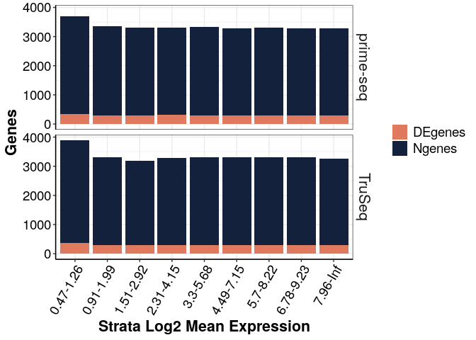<!-- -->

#### 4.1 Statified by Log fold change

``` r
delta_val<-1

evalderes_tru_inex_lfc<- evaluateDE2(simRes = simres_tru_inex,
                     alpha.type = 'adjusted',
                     MTC = 'BH',
                     alpha.nominal = 0.05,
                     stratify.by = 'lfc_abs',
                     filter.by = 'mean',
                     strata.filtered = 2,
                     target.by = "lfc",
                     delta =delta_val,
                     Table = F)


evalderes_tru_ex_lfc<-evaluateDE2(simRes = simres_tru_ex,
                     alpha.type = 'adjusted',
                     MTC = 'BH',
                     alpha.nominal = 0.05,
                     stratify.by = 'lfc_abs',
                     filter.by = 'mean',
                     strata.filtered = 1,
                     target.by = 'lfc',
                     delta = delta_val,
                     Table = F)


evalderes_prime_inex_lfc<- evaluateDE2(simRes = simres_prime_inex,
                     alpha.type = 'adjusted',
                     MTC = 'BH',
                     alpha.nominal = 0.05,
                     stratify.by = 'lfc_abs',
                     filter.by = 'mean',
                     strata.filtered = 1,
                     target.by = 'lfc',
                     delta = delta_val,
                     Table = F)


evalderes_prime_ex_lfc<- evaluateDE2(simRes = simres_prime_ex,
                     alpha.type = 'adjusted',
                     MTC = 'BH',
                     alpha.nominal = 0.05,
                     stratify.by = 'lfc_abs',
                     filter.by = 'mean',
                     strata.filtered = 1,
                     target.by = 'lfc',
                     delta = delta_val,
                     Table = F)
```

#### Plot power startified by LFC

``` r
## get dfs and combine them

df_rates<-getEvalDE_list_conditional(evalderes_prime_ex_lfc,method = "prime-seq",count_type = "exon")$dat.stratified.long

stratum.name<-getEvalDE_list_conditional(evalderes_prime_ex_lfc,method = "prime-seq",count_type = "exon")$stratum.name

df_rates<-bind_rows(df_rates,getEvalDE_list_conditional(evalderes_prime_inex_lfc,method = "prime-seq",count_type = "inex")$dat.stratified.long)

df_rates<-bind_rows(df_rates,getEvalDE_list_conditional(evalderes_tru_ex_lfc,method = "TruSeq",count_type = "exon")$dat.stratified.long)

df_rates<-bind_rows(df_rates,getEvalDE_list_conditional(evalderes_tru_inex_lfc,method = "TruSeq",count_type = "inex")$dat.stratified.long)


df_rates_sub<-df_rates %>% 
  mutate(Var2=sapply(str_extract_numbers(as.character(Var2)),function(x) x[1])) %>% 
  filter(Var2%in%sub&L1 %in% c("FDR","TPR"))
         


rate_cols<-c("#02401B","#81A88D","#972D15","#ddb967","#d0e37f","grey70")
names(rate_cols)<-unique(df_rates_sub$Var2)


Fig.cond.inex.lfc<-ggplot(data=subset(df_rates_sub,count_type=="inex"&L1=="TPR"),
       aes(x = Var1,
           y = value,
           linetype = method,
           color=factor(Var2))) +
  stat_summary(aes(x = Var1,
                   y = value,
                   group = paste(method,Var2),
                   color = factor(Var2)),
               fun = mean, geom="line") +
  geom_hline(data = subset(refval,L1=="TPR"),
             aes(yintercept = ref),
             linetype="dashed",
             color='black') +
  scale_y_continuous(labels = scales::percent_format(accuracy = 1)) +
  facet_grid(L1~., scales = 'free_y')+
  scale_color_manual(values=rate_cols,limits = force)+
  labs(x="Stratum absolute Log2 Fold Change",y="Rate",colour="",linetype="")+
  theme(axis.text.x=element_text(angle=60,hjust=1))

Fig.cond.inex.lfc
```

<!-- -->

``` r
   
Supp_Fig.cond.inex.lfc<-ggplot(data=subset(df_rates_sub,count_type=="inex"&L1=="FDR"),
     aes(x = Var1,
         y = value,
         linetype = method,
         color=factor(Var2))) +
stat_summary(aes(x = Var1,
                 y = value,
                 group = paste(method,Var2),
                 color = factor(Var2)),
             fun = mean, geom="line") +
geom_hline(data = subset(refval,L1=="FDR"),
           aes(yintercept = ref),
           linetype="dashed",
           color='black') +
scale_y_continuous(labels = scales::percent_format(accuracy = 1)) +
facet_grid(L1~., scales = 'free_y')+
scale_color_manual(values=rate_cols,limits = force)+
labs(x="Stratum absolute Log2 Fold Change",y="Rate",colour="",linetype="")+
theme(axis.text.x=element_text(angle=60,hjust=1))

Supp_Fig.cond.inex.lfc
```

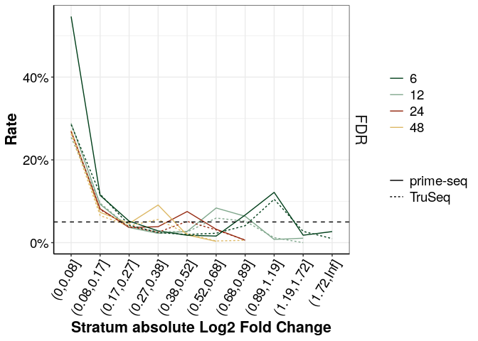<!-- -->

``` r
sup.fig.cond.ex.lfc<-ggplot(data=subset(df_rates_sub,count_type=="exon"),
       aes(x = Var1,
           y = value,
           linetype = method,
           color=factor(Var2))) +
  stat_summary(aes(x = Var1,
                   y = value,
                   group = paste(method,Var2),
                   color = factor(Var2)),
               fun = mean, geom="line",) +
  geom_hline(data = refval,
             aes(yintercept = ref),
             linetype="dashed",
             color='black') +
 labs(x="Stratum absolute Log2 Fold Change",y="Rate",colour="",linetype="")+
  scale_y_continuous(labels = scales::percent_format(accuracy = 1)) +
  facet_grid(L1~., scales = 'free_y')+
  scale_color_manual(values=rate_cols,limits = force)+
theme(legend.box = "vertical",legend.position = "top")+
theme(axis.text.x=element_text(angle=60,hjust=1))

sup.fig.cond.ex.lfc   
```

<!-- -->

#### number of genes per stratum

``` r
df_genes<-getEvalDE_list_conditional(evalderes_prime_inex_lfc,method = "prime-seq",count_type = "inex")$dat.genes.calc

df_genes<-bind_rows(df_genes,getEvalDE_list_conditional(evalderes_tru_inex_lfc,method = "TruSeq",count_type = "inex")$dat.genes.calc)

df_genes_sum<-df_genes %>% 
  group_by(method,count_type) %>% 
  separate(col = "Var1",sep = ",",into = c("lower","upper"),remove=F) %>% 
  mutate(lower=as.double(str_extract_numbers(lower,decimals = T,negs = T)),
         upper=as.double(str_extract_numbers(upper,decimals = T,negs = T)),
         upper=if_else(is.na(upper),Inf,upper),
         stratum=1:n()) %>% 
  group_by(stratum) %>% 
  mutate(lower=min(lower),
         upper=max(upper),
         stratum=paste0(lower,"-",upper))

ngenes_lfc<-ggplot(subset(df_genes_sum,lower>0),aes(x=stratum,y=Expectation,fill=L1,group=method))+
  geom_col()+
  facet_grid(method~.)+
  theme(axis.text.x=element_text(angle=60,hjust=1))+
  labs(x="Stratum absolute Log2 Fold Change",y="Genes",fill="")+
  scale_fill_manual(values=c("#e07a5f","#14213d"),limits = force)

ngenes_lfc
```

<!-- -->

### 5. Combine and export plots

``` r

main<-plot_grid(Fig.cond.inex,
                Fig.cond.inex.lfc+theme(legend.position = "none"),
                ncol = 2,
                axis="tlbr",
                align="hv")


ggsave(filename = "Fig3_comp_powsim.pdf",
       path = fig_path,
       plot = main,
       units = "mm",
       width=350,
       height= 130,
       device = "pdf")

ggsave(filename = "Fig3F_TPR.pdf",
       path = fig_path,
       plot = Fig_powsimr_mar,
       units = "mm",
       width=130,
       height= 120,
       device = "pdf")

                

Supp_Fig_power1<-plot_grid(lfc_dists,
                           sup_fig_powsimr_mar_1,
                           Supp_Fig.cond.inex_fdr,
                           Supp_Fig.cond.inex.lfc+theme(legend.position = "none"),
                           sup.fig.cond.ex,
                           sup.fig.cond.ex.lfc+theme(legend.position = "none"),
                           ncol=2,
                           axis = "tblr",
                           align="hv")


ggsave(filename = "Supp_fig_powsim1.pdf",
       path = fig_path,
       plot = Supp_Fig_power1,
       units = "mm",
       width= 400,
       height= 400,
       device = "pdf")
```
