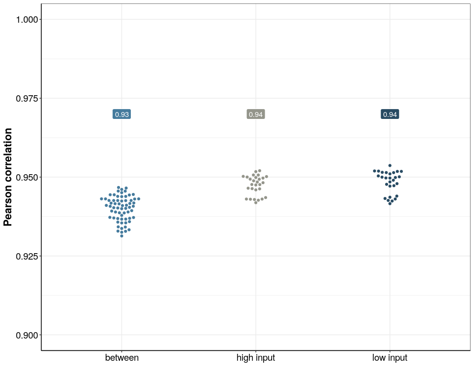
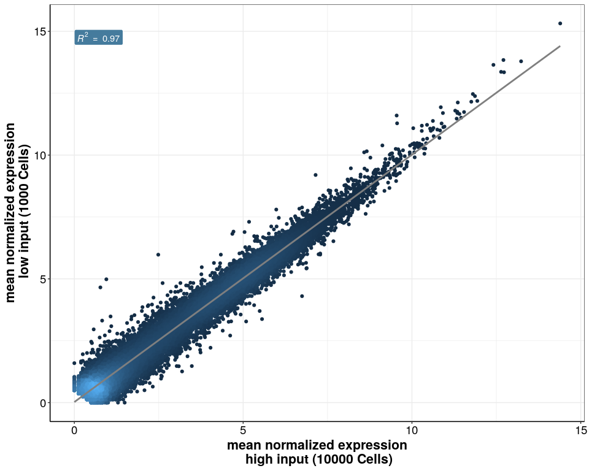
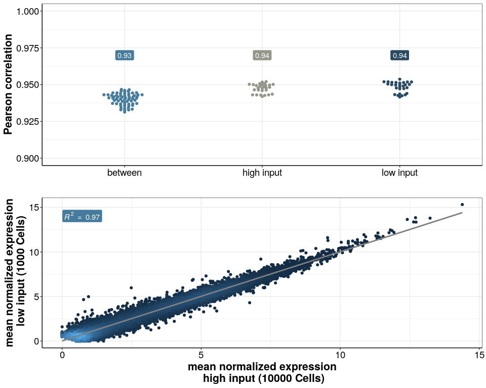

## Purpose:

Show that 1k Cells and 10k Cells have similar expression

### 1. Load the packages:

``` r
library(tidyverse)
library(ggbeeswarm)
library(cowplot)
library(RColorBrewer)
library(GGally)
```

### 2. Load functions, theme and color paletts:

``` r
### all necessary custom functions are in the following script
source(paste0(here::here(),"/0_Scripts/custom_functions.R"))

theme_pub <- theme_bw() + theme(
                                     plot.title = element_text(hjust = 0.5, size=18, face="bold"),
                                     axis.text = element_text(colour="black", size=14), 
                                     axis.title=element_text(size=16,face="bold"), 
                                     legend.text=element_text(size=14),
                                     legend.position="right",
                                     axis.line.x = element_line(colour = "black"), 
                                     axis.line.y = element_line(colour = "black"),
                                     strip.background=element_blank(), 
                                     strip.text=element_text(size=16))  

theme_set(theme_pub)


data_path<-paste0(here::here(),"/3_RNA_isolation/")

## colors 
input_cols<-c("#284b63","#94958B","#457b9d")
names(input_cols)<-c("low input","high input","between")
```

### 3. Load and subset count matrix and sample info

``` r
counts <- readRDS(paste0(data_path,"/Bulk_opt_lysis_test_2_HEK.dgecounts.rds"))

inf <- read.csv(paste0(data_path,"/sample_info.csv"), header = T, stringsAsFactors = F)

inf<-inf %>% 
  mutate(Condition=case_when(Condition=="Incubation + ProtK"~"Magnetic Beads",
                             TRUE~Condition),
         XC=if_else(Celltype=="HEK",BC,XC),
         Cells=as.character(Cells),
         Cells=case_when(Cells==1 ~ "low input",
                         Cells==10 ~ "high input",
                         T ~ Cells)) %>% 
  dplyr::filter(Celltype=="HEK",
                Condition=="Magnetic Beads")


inex_counts<-counts$umicount$inex$all %>% as.matrix()
inex_counts<-inex_counts[,inf$BC] 

inf<-inf[match(colnames(inex_counts),inf$BC),]
```

### 4. create filter and normalize

## filter for Genes expressed in at least 20 % of samples -&gt; 4

``` r
inex_counts_filt<-inex_counts[whichgenes_reproducible(inex_counts,exprcutoff = 1,reproducecutoff = 0.2),]

inex_counts_filt_log<-log2(inex_counts_filt+1)
```

``` r
library(grid)
library(gridExtra)
library(ggplotify)


colnames(inex_counts_filt_log)<-janitor::make_clean_names(inf$Cells)

cor_cols<-c("#e63946","#a8dadc","#1d3557")

sample_cor <- ggcorr(inex_counts_filt_log,
  method = c("pairwise", "pearson"),
  geom = "tile",
  midpoint = 0.96,
  hjust = 0.8,
  low = cor_cols[2],
  high = cor_cols[1],
  mid = cor_cols[3],
  label = T,
  label_round = 2,
  layout.exp = 1,
  label_size = 3,
  size = 3,
  limits = c(0.93, 1),
  legend.position = "none",
  color = "black",
  label_color = "white") +
  theme_minimal()


#### get Correlation df

colnames(inex_counts_filt_log)<-inf$BC
sampleCorrelation <- cor(inex_counts_filt_log,method = "pearson")


 lt<-sampleCorrelation
    lt[lower.tri(sampleCorrelation)]<-""
    diag(lt)<-""

cor_df<-lt %>% 
  reshape2::melt(value.name = "cor",varnames=c("BC", "BC2")) %>%
  filter(cor!="") %>% 
  left_join(inf) %>% 
  select(c(BC2,Cells,cor)) %>% 
  left_join(inf,by=c("BC2"="BC")) %>% 
  select(c(Cells.x,Cells.y,cor)) %>% 
  mutate(type=if_else(Cells.x==Cells.y,"within","between"),
         input_col=if_else(type=="between","between",Cells.x)) %>% 
  mutate(cor=as.numeric(cor))

mean_df<-cor_df %>% 
  group_by(input_col) %>% 
  summarise(cor=round((cor),digits = 2))

sample_cor<-ggplot(cor_df,aes(x=input_col,y=cor,colour=input_col))+
  geom_beeswarm()+
  scale_colour_manual(values = input_cols)+
  scale_fill_manual(values = input_cols)+
  theme(legend.position = "none")+
  geom_label(data=mean_df,aes(label=cor,y=0.97,fill=input_col),colour="white")+
  #labs(x="",y=expression("Pearsons "~R^2*""))
  labs(x="",y="Pearson correlation")+
  scale_y_continuous(limits = c(0.9,1))

sample_cor
```

<!-- -->

### 5.Gene wise correlation

``` r
### correlate mean expression

mean_exp<-inex_counts_filt_log%>% 
  as.data.frame() %>% 
  rownames_to_column(var="Gene") %>% 
  pivot_longer(names_to = "BC",values_to="count",cols=-Gene) %>% 
  left_join(inf) %>% 
  group_by(Cells,Gene) %>% 
  dplyr::summarize(mean_exp=mean(count)) %>% 
  mutate(spike_in=if_else(Gene %in% grep(Gene,pattern="ERCC*",
                                         value = T),
                          "Spike-Ins","Endogenous Genes")) %>% 
  pivot_wider(names_from = "Cells",values_from="mean_exp") %>% 
  as.data.frame()
  

gene_cor<-ggplot(data=subset(mean_exp,spike_in=="Endogenous Genes"),aes(x=`high input`,y=`low input`))+
  ggpubr::stat_cor(data=subset(mean_exp,spike_in=="Endogenous Genes"),aes(fill=spike_in, label=paste(..rr.label..)),
                   method = "pearson",
                   geom = "label",
                   colour="white")+
  ggpointdensity::geom_pointdensity()+
  geom_smooth(method = "lm",colour="grey50")+
  
  theme(axis.line.y = element_line(),
        legend.position="none")+
  scale_fill_manual(values=c("#457b9d"))+
  xlab("mean normalized expression\n high input (10000 Cells)")+
  ylab("mean normalized expression\n low input (1000 Cells)")

gene_cor
```

<!-- -->

``` r
low_input_supplement<-plot_grid(sample_cor,gene_cor,axis="rl",align = "v",ncol=1)

low_input_supplement
```

<!-- -->

``` r
ggsave(low_input_supplement,
       device = "pdf",
       path = data_path,
       width = 150,
       height = 200,
       units = "mm",
       filename = "Sup_Fig_low_input_left.pdf"
       )
```
