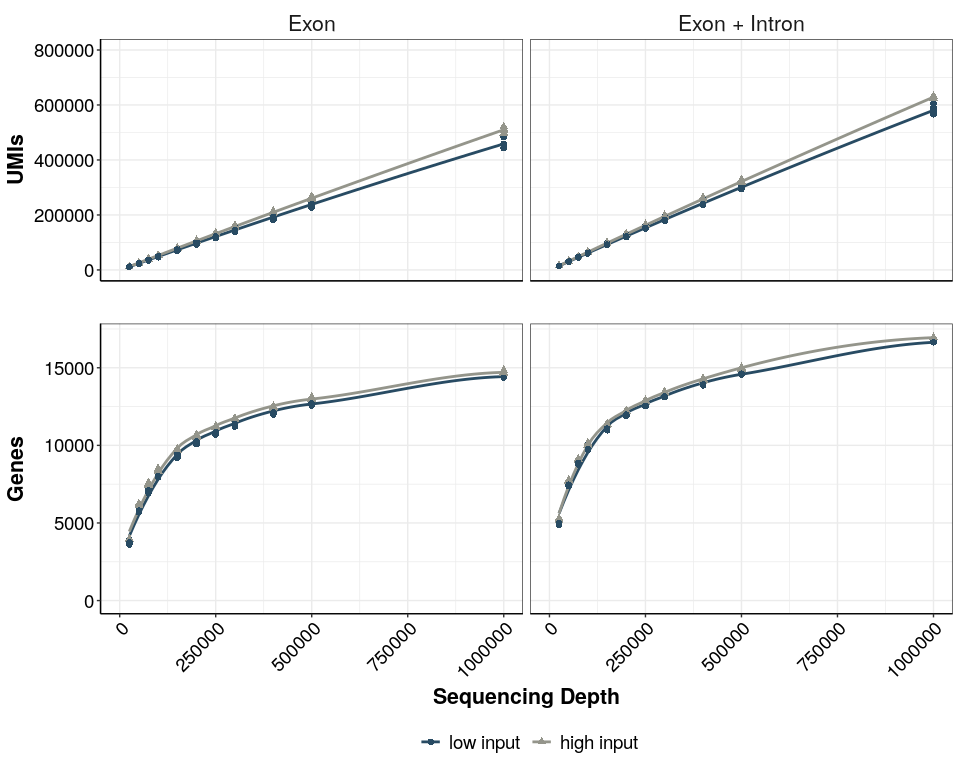
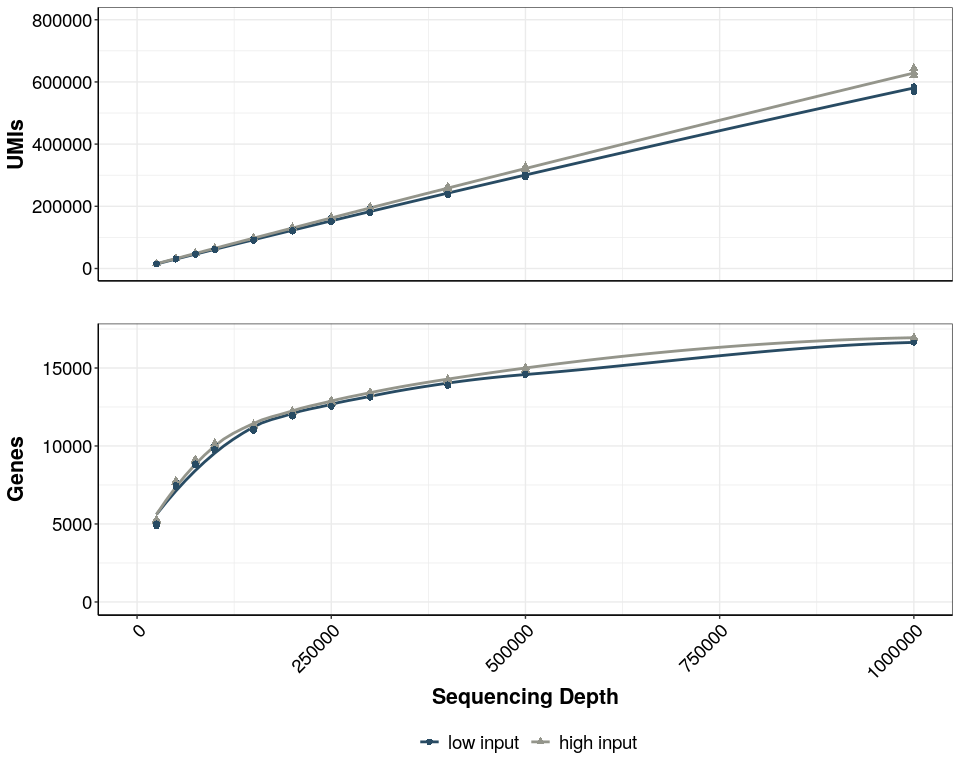
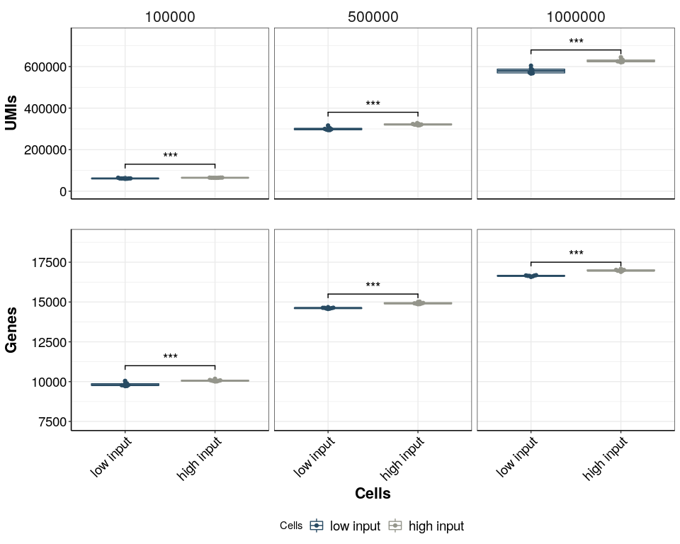

## Purpose:

Compare sensitivity for 1k and 10k cells of input

### 1. Load the packages:

``` r
library(tidyverse)
library(ggsignif)
library(ggplotify)
library(ggrepel)
library(ggbeeswarm)
library(edgeR)
library(genefilter)
library(grid)
library(gridExtra)
library(ggsci)
library(UpSetR)
library(cowplot)
```

### 2. Load following functions:

``` r
### all necessary custom functions are in the following script
source(paste0(here::here(),"/0_Scripts/custom_functions.R"))

theme_pub <- theme_bw() + theme(plot.title = element_text(hjust = 0.5, size=18, face="bold"),
                                     axis.text = element_text(colour="black", size=14), 
                                     axis.title=element_text(size=16,face="bold"), 
                                     legend.text=element_text(size=14),
                                     legend.position="right",
                                     axis.line.x = element_line(colour = "black"), 
                                     axis.line.y = element_line(colour = "black"),
                                     strip.background=element_blank(), 
                                     strip.text=element_text(size=16))  

theme_set(theme_pub)

#prevent scientific notation
options(scipen=999)

fig_path<-paste0(here::here(),"/3_RNA_isolation/")

## colors 
input_cols<-c("#284b63","#94958B")
names(input_cols)<-c("low input","high input")


biotype_cols<-c("#264653","#2a9d8f","#8ab17d","#babb74","#e9c46a","#f4a261","#e76f51")

names(biotype_cols)<-c("protein coding","lncRNA","rRNA","small RNA","miRNA","other","pseudogene")
```

## Mito, Ribo, lncRNA

``` r
gtype_human <- data.frame( species="human", getbiotype("hsapiens_gene_ensembl",species="human"))

gtype_mouse <- data.frame( species="mouse", getbiotype("mmusculus_gene_ensembl",species="mouse"))
```

## Sensitivity Plots

### 3. Load Data

``` r
counts <- readRDS(paste0(fig_path,"/Bulk_opt_lysis_test_2_HEK.dgecounts.rds"))

inf <- read.csv(paste0(fig_path,"/sample_info.csv"), header = T, stringsAsFactors = F)

inf$Sample <- as.character(inf$Sample)

inf<-inf %>% 
  mutate(Condition=case_when(Condition=="Incubation + ProtK"~"Magnetic Beads",
                             TRUE~Condition),
         XC=if_else(Celltype=="HEK",BC,XC),
         Cells=as.character(Cells),
         Cells=case_when(Cells==1 ~ "low input",
                         Cells==10 ~ "high input",
                         T ~ Cells)) %>% 
  filter(Celltype=="HEK",
         Condition=="Magnetic Beads")


coding_genes<-rownames(counts$umicount$inex$all)[!(rownames(counts$umicount$inex$all)%in%gtype_human$Gencode)]

ds_df<-collapse_downsampled_counts(zumismat = counts,type="all",frac.samples = 0.25,genes=coding_genes,umi = T)
```

### 4. Number of exonic umis and genes per sample per downsampling

``` r
## add sample_info and filter for exon and inex
ds_df <- dplyr::inner_join(ds_df, inf, by= "XC") %>% 
  filter(type%in%c("exon","inex"))

#adjust input factor levels
ds_df$Cells<-factor(ds_df$Cells,levels=c("low input","high input"))


grid_lab<-c("Exon", "Exon + Intron")
names(grid_lab) <- c("exon", "inex")

# plot - supplement with all conditions
sa1 <- ggplot(data = ds_df, aes(x= depth, y = UMIs, color = Cells, group = Cells))+
  geom_smooth(method = "loess", se = F)+
  geom_point(position = position_jitter(width = 0.2), size =2, aes(shape=Cells))+
  xlab("")+
  ylim(0,800000)+
  xlim(0,1e6)+
  theme_pub+
  scale_color_manual(values=input_cols)+
  facet_wrap(type~.,labeller = labeller(type=grid_lab))+
  theme(axis.text.x=element_text(angle=45,hjust=1),
        axis.ticks.x = element_blank())+
  theme(legend.position="none", axis.text.x = element_blank())

sb1 <- ggplot(data = ds_df, aes(x= depth, y = Genes, color = Cells, group = Cells))+
  geom_smooth(method = "loess", se = F)+
  geom_point(position = position_jitter(width = 0.2), size =2, aes(shape=Cells))+
  xlab("Sequencing Depth")+
  ylim(0,17000)+
  xlim(0,1e6)+
  theme_pub+
  scale_color_manual(values = input_cols)+
  facet_wrap(type~.)+
  theme(legend.position="bottom", axis.text.x = element_text(angle = 45, hjust = 1),
        strip.text = element_blank())+
  labs(color="",shape="")


suppl<-plot_grid(sa1,sb1,ncol = 1,rel_heights = c(0.7,1),align = "hv")
suppl
```

<!-- -->

``` r
ds_df<-ds_df %>% 
  filter(type=="inex")

Fig_umis<-  ggplot(data = ds_df, aes(x= depth, y = UMIs, color = Cells, group = Cells))+
  geom_smooth(method = "loess", se = F)+
  geom_point(position = position_jitter(width = 0.2), size =2, aes(shape=Cells))+
  xlab("")+
  ylim(0,800000)+
  xlim(0,1e6)+
  theme_pub+
  scale_color_manual(values=input_cols)+
  theme(axis.text.x=element_text(angle=45,hjust=1),
        axis.ticks.x = element_blank())+
  theme(legend.position="none", axis.text.x = element_blank())

Fig_genes <- ggplot(data = ds_df, aes(x= depth, y = Genes, color = Cells, group = Cells))+
  geom_smooth(method = "loess", se = F)+
  geom_point(position = position_jitter(width = 0.2), size =2, aes(shape=Cells))+
  xlab("Sequencing Depth")+
  ylim(0,17000)+
  xlim(0,1e6)+
  theme_pub+
  scale_color_manual(values = input_cols)+
  theme(legend.position="bottom", axis.text.x = element_text(angle = 45, hjust = 1),
        strip.text = element_blank())+
  labs(color="",shape="")

Fig_GeneUMI<-plot_grid(Fig_umis,Fig_genes,ncol = 1,rel_heights = c(0.7,1),align = "hv")

Fig_GeneUMI
```

<!-- -->

### 5. Sensitivity and complexity at different seq depth

``` r
sub_depth<-c(100000,500000,1000000)

ds_df_sub<-ds_df %>% 
  filter(depth%in%sub_depth)

res_tab_genes<-ds_df_sub %>% 
  group_by(depth,Cells) %>% 
  summarise(value = list(Genes)) %>% 
  pivot_wider(id_cols = c(depth),values_from = value,names_from=Cells) %>% 
  group_by(depth) %>% 
  mutate(p_value = t.test(unlist(`low input`), unlist(`high input`))$p.value,
         t_value = t.test(unlist(`low input`), unlist(`high input`))$statistic) %>% 
  ungroup() %>% 
  mutate(significance_level=case_when(p_value<0.001 ~ "highly significant",
                                      p_value<0.01 ~ "very significant",
                                      p_value<0.05 ~ "significant",
                                      T~"not significant")) %>% 
  dplyr::select(-c(`low input`,`high input`))


res_tab_umi<-ds_df_sub %>% 
  group_by(depth,Cells) %>% 
  summarise(value = list(UMIs)) %>% 
  pivot_wider(id_cols = c(depth),values_from = value,names_from=Cells) %>% 
  group_by(depth) %>% 
  mutate(p_value = t.test(unlist(`low input`), unlist(`high input`))$p.value,
         t_value = t.test(unlist(`low input`), unlist(`high input`))$statistic) %>% 
  ungroup() %>% 
  mutate(significance_level=case_when(p_value<0.001 ~ "highly significant",
                                      p_value<0.01 ~ "very significant",
                                      p_value<0.05 ~ "significant",
                                      T~"not significant")) %>% 
  dplyr::select(-c(`low input`,`high input`))

res_tab_umi
#> # A tibble: 3 × 4
#>     depth   p_value t_value significance_level
#>     <int>     <dbl>   <dbl> <chr>             
#> 1  100000 0.000232    -6.07 highly significant
#> 2  500000 0.0000193   -7.38 highly significant
#> 3 1000000 0.0000151   -7.87 highly significant

annotation_df_UMI <- data.frame(depth=sub_depth, 
                            start=rep("low input",times=3), 
                            end=rep("high input",times=3),
                            label=c("***", "***", "***"),
                            y=c(130000,380000,680000),stringsAsFactors = T,
                            type=rep(c("inex"),each=3))


sa2<-ggplot(data = ds_df_sub, aes(x= Cells, y = UMIs))+
  geom_boxplot(alpha=0.5, aes(color = Cells))+
  geom_point(position=position_beeswarm(dodge.width = 0.7),aes(color = Cells))+
  geom_signif(data=annotation_df_UMI,
              aes(xmin=start, xmax=end, annotations=label, y_position=y),
              textsize = 5, vjust = 0, manual=TRUE)+
  scale_fill_manual(values = input_cols)+
  scale_colour_manual(values = input_cols)+
  facet_grid(~factor(depth))+
  xlab("")+
  theme(axis.text.x = element_blank(),
        axis.ticks.x = element_blank(),
        legend.position = "none")+
  ylim(0,750000)

annotation_df_Genes <- data.frame(depth=sub_depth, 
                            start=rep("low input",times=3), 
                            end=rep("high input",times=3),
                            label=c("***", "***", "***"),
                            y=c(11000,15500,17500),stringsAsFactors = T,
                            type=rep(c("inex"),each=3))

sb2<-ggplot(data = ds_df_sub, aes(x= Cells, y = Genes))+
  geom_boxplot(alpha=0.5, aes(color = Cells))+
  geom_point(position=position_beeswarm(dodge.width = 0.7),aes(color = Cells))+
  geom_signif(data=annotation_df_Genes,
              aes(xmin=start, xmax=end, annotations=label, y_position=y),
              textsize = 5, vjust = 0, manual=TRUE)+
  scale_fill_manual(values = input_cols)+
  scale_colour_manual(values = input_cols)+
  facet_grid(~factor(depth))+
  theme(axis.text.x = element_text(angle = 45, hjust = 1),
        legend.position = "bottom",
        strip.text.x = element_blank())+
  ylim(7500,19000)

B<-plot_grid(sa2,sb2,ncol = 1,rel_heights = c(0.7,1),align = "hv")

B
```

<!-- -->
\#\#\# 6. Biotypes of transcripts for 1k Cells and 10k Cells

``` r
# 
# ex_umi_500<-counts$umicount$exon$downsampling$downsampled_500000 %>% as.matrix()
# 
# ex_umi_500<-ex_umi_500[rowSums(ex_umi_500)>0,colnames(ex_umi_500)%in%inf$XC] ## filter matrix for detected Genes and samples in the annotation
# 
# ## get biotypes and plot fractions per condition at a given sequencing depth
# 
# ens <- useMart("ensembl") 
# ensmart <- useDataset("hsapiens_gene_ensembl",ens)
# 
# biotypes <- getBM(attributes = c("ensembl_gene_id","ensembl_gene_id_version","gene_biotype"),
#             filters = "ensembl_gene_id_version" ,
#             values = row.names(ex_umi_500),
#             mart = ensmart)
# 
# table(biotypes$gene_biotype)
# 
# type_df<-ex_umi_500 %>% 
#   as.data.frame() %>% 
#   rownames_to_column(var="ensembl_gene_id_version") %>% 
#   left_join(biotypes) %>% 
#   filter(!is.na(gene_biotype)) %>% 
#   group_by(gene_biotype) %>% 
#   summarize(across(.cols=where(is.double),.fns = sum)) %>% 
#   column_to_rownames(var="gene_biotype") %>% 
#   t() %>% 
#   as.data.frame() %>% 
#   rownames_to_column(var="XC") %>% 
#   pivot_longer(names_to = "biotype",values_to="Count",cols=2:30) %>% 
#   left_join(inf) %>% 
#   mutate(biotype2=case_when(grepl(biotype,pattern="*pseudogene")~ "pseudogene",
#                             grepl(biotype,pattern="IG*")~ "protein coding",
#                             grepl(biotype,pattern="TR*")~ "protein coding",
#                             grepl(biotype,pattern="MT*")~ "other",
#                             grepl(biotype,pattern="^s")~ "small RNA",
#                             grepl(biotype,pattern="ribozyme")~ "other",
#                            biotype=="misc_RNA"~ "other",
#                            biotype=="protein_coding"~ "protein coding",
#                            T~biotype)) %>% 
#   group_by(Condition,Cells,biotype2) %>% 
#   summarize(Count=sum(Count)) %>% 
#   mutate(count_type="exon")
# 
# ## inex
# 
# inex_umi_500<-counts$umicount$inex$downsampling$downsampled_500000 %>% as.matrix()
# 
# inex_umi_500<-inex_umi_500[rowSums(inex_umi_500)>0,colnames(inex_umi_500)%in%inf$XC] ## filter matrix for detected Genes and samples in the annotation
# 
# ## get biotypes and plot fractions per condition at a given sequencing depth
# 
# 
# biotypes <- getBM(attributes = c("ensembl_gene_id","ensembl_gene_id_version","gene_biotype"),
#             filters = "ensembl_gene_id_version" ,
#             values = row.names(inex_umi_500),
#             mart = ensmart)
# 
# table(biotypes$gene_biotype)
# 
# type_df_inex<-inex_umi_500 %>% 
#   as.data.frame() %>% 
#   rownames_to_column(var="ensembl_gene_id_version") %>% 
#   left_join(biotypes) %>% 
#   filter(!is.na(gene_biotype)) %>% 
#   group_by(gene_biotype) %>% 
#   summarize(across(.cols=where(is.double),.fns = sum)) %>% 
#   column_to_rownames(var="gene_biotype") %>% 
#   t() %>% 
#   as.data.frame() %>% 
#   rownames_to_column(var="XC") %>% 
#   pivot_longer(names_to = "biotype",values_to="Count",cols=2:30) %>% 
#   left_join(inf) %>% 
#   mutate(biotype2=case_when(grepl(biotype,pattern="*pseudogene")~ "pseudogene",
#                             grepl(biotype,pattern="IG*")~ "protein coding",
#                             grepl(biotype,pattern="TR*")~ "protein coding",
#                             grepl(biotype,pattern="MT*")~ "other",
#                             grepl(biotype,pattern="^s")~ "small RNA",
#                             grepl(biotype,pattern="ribozyme")~ "other",
#                            biotype=="misc_RNA"~ "other",
#                            biotype=="protein_coding"~ "protein coding",
#                            T~biotype)) %>% 
#   group_by(Condition,Cells,biotype2) %>% 
#   summarize(Count=sum(Count)) %>% 
#   mutate(count_type="inex")
# 
# type_df<-bind_rows(type_df,type_df_inex)
# 
# type_df$biotype2<-factor(type_df$biotype2,levels=rev(c("protein coding","lncRNA","rRNA","small RNA","miRNA","other","pseudogene")))
# 
# type_df$Cells<-factor(type_df$Cells,levels=c("low input","high input"))
# 
# C<-ggplot(data=subset(type_df,count_type="inex"),aes(x=Cells,y=Count,fill=biotype2))+
#   geom_col(position=position_fill())+
#   scale_fill_manual(values=biotype_cols)+
#   coord_flip()+
#   theme(legend.position = "bottom")+
#   labs(x="",y="Fraction of UMIs",fill="")
# 
# C
```

### 7. Export Sensitivity Figures – Inex, Column and Beads

``` r

ggsave(Fig_GeneUMI,device = "pdf",
       path = "/data/share/htp/prime-seq_Paper/Fig_aml_lowinput/",
       width = 150,
       height = 200,
       units = "mm",
       filename = "Sup_Fig_low_input_right.pdf"
       )

# ggsave(C,device = "pdf",
#        path = "/data/share/htp/prime-seq_Paper/Fig_aml_lowinput/",
#        width = 300,
#        height = 80,
#        units = "mm",
#        filename = "Sup_Fig_low_input_bottom.pdf"
#        )
```
