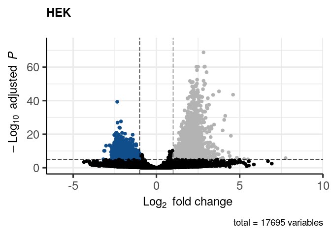
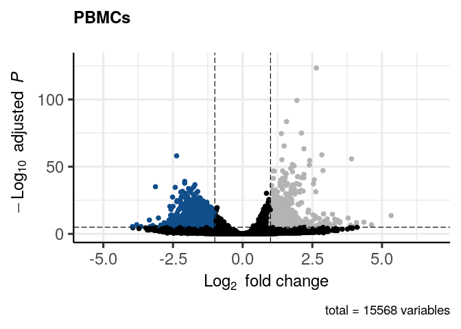
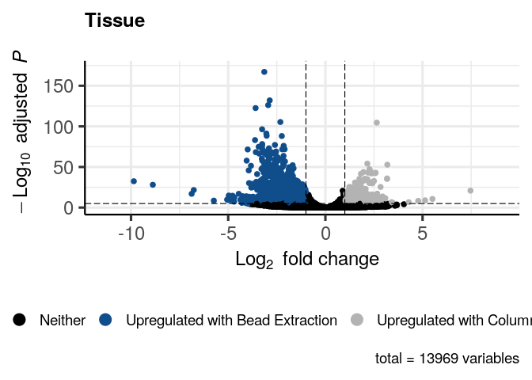
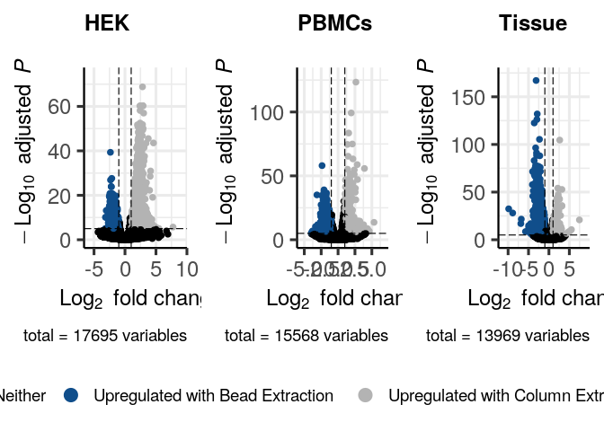
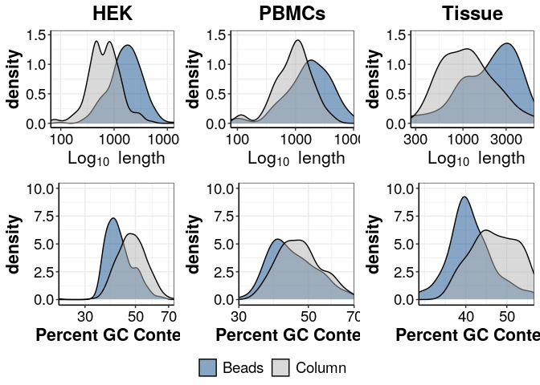

## Purpose:

# Figure S2 – Length/GC and Volcano Plots

### 1\. Load the following packages:

``` r
library(tidyverse)
library(ggsignif)
library(ggrepel)
library(edgeR)
library(genefilter)
library(grid)
library(gridExtra)
library(ggsci)
library(UpSetR)
library(cowplot)
library(Seurat)
library(DESeq2)
library(EnhancedVolcano)
library(biomaRt)
```

### 2\. Load following functions:

``` r
### all necessary custom functions are in the following script
source(paste0(here::here(),"/0_Scripts/custom_functions.R"))
#prevent scientific notation
options(scipen=999)

theme_pub <- theme_bw() + theme(
                                     plot.title = element_text(hjust = 0.5, size=18, face="bold"),
                                     axis.text = element_text(colour="black", size=14), 
                                     axis.title=element_text(size=16,face="bold"), 
                                     legend.text=element_text(size=14),
                                     legend.position="right",
                                     axis.line.x = element_line(colour = "black"), 
                                     axis.line.y = element_line(colour = "black"),
                                     strip.background=element_blank(), 
                                     strip.text=element_text(size=16))  

fig_path<-paste0(here::here(),"/1_RNA_isolation/")
```

### 3\. HEK

#### 3.1 DE Genes HEK Columns vs. Beads

``` r
counts <- readRDS(paste0(fig_path,"Bulk_opt_lysis_test_2_HEK.dgecounts.rds"))

inf <- read.csv(paste0(fig_path,"sample_info.csv"), header = T, stringsAsFactors = F)

inf$Sample <- as.character(inf$Sample)

inf<-inf %>% 
  mutate(Condition=case_when(Condition=="Incubation + ProtK"~"Magnetic Beads",
                             TRUE~Condition))

##subset info table
inf_HEK <- inf %>% filter(Celltype == "HEK") %>% filter(Cells == "10") %>% filter(Condition == c("Column", "Magnetic Beads"))

##subset data
#inex
inex_umi <- as.matrix(counts$umicount$inex$all) %>% remove_Geneversion()
#only HEK XCs
inex_umi <- inex_umi[,inf_HEK$BC]
#remove ERCCs
inex_umi <- inex_umi[grep("ERCC", row.names(inex_umi), invert = TRUE) ,]


##DESeq2
des <- DESeqDataSetFromMatrix( countData = inex_umi,
                               colData = inf_HEK,
                               design = ~ 0 + Condition)
des <- DESeq(des, test = "Wald")

Column_vs_Beads <- results(des, contrast = c("Condition", "Column", "Magnetic Beads"), alpha = 0.05)
Column_vs_Beads <- na.omit(Column_vs_Beads)
summary(Column_vs_Beads)
```

    ## 
    ## out of 17695 with nonzero total read count
    ## adjusted p-value < 0.05
    ## LFC > 0 (up)       : 4157, 23%
    ## LFC < 0 (down)     : 4011, 23%
    ## outliers [1]       : 0, 0%
    ## low counts [2]     : 0, 0%
    ## (mean count < 1)
    ## [1] see 'cooksCutoff' argument of ?results
    ## [2] see 'independentFiltering' argument of ?results

``` r
Column_vs_Beads_HEK <- as.data.frame(Column_vs_Beads)

##volcano plot
# create custom key-value pairs for 'high', 'low', 'mid' expression by fold-change
# set the base colour as 'black'
keyvals <- rep('black', nrow(Column_vs_Beads))

# set the base name/label as 'Neither'
names(keyvals) <- rep('Neither', nrow(Column_vs_Beads))

# modify keyvals for variables with fold change > 1
keyvals[which((Column_vs_Beads$log2FoldChange > 1) & (Column_vs_Beads$padj < 10e-6))] <- 'gray70'
names(keyvals)[which((Column_vs_Beads$log2FoldChange > 1) & (Column_vs_Beads$padj < 10e-6))] <- 'Upregulated with Column Extraction'

# modify keyvals for variables with fold change < -1
keyvals[which((Column_vs_Beads$log2FoldChange < -1) & (Column_vs_Beads$padj < 10e-6))] <- 'dodgerblue4'
names(keyvals)[which((Column_vs_Beads$log2FoldChange < -1) & (Column_vs_Beads$padj < 10e-6))] <- 'Upregulated with Bead Extraction'

unique(names(keyvals))
```

    ## [1] "Upregulated with Column Extraction" "Neither"                           
    ## [3] "Upregulated with Bead Extraction"

``` r
volcano_hek <- EnhancedVolcano(Column_vs_Beads,
    lab = rownames(Column_vs_Beads),
    selectLab = "",
    x = 'log2FoldChange',
    y = 'padj',
    xlab = bquote(~Log[2]~ 'fold change'),
    ylab = bquote(~-Log[10]~adjusted~italic(P)),
    pCutoff = 10e-6,
    FCcutoff = 1,
    title = "HEK",
    subtitle = element_blank(),
    colCustom = keyvals,
    colAlpha = 1,
    legendPosition = "none")

volcano_hek
```

<!-- -->

#### 3.2 Length and GC bias of DE genes (HEK Column vs. Beads)

``` r
## length and gc
#df with genes and which cond it is upregulated in
Column_vs_Beads_HEK$ENSEMBL <- row.names(Column_vs_Beads_HEK)
Column_vs_Beads_HEK_filt <- Column_vs_Beads_HEK %>% 
  filter(padj >0.05) %>%
  filter(abs(log2FoldChange) > 2)%>%
  mutate(Upregulated=if_else(log2FoldChange > 2,"Column","Beads"))


#BM length and gc
ensembl<-useMart("ensembl", 
                 dataset="hsapiens_gene_ensembl", 
                 host="uswest.ensembl.org")

info_L_GC <- getBM(attributes = c("ensembl_gene_id", 
                                  "external_gene_name",
                                  "transcript_length",
                                  "percentage_gene_gc_content"),
                          filters = "ensembl_gene_id",
                          values = Column_vs_Beads_HEK_filt$ENSEMBL,
                          mart = ensembl) %>% 
  group_by(ensembl_gene_id) %>%
  summarise(length= round(mean( transcript_length )),
            gc = round(mean(percentage_gene_gc_content)))
colnames(info_L_GC) <- c("ENSEMBL", "Length", "GC")

Column_vs_Beads_HEK_filt <- left_join(Column_vs_Beads_HEK_filt, info_L_GC, by = "ENSEMBL")

plot_length_HEK <- ggplot(Column_vs_Beads_HEK_filt, aes(x=Length, fill = Upregulated)) + 
  geom_density(alpha=0.5) + 
  scale_x_continuous(trans = "log10",expand = c(0, 0)) + 
  ylim(0,1.5)+
  xlab(bquote(~Log[10]~length)) +
  ggtitle("HEK")+
  theme_pub+
  scale_fill_manual(values =c("dodgerblue4","gray70"))+
  theme(legend.title = element_blank(), 
        legend.position="none",
        strip.text.y = element_text(angle = 360)) 

plot_length_HEK
```

<!-- -->

``` r
plot_gc_HEK <- ggplot(Column_vs_Beads_HEK_filt, aes(x=GC, fill = Upregulated)) + 
  geom_density(alpha=0.5) + 
  scale_x_continuous(trans = "log10",expand = c(0, 0)) + 
  ylim(0,10)+
  xlab("Percent GC Content") +
  theme_pub+
  scale_fill_manual(values =c("dodgerblue4","gray70"))+
  theme(legend.title = element_blank(), 
        legend.position="none",
        strip.text.y = element_text(angle = 360)) 

plot_gc_HEK
```

<!-- -->

### 4\. PBMCs

#### 4.1 DE Genes PBMC Columns vs. Beads

``` r
counts <- readRDS(paste0(fig_path,"Bulk_opt_lysis_PBMCs.dgecounts.rds"))
##subset info table
inf_PBMC <- inf %>% filter(Celltype == "PBMCs")

##subset data
#inex
inex_umi <- as.matrix(counts$umicount$inex$all) %>% remove_Geneversion()
#only PBMCs XCs
inex_umi <- inex_umi[,inf_PBMC$XC]
#remove ERCCs
inex_umi <- inex_umi[grep("ERCC", row.names(inex_umi), invert = TRUE) ,]


##DESeq2
des <- DESeqDataSetFromMatrix( countData = inex_umi,
                               colData = inf_PBMC,
                               design = ~ 0 + Condition)
des <- DESeq(des, test = "Wald")

Column_vs_Beads <- results(des, contrast = c("Condition", "Column", "Magnetic Beads"), alpha = 0.05)
Column_vs_Beads <- na.omit(Column_vs_Beads)
summary(Column_vs_Beads)
```

    ## 
    ## out of 15568 with nonzero total read count
    ## adjusted p-value < 0.05
    ## LFC > 0 (up)       : 2841, 18%
    ## LFC < 0 (down)     : 3352, 22%
    ## outliers [1]       : 0, 0%
    ## low counts [2]     : 0, 0%
    ## (mean count < 1)
    ## [1] see 'cooksCutoff' argument of ?results
    ## [2] see 'independentFiltering' argument of ?results

``` r
Column_vs_Beads_pbmcs <- as.data.frame(Column_vs_Beads)

##volcano plot
# create custom key-value pairs for 'high', 'low', 'mid' expression by fold-change
# set the base colour as 'black'
keyvals <- rep('black', nrow(Column_vs_Beads))

# set the base name/label as 'Neither'
names(keyvals) <- rep('Neither', nrow(Column_vs_Beads))

# modify keyvals for variables with fold change > 1
keyvals[which((Column_vs_Beads$log2FoldChange > 1) & (Column_vs_Beads$padj < 10e-6))] <- 'gray70'
names(keyvals)[which((Column_vs_Beads$log2FoldChange > 1) & (Column_vs_Beads$padj < 10e-6))] <- 'Upregulated with Column Extraction'

# modify keyvals for variables with fold change < -1
keyvals[which((Column_vs_Beads$log2FoldChange < -1) & (Column_vs_Beads$padj < 10e-6))] <- 'dodgerblue4'
names(keyvals)[which((Column_vs_Beads$log2FoldChange < -1) & (Column_vs_Beads$padj < 10e-6))] <- 'Upregulated with Bead Extraction'

unique(names(keyvals))
```

    ## [1] "Neither"                            "Upregulated with Bead Extraction"  
    ## [3] "Upregulated with Column Extraction"

``` r
volcano_pbmcs <- EnhancedVolcano(Column_vs_Beads,
    lab = rownames(Column_vs_Beads),
    selectLab = "",
    x = 'log2FoldChange',
    y = 'padj',
    xlab = bquote(~Log[2]~ 'fold change'),
    ylab = bquote(~-Log[10]~adjusted~italic(P)),
    pCutoff = 10e-6,
    FCcutoff = 1,
    title = "PBMCs",
    subtitle = element_blank(),
    colCustom = keyvals,
    colAlpha = 1,
    legendPosition = "none")


volcano_pbmcs
```

<!-- -->

#### 4.2 Length and GC bias of DE genes (PBMCs Column vs. Beads)

``` r
## length and gc
#df with genes and which cond it is upregulated in
Column_vs_Beads_pbmcs$ENSEMBL <- row.names(Column_vs_Beads_pbmcs)
Column_vs_Beads_pbmcs_filt <- Column_vs_Beads_pbmcs %>%
  filter(padj >0.05) %>%
  filter(abs(log2FoldChange) > 2)%>%
  mutate(Upregulated=if_else(log2FoldChange > 2,"Column","Beads"))

#BM length and gc
ensembl<-useMart("ensembl", 
                 dataset="hsapiens_gene_ensembl", host="uswest.ensembl.org")

info_L_GC <- getBM(attributes = c("ensembl_gene_id", "external_gene_name",
                                         "transcript_length",
                                         "percentage_gene_gc_content"),
                          filters = "ensembl_gene_id",
                          values = Column_vs_Beads_pbmcs_filt$ENSEMBL,
                          mart = ensembl) %>% 
  group_by(ensembl_gene_id) %>%
  summarise(length= round(mean( transcript_length )),
            gc = round(mean(percentage_gene_gc_content)))
colnames(info_L_GC) <- c("ENSEMBL", "Length", "GC")

Column_vs_Beads_pbmcs_filt <- left_join(Column_vs_Beads_pbmcs_filt, info_L_GC, by = "ENSEMBL")

plot_length_pbmcs <- ggplot(Column_vs_Beads_pbmcs_filt, aes(x=Length, fill = Upregulated)) + 
  geom_density(alpha=0.5) + 
  scale_x_continuous(trans = "log10",expand = c(0, 0)) + 
  ylim(0,1.5)+
  xlab(bquote(~Log[10]~length)) +
  ggtitle("PBMCs")+
  theme_pub+
  scale_fill_manual(values =c("dodgerblue4","gray70"))+
  theme(legend.title = element_blank(), 
        legend.position="none",
        strip.text.y = element_text(angle = 360)) 

plot_length_pbmcs
```

<!-- -->

``` r
plot_gc_pbmcs <- ggplot(Column_vs_Beads_pbmcs_filt, aes(x=GC, fill = Upregulated)) + 
  geom_density(alpha=0.5) + 
  scale_x_continuous(trans = "log10",expand = c(0, 0)) + 
  ylim(0,10)+
  xlab("Percent GC Content") +
  theme_pub+
  scale_fill_manual(values =c("dodgerblue4","gray70"))+
  theme(legend.title = element_blank(), 
        legend.position="none",
        strip.text.y = element_text(angle = 360)) 

plot_gc_pbmcs
```

<!-- -->

### 5\. Striatal Tissue

#### 5.1 DE Genes Striatal Tissue Columns vs. Beads

``` r
counts <- readRDS(paste0(fig_path,"Bulk_opt_lysis_Tissue.dgecounts.rds"))


##subset info table
inf_Tissue <- inf %>% filter(Celltype == "Tissue")

##subset data
#inex
inex_umi <- as.matrix(counts$umicount$inex$all) %>%  remove_Geneversion()
#only tissue XCs
inex_umi <- inex_umi[,inf_Tissue$XC]
#remove ERCCs
inex_umi <- inex_umi[grep("ERCC", row.names(inex_umi), invert = TRUE) ,]


##DESeq2
des <- DESeqDataSetFromMatrix( countData = inex_umi,
                               colData = inf_Tissue,
                               design = ~ 0 + Condition)
des <- DESeq(des, test = "Wald")

Column_vs_Beads <- results(des, contrast = c("Condition", "Column", "Magnetic Beads"), alpha = 0.05)
Column_vs_Beads <- na.omit(Column_vs_Beads)
summary(Column_vs_Beads)
```

    ## 
    ## out of 13969 with nonzero total read count
    ## adjusted p-value < 0.05
    ## LFC > 0 (up)       : 1142, 8.2%
    ## LFC < 0 (down)     : 4833, 35%
    ## outliers [1]       : 0, 0%
    ## low counts [2]     : 0, 0%
    ## (mean count < 1)
    ## [1] see 'cooksCutoff' argument of ?results
    ## [2] see 'independentFiltering' argument of ?results

``` r
Column_vs_Beads_tissue <- as.data.frame(Column_vs_Beads)

##volcano plot
# create custom key-value pairs for 'high', 'low', 'mid' expression by fold-change
# set the base colour as 'black'
keyvals <- rep('black', nrow(Column_vs_Beads))

# set the base name/label as 'Neither'
names(keyvals) <- rep('Neither', nrow(Column_vs_Beads))

# modify keyvals for variables with fold change > 1
keyvals[which((Column_vs_Beads$log2FoldChange > 1) & (Column_vs_Beads$padj < 10e-6))] <- 'gray70'
names(keyvals)[which((Column_vs_Beads$log2FoldChange > 1) & (Column_vs_Beads$padj < 10e-6))] <- 'Upregulated with Column Extraction'

# modify keyvals for variables with fold change < -1
keyvals[which((Column_vs_Beads$log2FoldChange < -1) & (Column_vs_Beads$padj < 10e-6))] <- 'dodgerblue4'
names(keyvals)[which((Column_vs_Beads$log2FoldChange < -1) & (Column_vs_Beads$padj < 10e-6))] <- 'Upregulated with Bead Extraction'

unique(names(keyvals))
```

    ## [1] "Upregulated with Bead Extraction"   "Neither"                           
    ## [3] "Upregulated with Column Extraction"

``` r
volcano_tissue <- EnhancedVolcano(Column_vs_Beads,
    lab = rownames(Column_vs_Beads),
    selectLab = "",
    x = 'log2FoldChange',
    y = 'padj',
    xlab = bquote(~Log[2]~ 'fold change'),
    ylab = bquote(~-Log[10]~adjusted~italic(P)),
    pCutoff = 10e-6,
    FCcutoff = 1,
    title = "Tissue",
    subtitle = element_blank(),
    colCustom = keyvals,
    colAlpha = 1,
    legendPosition = "bottom")

volcano_tissue
```

<!-- -->

#### 5.2 Length and GC bias of DE genes (Striatal Tissue Column vs. Beads)

``` r
## length and gc
#df with genes and which cond it is upregulated in
Column_vs_Beads_tissue$ENSEMBL <- row.names(Column_vs_Beads_tissue)
Column_vs_Beads_tissue_filt <- Column_vs_Beads_tissue %>% filter(padj >0.05) %>%
  filter(padj >0.05) %>%
  filter(abs(log2FoldChange) > 2)%>%
  mutate(Upregulated=if_else(log2FoldChange > 2,"Column","Beads"))

#BM length and gc
ensembl<-useMart("ensembl", 
                 dataset="mmusculus_gene_ensembl", host="uswest.ensembl.org")

info_L_GC <- getBM(attributes = c("ensembl_gene_id", "external_gene_name",
                                         "transcript_length",
                                         "percentage_gene_gc_content"),
                          filters = "ensembl_gene_id",
                          values = Column_vs_Beads_tissue_filt$ENSEMBL,
                          mart = ensembl) %>% 
  group_by(ensembl_gene_id) %>%
  summarise(length= round(mean( transcript_length )),
            gc = round(mean(percentage_gene_gc_content)))
colnames(info_L_GC) <- c("ENSEMBL", "Length", "GC")

Column_vs_Beads_tissue_filt <- left_join(Column_vs_Beads_tissue_filt, info_L_GC, by = "ENSEMBL")

plot_length_tissue <- ggplot(Column_vs_Beads_tissue_filt, aes(x=Length, fill = Upregulated)) + 
  geom_density(alpha=0.5) + 
  scale_x_continuous(trans = "log10",expand = c(0, 0)) + 
  ylim(0,1.5)+
  xlab(bquote(~Log[10]~length)) +
  ggtitle("Tissue")+
  theme_pub+
  scale_fill_manual(values =c("dodgerblue4","gray70"))+
  theme(legend.title = element_blank(), 
        legend.position="none",
        strip.text.y = element_text(angle = 360)) 

plot_length_tissue
```

<!-- -->

``` r
plot_gc_tissue <- ggplot(Column_vs_Beads_tissue_filt, aes(x=GC, fill = Upregulated)) + 
  geom_density(alpha=0.5) + 
  scale_x_continuous(trans = "log10",expand = c(0, 0)) + 
  ylim(0,10)+
  xlab("Percent GC Content") +
  theme_pub+
  scale_fill_manual(values =c("dodgerblue4","gray70"))+
  theme(legend.title = element_blank(), 
        legend.position="bottom",
        strip.text.y = element_text(angle = 360))

plot_gc_tissue
```

<!-- -->

### 6\. Final Figures

``` r
#volcano plot
legend_volcano <- cowplot::get_legend(volcano_tissue)
volcano_all <- cowplot::plot_grid(volcano_hek, volcano_pbmcs, volcano_tissue + theme(legend.position = "none"),
  ncol = 3,
  nrow = 1
)
Supp_Fig_volcano_all <- cowplot::plot_grid(volcano_all, legend_volcano,
  ncol = 1,
  nrow = 2,
  rel_heights = c(5,1)
)

Supp_Fig_volcano_all
```

<!-- -->

``` r
#lenght gc content plot
legend_density <- cowplot::get_legend(plot_gc_tissue)
density_length <- cowplot::plot_grid(plot_length_HEK, 
                                  plot_length_pbmcs, 
                                  plot_length_tissue, ncol=3, nrow=1)
density_gc <- cowplot::plot_grid(plot_gc_HEK,
                                  plot_gc_pbmcs,
                                  plot_gc_tissue + theme(legend.position = "none"), ncol=3, nrow=1)

Supp_Fig_density_all <- cowplot::plot_grid(density_length, density_gc, legend_density,
  ncol = 1,
  nrow = 3,
  rel_heights = c(5.1,5,1)
)


Supp_Fig_density_all
```

<!-- -->
