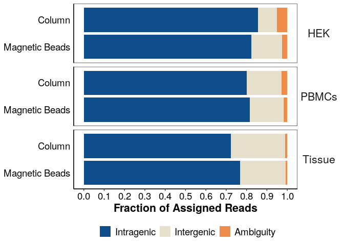
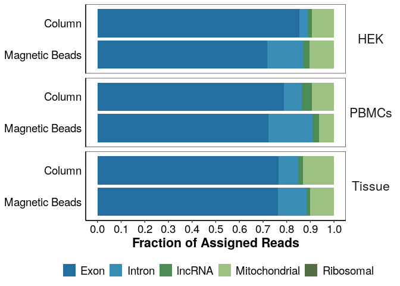
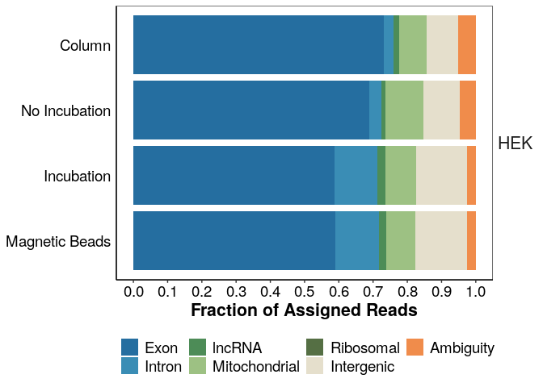

## Purpose:

Figure 2 - Lysis, mapping features

## Protocol:

### 1\. Load the following packages:

``` r
library(tidyverse)
library(ggsignif)
library(ggrepel)
library(edgeR)
library(genefilter)
library(grid)
library(gridExtra)
library(ggsci)
library(cowplot)
```

### 2\. Load following functions:

``` r
## all necessary custom functions are in the following script
source(paste0(here::here(),"/0_Scripts/custom_functions.R"))

theme_pub <- theme_bw() + theme(plot.title = element_text(hjust = 0.5, size=18, face="bold"),
                                     axis.text = element_text(colour="black", size=14), 
                                     axis.title=element_text(size=16,face="bold"), 
                                     legend.text=element_text(size=14),
                                     legend.position="right",
                                     axis.line.x = element_line(colour = "black"), 
                                     axis.line.y = element_line(colour = "black"),
                                     strip.background=element_blank(), 
                                     strip.text=element_text(size=16))  

theme_set(theme_pub)

#prevent scientific notation
options(scipen=999)

fig_path <- paste0(here::here(),"/1_RNA_isolation/")
```

# Features Plots

### 3\. Information files

``` r


inf <- read.csv(paste0(fig_path,"/sample_info.csv"), header = T, stringsAsFactors = F)

inf$Sample <- as.character(inf$Sample)

inf<-inf %>% 
  mutate(Condition=case_when(Condition=="Incubation + ProtK"~"Magnetic Beads",
                             TRUE~Condition))
```

### 3.1 readspercell files

Load readspercell files from zUMIs, which show mapping features for
every Barcode

``` r
#read files
readspercell_HEK <- read.table(paste0(fig_path,"Bulk_opt_lysis_test_2_HEK.readspercell.txt"), header = T)
readspercell_HEK$Celltype <- "HEK"

readspercell_PBMCs <- read.table(paste0(fig_path,"Bulk_opt_lysis_PBMCs.readspercell.txt"), header = T)
readspercell_PBMCs$Celltype <- "PBMCs"

readspercell_Tissue <- read.table(paste0(fig_path,"Bulk_opt_lysis_Tissue.readspercell.txt"), header = T)
readspercell_Tissue$Celltype <- "Tissue"


readspercell <- bind_rows(readspercell_HEK, 
                          readspercell_PBMCs,
                          readspercell_Tissue)

colnames(readspercell)[1] <- "XC" 
```

### 4\. Mitochondrial, Ribosomal, and lncRNA Reads - HEK

Calculate the mitochondrial and ribosomal reads from exonic and intronic
count matrix and use this for features plots

``` r

## define colours
iso_type_cols<-c("#00BECF","#EB343C","#F49D5B", "#4BAF66")
names(iso_type_cols)<-c("Column", 
                       "No Incubation",
                       "Incubation",
                       "Magnetic Beads")

seqType_cols<-c("#00BECF","#EB343C","#F49D5B", "#4BAF66")
names(seqType_cols)<-c("Mitochondrial", 
                       "Ribosomal",
                       "lncRNA",
                       "Coding")


# #load count matrix
# counts <- readRDS(paste0(fig_path,"Bulk_opt_lysis_test_2_HEK.dgecounts.rds"))# too big for github
# 
# #subset exonic and intronic reads
# 
# inex <- as.matrix(counts$readcount$inex$all) %>% remove_Geneversion()# remove ensembl gene_version_id
# 
# write_rds(inex,paste0(fig_path,"Bulk_opt_lysis_test_2_HEK.dgecounts.inex.rds"))

inex <- readRDS(paste0(fig_path,"Bulk_opt_lysis_test_2_HEK.dgecounts.inex.rds"))

gtype <- data.frame(species = "human", getbiotype("hsapiens_gene_ensembl", species = "human"))


## Summarize exonic & intronic counts by biotype and condition

inex_gtype_sum<-inex %>% 
  as.data.frame() %>% 
  rownames_to_column(var="ENSEMBL") %>% 
  left_join(gtype) %>% 
  group_by(type) %>% 
  summarize(across(where(is.double),sum)) %>% 
  mutate(type=if_else(is.na(type),"coding",type)) %>% 
  pivot_longer(cols = where(is.double),values_to="Counts",names_to="BC") %>% 
  mutate(type=case_when(type=="mito"~"Mitochondrial",
                        type=="rrna"~"Ribosomal",
                        type=="lnc"~"lncRNA",
                        type=="coding"~"Coding")) %>% 
  left_join(inf) %>% 
  mutate(cond=paste(Celltype, Condition)) %>% 
  mutate(Condition=factor(Condition,levels = c("Column", 
                                               "No Incubation",
                                               "Incubation",
                                               "Magnetic Beads")))

plot_gtype_bar_HEK_all_inex <- ggplot(inex_gtype_sum, aes(x=Condition, y=Counts))+
    geom_col(aes(fill=type),position=position_fill()) +
    ylab("Counts") +
    xlab("Extraction Conditions") +
    scale_fill_manual(values = seqType_cols)+
    facet_grid(Cells~.)+
    coord_flip()+
    theme(strip.background =element_rect(fill="gray90"),
          legend.title = element_blank(),
          legend.position= "right",
          axis.title.y = element_blank(),
          axis.text.x = element_text(angle=45,hjust=1))
plot_gtype_bar_HEK_all_inex
```

<!-- -->

``` r


mitoribo_agg_HEK_inex <- inex_gtype_sum %>% 
  group_by(type,cond) %>% 
  summarize(Counts=sum(Counts),Celltype=unique(Celltype),Condition=unique(Condition)) 
```

### 5\. Mitochondrial, Ribosomal, and lncRNA Reads - PBMCs

Calculate the mitochondrial and ribosomal reads from exonic and intronic
count matrix and use this for features plots

``` r
#load count matrix
counts <- readRDS(paste0(fig_path,"/Bulk_opt_lysis_PBMCs.dgecounts.rds"))

#subset exonic and intronic reads

inex <- as.matrix(counts$readcount$inex$all) %>% remove_Geneversion()


gtype <- data.frame( species="human", getbiotype("hsapiens_gene_ensembl", species = "human"))


## Summarize exonic & intronic counts by biotype and condition

inex_gtype_sum<-inex %>% 
  as.data.frame() %>% 
  rownames_to_column(var="ENSEMBL") %>% 
  left_join(gtype) %>% 
  group_by(type) %>% 
  summarize(across(where(is.double),sum)) %>% 
  mutate(type=if_else(is.na(type),"coding",type)) %>% 
  pivot_longer(cols = where(is.double),values_to="Counts",names_to="XC") %>% 
  mutate(type=case_when(type=="mito"~"Mitochondrial",
                        type=="rrna"~"Ribosomal",
                        type=="lnc"~"lncRNA",
                        type=="coding"~"Coding")) %>% 
  left_join(inf) %>% 
  mutate(cond=paste(Celltype, Condition)) %>% 
  mutate(Condition=factor(Condition,levels = c("Column", 
                                               "Magnetic Beads")))

plot_gtype_bar_PBMC_all_inex <- ggplot(inex_gtype_sum, aes(x=Condition, y=Counts))+
    geom_col(aes(fill=type),position=position_fill()) +
    ylab("Counts") +
    xlab("Extraction Conditions") +
    scale_fill_manual(values = seqType_cols)+
    coord_flip()+
    theme(strip.background =element_rect(fill="gray90"),
          legend.title = element_blank(),
          legend.position= "right",
          axis.title.y = element_blank(),
          axis.text.x = element_text(angle=45,hjust=1))
plot_gtype_bar_PBMC_all_inex
```

<!-- -->

``` r


mitoribo_agg_PBMC_inex <- inex_gtype_sum %>% 
  group_by(type,cond) %>% 
  summarize(Counts=sum(Counts),Celltype=unique(Celltype),Condition=unique(Condition)) 
```

### 6\. Mitochondrial, Ribosomal, and lncRNA Reads - Tissue

Calculate the mitochondrial and ribosomal reads from exonic and intronic
count matrix and use this for features plots

``` r
#load count matrix
counts <- readRDS(paste0(fig_path,"/Bulk_opt_lysis_Tissue.dgecounts.rds"))

#subset exonic and intronic reads
inex <- as.matrix(counts$readcount$inex$all) %>% remove_Geneversion()

gtype <- data.frame( species="mouse", getbiotype("mmusculus_gene_ensembl", species = "mouse"))


## Summarize intronic counts by biotype and condition

inex_gtype_sum<-inex %>% 
  as.data.frame() %>% 
  rownames_to_column(var="ENSEMBL") %>% 
  left_join(gtype) %>% 
  group_by(type) %>% 
  summarize(across(where(is.double),sum)) %>% 
  mutate(type=if_else(is.na(type),"coding",type)) %>% 
  pivot_longer(cols = where(is.double),values_to="Counts",names_to="XC") %>% 
  mutate(type=case_when(type=="mito"~"Mitochondrial",
                        type=="rrna"~"Ribosomal",
                        type=="lnc"~"lncRNA",
                        type=="coding"~"Coding")) %>% 
  left_join(inf) %>% 
  mutate(cond=paste(Celltype, Condition)) %>% 
  mutate(Condition=factor(Condition,levels = c("Column", 
                                               "Magnetic Beads")))

plot_gtype_bar_Tissue_all_inex <- ggplot(inex_gtype_sum, aes(x=Condition, y=Counts))+
    geom_col(aes(fill=type),position=position_fill()) +
    ylab("Counts") +
    xlab("Extraction Conditions") +
    scale_fill_manual(values = seqType_cols)+
    coord_flip()+
    theme(strip.background =element_rect(fill="gray90"),
          legend.title = element_blank(),
          legend.position= "right",
          axis.title.y = element_blank(),
          axis.text.x = element_text(angle=45,hjust=1))
plot_gtype_bar_Tissue_all_inex
```

<!-- -->

``` r


mitoribo_agg_Tissue_inex <- inex_gtype_sum %>% 
  group_by(type,cond) %>% 
  summarize(Counts=sum(Counts),Celltype=unique(Celltype),Condition=unique(Condition))
```

### 7\. Make Final Plots

Calculate the necessary features for the mapped table

``` r


#add condition information to reads per cell
inf<-inf %>% 
  mutate(XC=if_else(Celltype=="HEK",BC,XC))

readspercell_sum <- left_join(readspercell, inf[,3:8], by = "XC") %>% 
  mutate(cond=paste(Celltype, Condition)) %>% 
  filter(XC!="bad")

#aggregate mapped assigned features
mapped <- readspercell_sum %>% 
  group_by(cond, type) %>% 
  summarize(Counts=sum(N),
            Condition=unique(Condition),
            Celltype=unique(Celltype)) %>%
  as.data.frame()

#combine the three mitoribo_agg tables

mitoribo_agg_inex <- bind_rows(mitoribo_agg_HEK_inex,mitoribo_agg_PBMC_inex,mitoribo_agg_Tissue_inex)


#add mito and ribo amounts to df
mapped <- mapped %>% 
  bind_rows(mitoribo_agg_inex) %>% 
  mutate(Condition=factor(Condition,levels=c( "Magnetic Beads",
                                               "Incubation",
                                               "No Incubation",
                                               "Column")),
         type_map=if_else(as.character(type)%in% c("Coding","lncRNA","Mitochondrial","Ribosomal","Intron","User"),
                          "Intragenic",
                          type),
         type=factor(type,
                     levels=rev(c("Coding","Intron","lncRNA","Mitochondrial","Ribosomal","Intergenic","Ambiguity","User")))) %>% 
  filter(type != "User")


mapped_type<-mapped %>% 
  group_by(Condition,Celltype,type_map,cond) %>% 
  summarize(Counts=sum(Counts))
```

``` r

feat_cols<-c("#F08C4B", "#E5DFCC", "#3A8DB5", "#556f44", "#9dc183", "#4D8C57", "#256EA0","dodgerblue4")

names(feat_cols)<-c("Ambiguity","Intergenic","Intron","Ribosomal","Mitochondrial","lncRNA","Exon","Intragenic")

#Figure 2a
plot_type_map <- ggplot(subset(mapped_type, Condition %in% c("Magnetic Beads", "Column")), aes(x=Condition, y=Counts, fill=type_map))+
    geom_bar(stat="identity", position = "fill")+
    facet_grid(Celltype~., scales="free") +
    ylab("Fraction of Assigned Reads") +
    scale_y_continuous(breaks=seq(0,1,0.1)) +
    coord_flip() +
    scale_fill_manual(values = feat_cols)+
    guides(fill = guide_legend(reverse=T))+
    theme(legend.title = element_blank(), 
          legend.position="bottom", 
          axis.title.y = element_blank(), 
          #axis.text.y = element_blank(),
          strip.text.y = element_text(angle = 360),
          panel.grid.major = element_blank(), 
          panel.grid.minor = element_blank(),
          axis.ticks.y = element_blank()) 
plot_type_map
```

<!-- -->

``` r

#Figure 2b
mapped_gtype<-mapped %>% 
  filter(type %in% c("Coding","lncRNA","Mitochondrial","Ribosomal","Intron")) %>%
  mutate(type = as.character(type), type = if_else(type == "Coding", "Exon", type), type=factor(type,
  levels=rev(c("Exon","Intron","lncRNA","Mitochondrial","Ribosomal","Intergenic","Ambiguity"))))

plot_gtype_map <- ggplot(subset(mapped_gtype, Condition %in% c("Magnetic Beads", "Column")), aes(x=Condition, y=Counts, fill=type))+
    geom_bar(stat="identity", position = "fill")+
    facet_grid(Celltype~., scales="free") +
    ylab("Fraction of Assigned Reads") +
    scale_y_continuous(breaks=seq(0,1,0.1)) +
    coord_flip() +
    scale_fill_manual(values = feat_cols)+
    guides(fill = guide_legend(reverse=T))+
    theme(legend.title = element_blank(), 
          legend.position="bottom", 
          axis.title.y = element_blank(), 
          #axis.text.y = element_blank(),
          strip.text.y = element_text(angle = 360),
          panel.grid.major = element_blank(), 
          panel.grid.minor = element_blank(),
          axis.ticks.y = element_blank()) 
plot_gtype_map
```

<!-- -->

``` r

mapped_HEK<-mapped %>% 
  mutate(type = as.character(type), type = if_else(type == "Coding", "Exon", type), type=factor(type,
  levels=rev(c("Exon","Intron","lncRNA","Mitochondrial","Ribosomal","Intergenic","Ambiguity")))) %>% 
  filter(Celltype == "HEK")


#Figure Supp_feat_HEK_all
plot_feat_map_HEK <- ggplot(mapped_HEK, aes(x=Condition, y=Counts, fill=type))+
    geom_bar(stat="identity", position = "fill")+
    facet_grid(Celltype~., scales="free") +
    ylab("Fraction of Assigned Reads") +
    scale_y_continuous(breaks=seq(0,1,0.1)) +
    coord_flip() +
    scale_fill_manual(values = feat_cols)+
    guides(fill = guide_legend(reverse=T))+
    theme_pub+
    theme(legend.title = element_blank(), 
          legend.position="bottom", 
          axis.title.y = element_blank(), 
          #axis.text.y = element_blank(),
          strip.text.y = element_text(angle = 360),
          panel.grid.major = element_blank(), 
          panel.grid.minor = element_blank(),
          axis.ticks.y = element_blank()) 

plot_feat_map_HEK
```

<!-- -->
