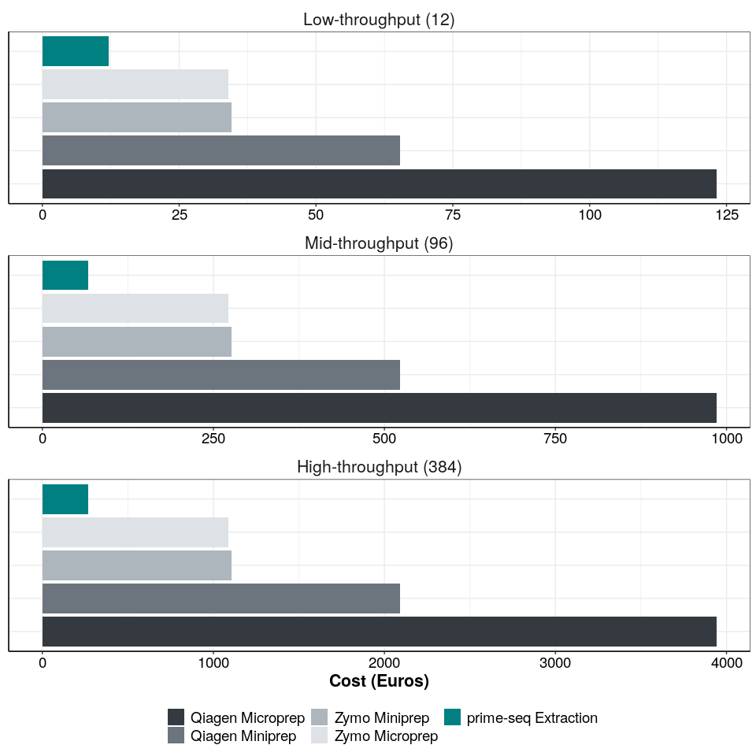
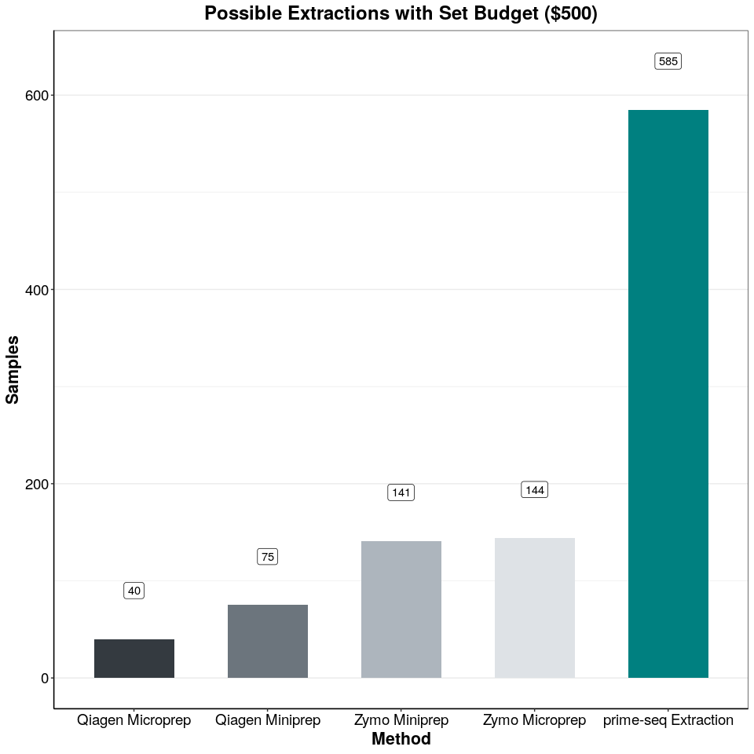

## Purpose:

Figure 2e – Cost

# Protocol:

### 1\. Load following functions:

``` r
library(ggplot2)
theme_pub <- theme_bw() + theme(plot.title = element_text(hjust = 0.5, size=18, face="bold"),
                                     axis.text = element_text(colour="black", size=14), 
                                     axis.title=element_text(size=16,face="bold"), 
                                     legend.text=element_text(size=14),
                                     legend.position="right",
                                     axis.line.x = element_line(colour = "black"), 
                                     axis.line.y = element_line(colour = "black"),
                                     strip.background=element_blank(), 
                                     strip.text=element_text(size=16))  
```

### 2\. Load the following packages:

``` r
library(tidyverse)
library(ggsignif)
library(ggrepel)
library(edgeR)
library(genefilter)
library(grid)
library(gridExtra)
library(ggsci)
library(ggplot2)

theme_set(theme_pub)


fig_path<-paste0(here::here(),"/1_RNA_isolation/")
```

## Price Plots

### 3\. Lysis Plot

``` r
lysis <- read.csv(paste0(fig_path,"Extraction_costs.csv"), header = T, stringsAsFactors = F)
samples <- read.csv(paste0(fig_path,"Extraction_samples.csv"), header = T, stringsAsFactors = F)

#factor
lysis$Method<-factor(lysis$Method,levels=(c("Qiagen Microprep", 
                                             "Qiagen Miniprep", 
                                            "Zymo Miniprep",
                                            "Zymo Microprep",
                                            "prime-seq Extraction")))
lysis$Samples<-factor(lysis$Samples,levels=(c("Low-throughput (12)", 
                                             "Mid-throughput (96)", 
                                            "High-throughput (384)")))
samples$Method<-factor(samples$Method,levels=(c("Qiagen Microprep", 
                                             "Qiagen Miniprep", 
                                            "Zymo Miniprep",
                                            "Zymo Microprep",
                                            "prime-seq Extraction")))

cost_bar <- ggplot(lysis, aes(x=Method, y=Cost, fill=Method))+
    geom_bar(stat = "identity")+
    facet_wrap(Samples~., nrow = 3, ncol = 1, scales = "free") +
    ylab("Cost (Euros)") +
    coord_flip() +
    guides(fill = guide_legend(reverse=T))+
    scale_fill_manual(values = c("#343a40","#6c757d","#adb5bd","#dee2e6","#008080"))+
    theme_pub+
    labs(fill = "RNA Extraction Method")+
    guides(fill = guide_legend(nrow = 2))+
    theme(legend.position="bottom",
          legend.title = element_blank(),
          axis.title.y = element_blank(), 
          axis.text.y = element_blank(),
          strip.text = element_text(angle = 360),
          axis.ticks.y = element_blank(),
          strip.placement = "outside") 
cost_bar
```

<!-- -->

``` r
sample_bar <- ggplot(samples, aes(x=Method, y=Samples))+
    geom_bar(aes(fill=Method), stat = "identity", width=0.6)+
    geom_label(aes(x= Method, y = Samples+50, label = Samples), data = samples)+
    ylab("Samples") +
    guides(fill = guide_legend(reverse=T))+
    scale_fill_manual(values = c("#343a40","#6c757d","#adb5bd","#dee2e6","#008080"))+
    theme_pub+
    ggtitle(label = "Possible Extractions with Set Budget ($500)")+
    guides(fill = guide_legend(nrow = 2))+
    theme(legend.position="none",
          panel.grid.major.x = element_blank()) 

sample_bar
```

<!-- -->

## Time Plots

### 4\. Lysis Plot

``` r
time <- read.csv(paste0(fig_path,"Lysis_Time.csv"), header = T, stringsAsFactors = F)

time_bar <- ggplot(time, aes(x=Method, y=Minutes, fill=Type))+
    geom_bar(position = "stack", stat = "identity", width = 0.75)+
    ylab("Minutes") +
    scale_fill_manual(values = c("#ced4da","#014f86"))+
    theme_pub+
    labs(fill = "RNA Extraction Method")+
    theme(legend.position="right",
          legend.title = element_blank()) 

time_bar
```

<!-- -->
