## Purpose:

Check Intron Expression in HEK cells

### 1. Load packages:

``` r
library(tidyverse)
library(cowplot)
library(ggsci)
library(ggbeeswarm)
library(ComplexUpset)
library(Gviz)
```

### 2. Load functions:

``` r
### all necessary custom functions are in the following script
source(paste0(here::here(),"/0_Scripts/custom_functions.R"))

theme_pub <- theme_bw() + theme(
                                     plot.title = element_text(hjust = 0.5, size=18, face="bold"),
                                     axis.text = element_text(colour="black", size=14), 
                                     axis.title=element_text(size=16,face="bold"), 
                                     legend.text=element_text(size=14),
                                     legend.position="right",
                                     axis.line.x = element_line(colour = "black"), 
                                     axis.line.y = element_line(colour = "black"),
                                     strip.background=element_blank(), 
                                     strip.text=element_text(size=16))  

theme_set(theme_pub)

#prevent scientific notation
options(scipen=999)

fig_path <- paste0(here::here(),"/3_RNA_isolation/intron_exon_analysis/")
data_path<-paste0(here::here(),"/3_RNA_isolation/")

## Feature Colours

feat_cols<-c("#F08C4B", "#E5DFCC", "#556f44", "#9dc183", "#4D8C57", "#3A8DB5", "#256EA0","dodgerblue4","#256EA0")

names(feat_cols)<-c("Ambiguity","Intergenic","Ribosomal","Mitochondrial","lncRNA","Intron","Coding","Intragenic","Exon")

inex_colors <- c("#ff5154","#91a6ff","#550527","#BC7238")
names(inex_colors)<-c("Intron","Exon","Both","Intron only")
```

### 3. Load annotation:

``` r
## annotation
gtype_human <-getbiotype("hsapiens_gene_ensembl",species="human")

ensembl <- useMart("ensembl", dataset ="hsapiens_gene_ensembl", host="uswest.ensembl.org") 

biotype <- getBM(attributes=c("ensembl_gene_id","ensembl_gene_id_version","gene_biotype","external_gene_name","chromosome_name"),
                 mart=ensembl )
```

### 4. Load data:

``` r
inf <-
  read.csv(
    paste0(data_path, "/sample_info.csv"),
    header = T,
    stringsAsFactors = F
  ) %>%
  mutate(Condition = case_when(
    Condition == "Incubation + ProtK" ~ "Magnetic Beads",
    TRUE ~ Condition
  )) %>%
  filter(Celltype == "HEK")

inf$Sample <- as.character(inf$Sample)


counts_hek <-
  readRDS(
    paste0(
      data_path,
      "Bulk_opt_lysis_test_2_HEK.dgecounts.rds"
    )
  )

# Split into exon, intron and Exon+ intron matrices.
# Filter samples and remove Geneversion numbers

counts_hek_ex <-
  counts_hek$umicount$exon$all %>% as.matrix() %>% remove_Geneversion()
counts_hek_ex <- counts_hek_ex[, inf$BC]
counts_hek_inex <-
  counts_hek$umicount$inex$all %>% as.matrix() %>% remove_Geneversion()
counts_hek_inex <- counts_hek_inex[, inf$BC]
counts_hek_in <-
  counts_hek$umicount$intron$all  %>% as.matrix() %>% remove_Geneversion()
counts_hek_in <- counts_hek_in[, inf$BC]

## make exon only / intron only matrix, remove genes detected in both
counts_hek_ex_o <-
  counts_hek_ex[!(rownames(counts_hek_ex) %in% rownames(counts_hek_in)), ]
counts_hek_in_o <-
  counts_hek_in[!(rownames(counts_hek_in) %in% rownames(counts_hek_ex)), ]
counts_hek_inex_o <-
  counts_hek_inex[!(rownames(counts_hek_inex) %in% rownames(counts_hek_ex_o)), ]
counts_hek_inex_o <-
  counts_hek_inex_o[!(rownames(counts_hek_inex_o) %in% rownames(counts_hek_in_o)), ]

counts_hek_in_o <- counts_hek_in_o[rowSums(counts_hek_in_o) > 0, ]
counts_hek_ex_o <- counts_hek_ex_o[rowSums(counts_hek_ex_o) > 0, ]
counts_hek_inex_o <- counts_hek_inex_o[rowSums(counts_hek_inex_o) > 0, ]

cond <- c("Magnetic Beads", "Column")


for (i in cond) {
  
  sub_inf <- inf %>%
    filter(Condition %in% i)
  
  intron_only_genes <-
    rownames(counts_hek_in_o[whichgenes_reproducible(counts_hek_in_o[,sub_inf$BC],
                                                     exprcutoff = 5,
                                                     reproducecutoff = 0.1), sub_inf$BC])
  
  exon_only_genes <-
    rownames(counts_hek_ex_o[whichgenes_reproducible(counts_hek_ex_o[,sub_inf$BC],
                                                     exprcutoff = 5,
                                                     reproducecutoff = 0.1), sub_inf$BC])
  
  inex_genes <-
    rownames(counts_hek_inex_o[whichgenes_reproducible(counts_hek_inex_o[,sub_inf$BC],
                                                       exprcutoff = 5,
                                                       reproducecutoff = 0.1), sub_inf$BC])
  
  inex_genes <-
    inex_genes[order(rowSums(counts_hek_inex_o[whichgenes_reproducible(counts_hek_inex_o[,sub_inf$BC],
                                                                       exprcutoff = 5,
                                                                       reproducecutoff = 0.1),
                                               sub_inf$BC]),
                     decreasing = T)] # sort by highest overall count
  
  gene_type <-
    data.frame(
      ENSEMBL = c(exon_only_genes, intron_only_genes, inex_genes),
      detection = c(
        rep("exon", times = length(exon_only_genes)),
        rep("intron", times = length(intron_only_genes)),
        rep("both", times = length(inex_genes))
      )
    ) %>%
    left_join(biotype, by = c("ENSEMBL" = "ensembl_gene_id")) %>%
    mutate(
      biotype2 = case_when(
        grepl(gene_biotype, pattern = "*pseudogene") ~ "pseudogene",
        grepl(gene_biotype, pattern = "IG*") ~ "protein coding",
        grepl(gene_biotype, pattern = "TR*") ~ "protein coding",
        grepl(gene_biotype, pattern = "MT*") ~ "other",
        grepl(gene_biotype, pattern = "^s") ~ "small RNA",
        grepl(gene_biotype, pattern = "ribozyme") ~ "other",
        gene_biotype == "misc_RNA" ~ "other",
        gene_biotype == "protein_coding" ~ "protein coding",
        T ~ gene_biotype
      ),
      cond = i
    ) %>%
    filter(!(is.na(biotype2)))
  
  gene_type$biotype2 <-
    factor(gene_type$biotype2, levels = rev(
      c(
        "protein coding",
        "lncRNA",
        "pseudogene",
        "rRNA",
        "small RNA",
        "miRNA",
        "not_annotated",
        "other"
      )
    ))
  
  if (!(exists("gene_type_sum"))) {
    gene_type_sum <- gene_type
    
  } else{
    gene_type_sum <- bind_rows(gene_type_sum, gene_type)
  }
  
}
```

### 5. Plot gene biotypes per group

``` r
ggplot() +
  geom_bar(data = gene_type_sum,
           aes(x = cond, fill = biotype2),
           #position = position_fill(),
           na.rm = T) +
  ggsci::scale_fill_npg() +
  theme(legend.position = "right") +
  labs(fill = "",
       x = "",
       y = "detected Genes") +
  facet_grid(~detection)+
  theme(axis.text.x = element_text(angle=45,hjust=1))
```

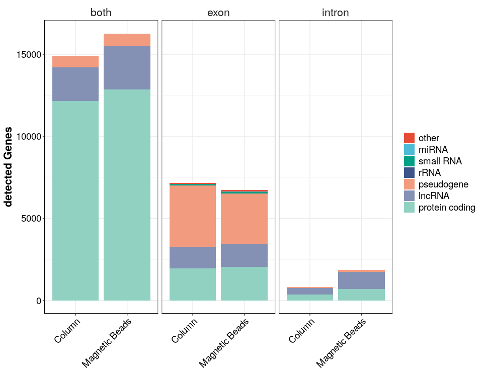<!-- -->

No difference in composition based on extraction method. We continue
with the Bead isolation Condition from here on.

``` r
inf<-inf %>% 
  filter(Condition=="Magnetic Beads")

gene_type<-gene_type_sum %>% 
  filter(cond=="Magnetic Beads")

counts_hek_inex<-counts_hek_inex[,inf$BC]

counts_hek_ex_o<-counts_hek_inex[subset(gene_type,detection=="exon")$ENSEMBL,]

counts_hek_in_o<-counts_hek_inex[subset(gene_type,detection=="intron")$ENSEMBL,]

counts_hek_inex_o<-counts_hek_inex[subset(gene_type,!(detection%in%c("intron","exon")))$ENSEMBL,]

##

counts_hek_in <- counts_hek_in[whichgenes_reproducible(counts_hek_in[,inf$BC],
                                                     exprcutoff = 2,
                                                     reproducecutoff = 0.1), inf$BC]
counts_hek_ex <- counts_hek_ex[whichgenes_reproducible(counts_hek_ex[,inf$BC],
                                                     exprcutoff = 2,
                                                     reproducecutoff = 0.1), inf$BC]
```

### 6. upset plot of intersections

``` r

average_counts<-data.frame(ENSEMBL=rownames(counts_hek_inex),
                           mean_cnt=rowMeans(counts_hek_inex)
                           )

intron_genes<-rownames(counts_hek_in) %>% 
  unique()

exon_genes<-rownames(counts_hek_ex)%>% 
  unique()

upset_df<-data.frame(ENSEMBL=c(exon_genes,intron_genes),
                      detection=c(rep("exon",
                                      times=length(exon_genes)),
                             rep("intron",
                                 times=length(intron_genes))
                             )) %>% 
  left_join(biotype,by=c("ENSEMBL"="ensembl_gene_id")) %>% 
  mutate(biotype2=case_when(grepl(gene_biotype,pattern="*pseudogene")~ "pseudogene",
                            grepl(gene_biotype,pattern="IG*")~ "protein coding",
                            grepl(gene_biotype,pattern="TR*")~ "protein coding",
                            grepl(gene_biotype,pattern="MT*")~ "other",
                            grepl(gene_biotype,pattern="^s")~ "small RNA",
                            grepl(gene_biotype,pattern="ribozyme")~ "other",
                           gene_biotype=="misc_RNA"~ "other",
                           gene_biotype=="protein_coding"~ "protein coding",
                           T~gene_biotype)) %>% 
  filter(!is.na(biotype2)) %>% 
  inner_join(average_counts)

upset_df$biotype2<-factor(upset_df$biotype2,levels=rev(c("protein coding","lncRNA","pseudogene","rRNA","small RNA","miRNA","other")))


upset_df<-upset_df %>% 
  mutate(value=TRUE) %>% 
  pivot_wider(names_from = detection,values_from = value,values_fill = FALSE) %>% 
  left_join(gene_type)

categories<-c("exon","intron")
 
upset<-upset(upset_df,
      categories,
      name="Gene detection",
      base_annotations=list(
        'Intersection size'=intersection_size(
            counts=FALSE,
            mapping=aes(fill=biotype2)
            
        )+scale_fill_npg()
        +labs(fill="")
      ),
      annotations = list(
        'nUMI'=(
            ggplot(mapping=aes(y=mean_cnt,fill=biotype2))
            +geom_boxplot(position="dodge",outlier.shape = NA,show.legend = F)
            +scale_y_log10()
            +scale_fill_npg()
      )))

upset
```

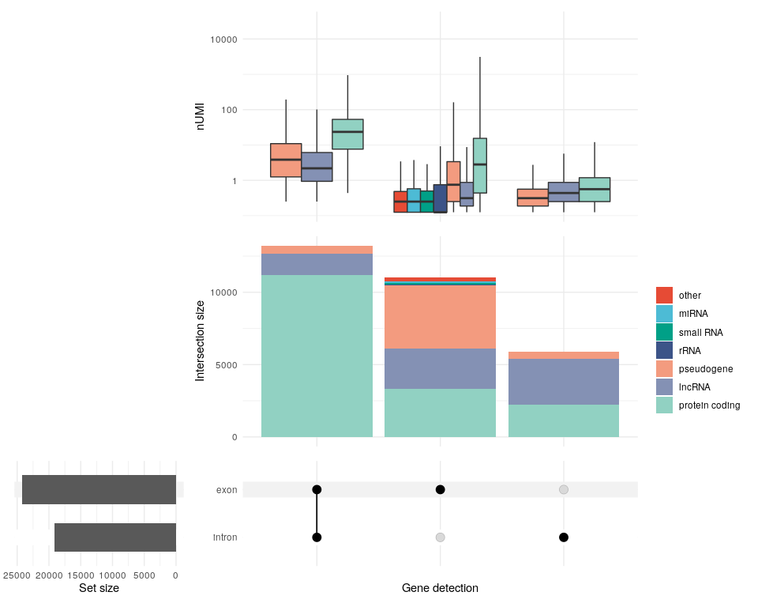<!-- -->

``` r

ggsave(upset,
       device = "pdf",
       path = fig_path,
       width = 150,
       height=180,
       units = "mm",
       filename = "upset_plot.pdf"
       )
```

### 7. Gene and UMI counts for the different conditions

``` r
make_summary<-function(mat,type){
  data.frame(BC=colnames(mat),
             umi=colSums(mat),
             gene=colSums(mat>0),
             type=type)
}


summary<-rbind(make_summary(counts_hek_ex_o,"Exon"),
      make_summary(counts_hek_in_o,"Intron"),
      make_summary(counts_hek_inex_o,"Both"))

summary$exclusive<-"yes"

ggplot(summary,aes(y=umi,x=type,col=type))+
  geom_boxplot()+
  geom_beeswarm()+
  scale_y_log10()+
  scale_colour_manual(values=inex_colors,limits=force)
```

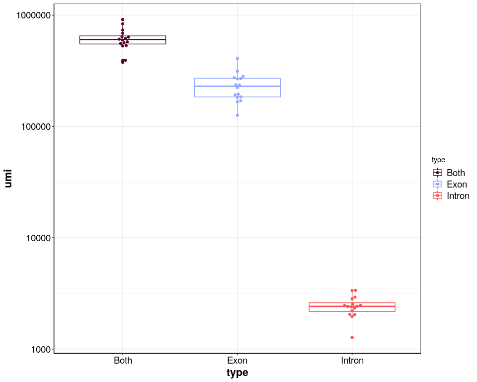<!-- -->

``` r
ggplot(summary,aes(y=gene,x=type,col=type))+
  geom_boxplot()+
  geom_beeswarm()+
  scale_y_log10()+
  scale_colour_manual(values=inex_colors,limits=force)
```

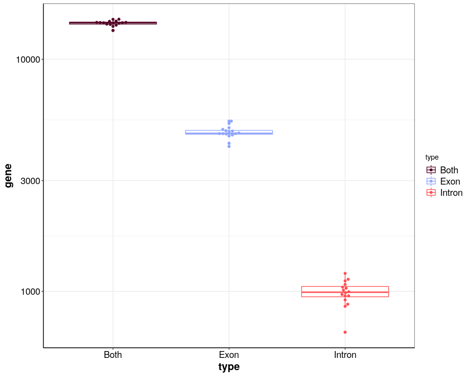<!-- -->

``` r

summary2<-rbind(make_summary(counts_hek_ex,"Exon"),
      make_summary(counts_hek_in,"Intron"),
      make_summary(counts_hek_inex,"Both"))

summary2$exclusive<-"no"

ggplot(summary2,aes(y=umi,x=type,col=type))+
  geom_boxplot()+
  geom_beeswarm()+
  scale_y_log10()+
  ggtitle("")+
  scale_colour_manual(values=inex_colors,limits=force)
```

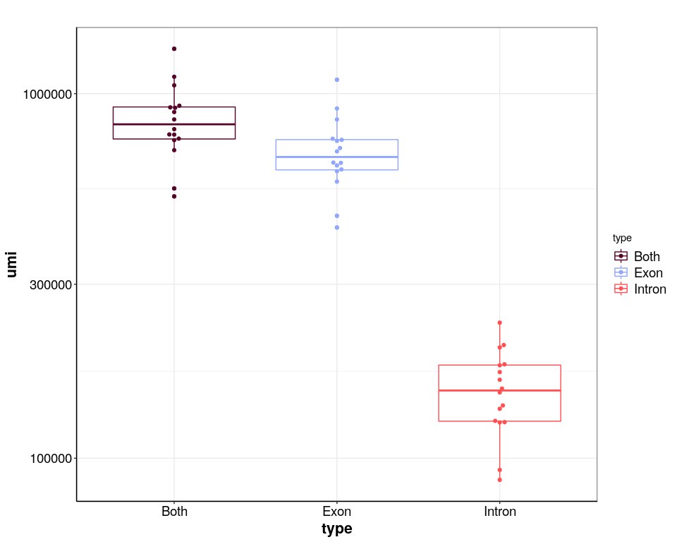<!-- -->

``` r
ggplot(summary2,aes(y=gene,x=type,col=type))+
  geom_boxplot()+
  geom_beeswarm()+
  scale_y_log10()+
  scale_colour_manual(values=inex_colors,limits=force)
```

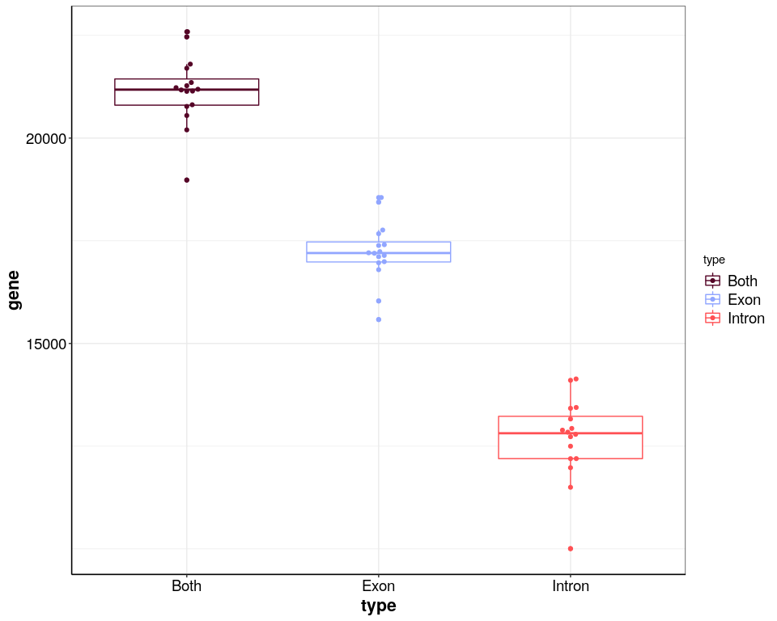<!-- -->

``` r
summary3<-rbind(summary,summary2) #%>% 
 # pivot_longer(cols=c(umi,gene),names_to = "type2" ,values_to = "count") 


ggplot(summary3,aes(type,y=gene,group=paste0(exclusive,type),col=exclusive))+
  geom_boxplot()+
  geom_beeswarm(dodge.width = 0.80)+
  scale_y_log10()
```

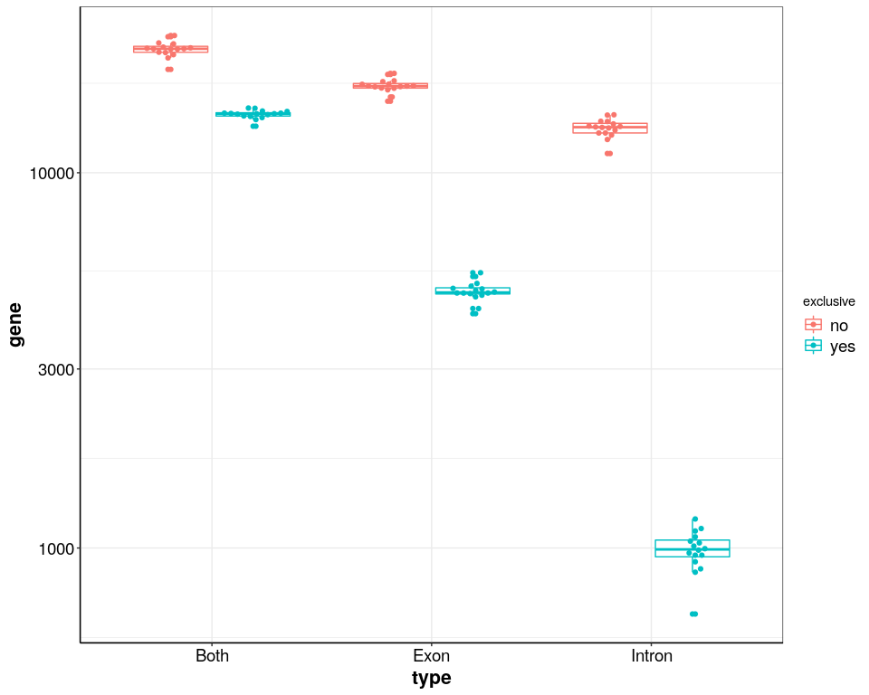<!-- -->

``` r
ggplot(summary3,aes(type,y=umi,group=paste0(exclusive,type),col=exclusive))+
  geom_boxplot()+
  geom_beeswarm(dodge.width = 0.80)+
  scale_y_log10()
```

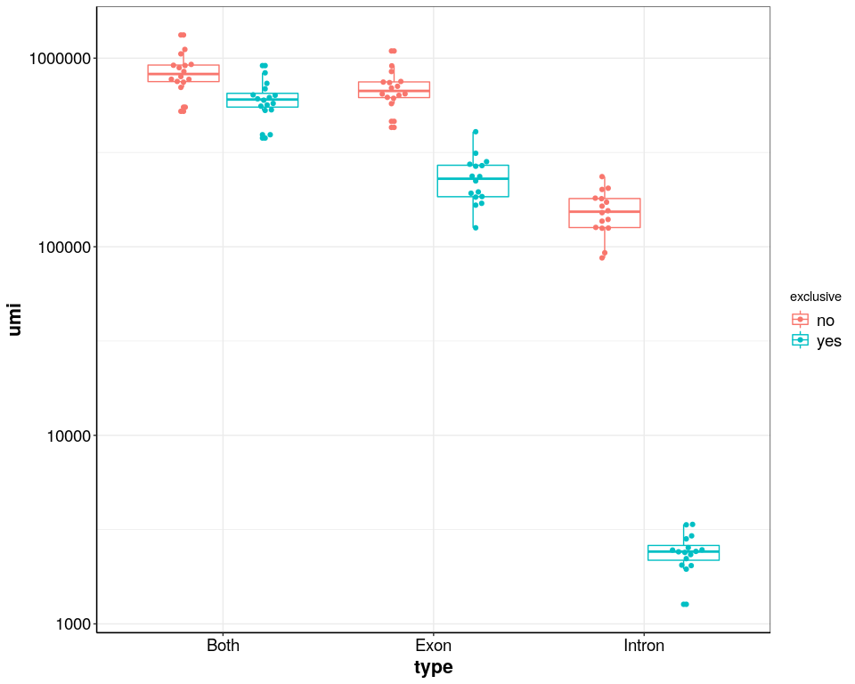<!-- -->

### 8. Exon vs. Intron expression correlation

``` r
inex_genes<-rownames(counts_hek_inex)

# subset for genes expressed in both
exon<-counts_hek_ex[rownames(counts_hek_ex)%in%inex_genes,] 
exon<-exon[whichgenes_reproducible(exon,5,reproducecutoff = 0.2),] 
exon<-exon[,] 

intron<-counts_hek_in[rownames(counts_hek_in)%in%inex_genes,]
intron<-intron[whichgenes_reproducible(intron,5,reproducecutoff = 0.2),] 

inex_lib<-data.frame(sample=names(colSums(counts_hek_inex)),
           LibSize=colSums(counts_hek_inex))

## normalize to UMI per million

upm<-function(umi_counts){ 
  umi_counts%>%
  as.data.frame() %>%
  rownames_to_column(var="GeneID") %>%
  pivot_longer( cols = 2:ncol(.),
                names_to = "sample",
                values_to = "cnt") %>%
  left_join(inex_lib) %>% 
  group_by(sample) %>%
  mutate(upm = cnt / LibSize *1e6 ) %>%
  dplyr::select(-c(LibSize,cnt))%>%
  pivot_wider(names_from = sample,
              values_from = upm) %>%
  column_to_rownames(var = "GeneID") %>%
  as.matrix()
}

exon_upm<-upm(exon)
exon_upm<-log2(exon_upm+1)
head(exon_upm)
#>                   AAAACT   ATATAG   GTTTAT   TGTTTA   GCTAGA    CCCACG   CGGTGG
#> ENSG00000000003 6.777043 6.894788 6.881346 6.944080 6.935219 7.1598135 6.991783
#> ENSG00000000419 5.572084 5.541948 5.722610 5.331175 4.769669 5.2074211 5.363794
#> ENSG00000000457 2.626398 1.880397 3.364346 2.689834 2.859309 1.8860013 2.270964
#> ENSG00000000460 3.928917 4.865845 4.638661 4.511567 4.896307 4.2459487 4.331438
#> ENSG00000000971 0.000000 0.000000 0.000000 0.000000 0.000000 0.9250104 1.542618
#> ENSG00000001036 6.173004 6.197858 6.236245 6.332796 6.385227 6.2907196 5.914327
#>                   GCTCGC   AAAGTT   ATCAAA   TAAAGT   TTAATC   GGGATT   CCCCGT
#> ENSG00000000003 7.197138 6.375255 6.389947 6.430394 6.690962 6.469344 6.334377
#> ENSG00000000419 5.931007 4.515383 4.605971 4.806156 4.524692 4.328676 4.681841
#> ENSG00000000457 3.792812 2.097778 1.704817 2.677023 3.132752 1.086215 1.943430
#> ENSG00000000460 4.886397 3.285104 3.706273 3.267919 3.802377 3.147655 3.928934
#> ENSG00000000971 0.000000 1.065916 0.000000 1.055938 1.198606 0.000000 0.000000
#> ENSG00000001036 6.120693 5.680913 5.598644 5.599290 5.722660 5.836887 5.879522
#>                   CGTGGG   GGAGCC
#> ENSG00000000003 6.876656 6.983402
#> ENSG00000000419 4.684511 4.822240
#> ENSG00000000457 2.179717 3.335826
#> ENSG00000000460 4.026753 3.959295
#> ENSG00000000971 0.000000 0.000000
#> ENSG00000001036 6.340348 5.888000

intron_upm<-upm(intron)
intron_upm<-log2(intron_upm+1)
head(intron_upm)
#>                   AAAACT   ATATAG   GTTTAT   TGTTTA   GCTAGA    CCCACG   CGGTGG
#> ENSG00000000003 0.000000 1.227052 1.870535 0.000000 1.170781 0.9250104 0.000000
#> ENSG00000000419 2.900825 3.707959 3.695444 4.023849 3.088823 3.9429054 3.641473
#> ENSG00000000457 2.900825 0.000000 1.870535 2.422748 2.586247 2.4577228 2.752681
#> ENSG00000000460 4.256398 4.651676 4.475957 4.205365 4.393785 4.8509811 4.582480
#> ENSG00000001036 1.842944 0.000000 0.000000 1.063833 1.170781 0.0000000 0.000000
#> ENSG00000001084 4.350893 4.095129 4.475957 4.820789 4.393785 4.8053408 4.892314
#>                   GCTCGC   AAAGTT   ATCAAA   TAAAGT   TTAATC   GGGATT   CCCCGT
#> ENSG00000000003 0.000000 2.425995 0.810066 1.659075 1.198606 0.000000 0.962534
#> ENSG00000000419 3.258980 2.693206 2.649165 2.677023 3.802377 3.473587 4.016111
#> ENSG00000000457 2.747467 1.672198 2.464603 3.096513 0.000000 2.127464 2.521967
#> ENSG00000000460 4.181589 4.444698 3.936642 3.685914 4.603667 4.481563 3.836148
#> ENSG00000001036 1.280269 1.065916 0.810066 1.055938 1.198606 2.127464 0.000000
#> ENSG00000001084 3.635841 3.577125 3.529332 4.426421 4.048073 4.481563 3.736982
#>                   CGTGGG   GGAGCC
#> ENSG00000000003 1.122263 0.000000
#> ENSG00000000419 3.674553 2.691105
#> ENSG00000000457 2.783333 2.213726
#> ENSG00000000460 4.026753 4.393207
#> ENSG00000001036 0.000000 1.495367
#> ENSG00000001084 4.309621 3.574847

df<-data.frame(ENSEMBL=rownames(exon_upm),exon=rowMeans(exon_upm)) %>% 
  inner_join(data.frame(ENSEMBL=rownames(intron_upm),intron=rowMeans(intron_upm))) %>% 
  inner_join(gene_type) %>% 
  filter(biotype2%in%c("protein coding")) %>% 
  unique()
  

smc_inex<-ggplot(df) + aes(x=exon, y=intron)+
  stat_density2d(geom="tile", aes(fill=..density..^0.25, alpha=1), contour=FALSE,show.legend = F) +
  geom_point(size=0.5,show.legend = F) +
  stat_density2d(geom="tile", aes(fill=..density..^0.25,     alpha=ifelse(..density..^0.25<0.15,0,1)), contour=FALSE,show.legend = F) +
  scale_fill_gradientn(colours = colorRampPalette(c("white", blues9,"black"))(256))+
  theme(panel.grid = element_blank())+
  geom_smooth(aes(exon,intron),method="lm",col="grey70")+
  labs(x="Log Mean expression Exon",y="Log Mean expression Intron")

smc_inex
```

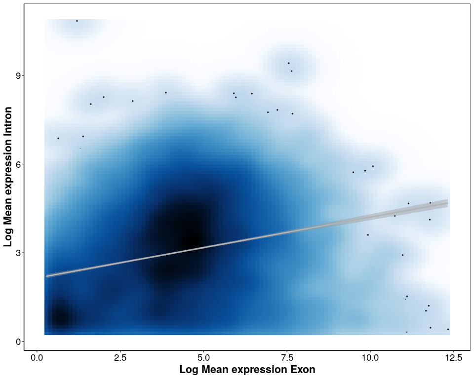<!-- -->

``` r
hist.inex<-df %>%
  dplyr::rename(Exon=exon,
         Intron=intron) %>%
  pivot_longer(cols = c("Exon","Intron")) %>%
  ggplot()+
  geom_histogram(aes(value,fill=name),alpha=0.8,colour="grey50",bins = 50)+
  scale_fill_manual(values = inex_colors,limits=force)+
  labs(x="Log Mean Expression",
       fill="")+
  theme(legend.position = c(0.8,0.5),
        legend.background = element_blank())


hist.inex
```

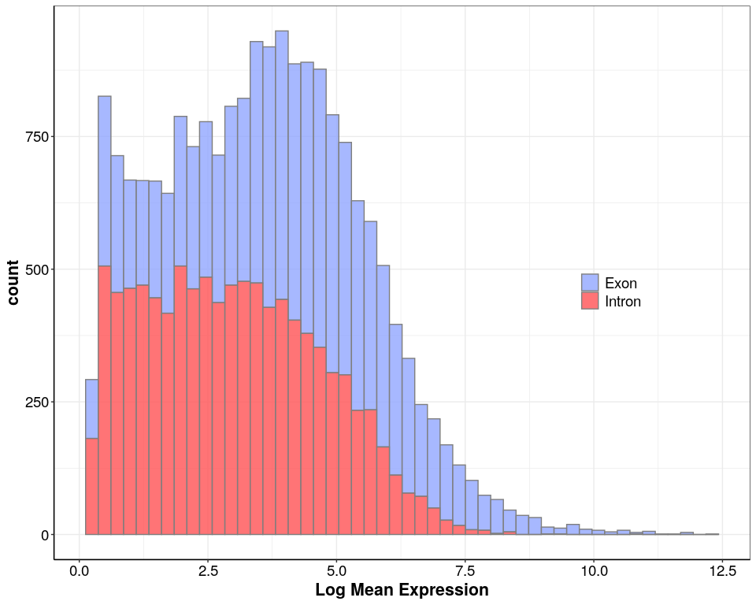<!-- -->

``` r
ggsave(smc_inex,
       device = "pdf",
       path = fig_path,
       width = 100,
       height=100,
       units = "mm",
       filename = "scatter_plot.pdf"
       )

ggsave(hist.inex,
       device = "pdf",
       path = fig_path,
       width = 100,
       height=100,
       units = "mm",
       filename = "exp_dist_plot.pdf"
       )
```

### 9. ranked exon vs. intron

``` r
rank_mat<-function(count_mat){ 
  count_mat%>%
  as.data.frame() %>%
  rownames_to_column(var="GeneID") %>%
  pivot_longer( cols = 2:ncol(.),
                names_to = "sample",
                values_to = "cnt") %>%
  arrange(GeneID,cnt) %>% 
  group_by(sample) %>%
  mutate(gene_rank = rank(cnt)) %>%
    dplyr::select(-cnt) %>% 
  pivot_wider(names_from = sample,
              values_from = gene_rank) %>% 
  ungroup() %>% 
  column_to_rownames(var = "GeneID") %>%
  as.matrix()
    
}

exon_rank<-rank_mat(exon)

intron_rank<-rank_mat(intron)

df_rank<-data.frame(ENSEMBL=rownames(exon_rank),
                    exon_rank=rowMeans(exon_rank)) %>% 
  inner_join(data.frame(ENSEMBL=rownames(intron_rank),
                        intron_rank=rowMeans(intron_rank))) %>% 
  inner_join(df) %>% 
  filter(biotype2%in%c("protein coding","lncRNA")) %>% 
  mutate(norm_rank_exon=exon_rank/max(exon_rank),
         norm_rank_intron=intron_rank/max(intron_rank))
  
  ggplot(df_rank)+
  geom_density2d_filled(aes(exon_rank,intron_rank),)+
  geom_smooth(aes(exon_rank,intron_rank),method="lm")+
  facet_wrap(~biotype2,nrow=2,scales="free")
```

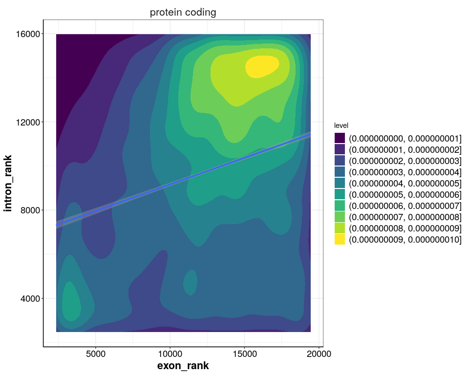<!-- -->

### 10. Genbody coverage

1: subset .bam file for barcodes 2: run get3distance\_v3\_SP\_v2.R for
intron and for exon separately 3: combine outputs and plot

``` r
bam_path<- "/data/share/htp/prime-seq_Paper/Fig_beads_columns/zUMIs/HEK/zUMIs_output/demultiplexed/"

bam_files<-list.files(path = bam_path,pattern = ".bam$")

bcs<-inf$XC

bam_files<-bam_files[str_split(bam_files,pattern = "[.]",simplify = T)[,2] %in% bcs]
```

#### get per bam file geneBody coverage

``` r
# library(GenomicRanges, quietly=T, warn.conflicts = F)
# library(GenomicFeatures, quietly=T, warn.conflicts = F)
# library(GenomicAlignments, quietly=T, warn.conflicts = F)
# 
# ## Inputs:
# #bam_files #with corresponding .bai
# #out #"name base for plot and outtable"
# counts_hek_inex<-counts_hek$umicount$inex$all %>% as.matrix()
# counts_hek_inex<-counts_hek_inex[,inf$BC]
# 
# inex_genes<-rownames(counts_hek_inex)
# 
# inex_genes<-inex_genes[order(rowSums(counts_hek_inex),decreasing = T)] # sort by highest overall count
# 
# genes <- inex_genes[1:2000] #if you want to subset genes, list of ENSG ids
# write.table(genes,paste0(bam_path,"inex.genes.txt"),quote = F,row.names = F,col.names = F)
# genes<-paste0(bam_path,"inex.genes.txt")
# 
# #ftype" #"intron or exon"
# 
# gtf_file<- "/data/share/htp/prime-seq_Paper/genomes/Hsap/gencode.v35.primary_assembly.annotation.gtf" #gtf file containing the transcript info"
# txdb <- makeTxDbFromGFF(gtf_file, format="gtf")
# 
# # restrict to canonical chromosomes
# 
# canonical_chr<-seqlevels(txdb)[1:25]
# 
# 
# tmp<-transcriptsBy(txdb, by="gene")
# gene2transcript<-lapply( tmp, function(x){  mcols(x)$tx_name })
# 
# saveDb(txdb, file="/data/share/htp/prime-seq_Paper/genomes/Hsap/gencode.v35.primary_assembly.sqlite")
# save(gene2transcript,file="/data/share/htp/prime-seq_Paper/genomes/Hsap/gene2transcript_canonical.Rdata" )
# 
# txdb<-"/data/share/htp/prime-seq_Paper/genomes/Hsap/gencode.v35.primary_assembly.sqlite"
# g2t<-"/data/share/htp/prime-seq_Paper/genomes/Hsap/gene2transcript_canonical.Rdata"
# 
# maxTdist <- 10000 #"max dist. to 3' end counted"
# minTlength <- 0  #"minimal length of transcripts considered"
# max_exon_length<- 5000 # max length of exons per gene
# ngenes<- 2000 #max number of genes to use
# 
# # i="HEK.ACTGAGCGAAAACT.demx.bam"
# # j="intron"
# 
# # index
#  for (i in bam_files){
#    if (!(file.exists(paste0(bam_path,i,".bai"))))
# 
#    # index bam file
#   system(paste0("samtools index ",bam_path,i))
# 
#  }
# 
# 
# ## start slurm jobs
#  for (i in bam_files){
#    for (j in c("exon","intron")){
#   out<- str_split(i,pattern = "[.]",simplify = T)[,2]
# 
# 
#   system(
#     paste0(
#       "sbatch -J ",
#       out,
#       " --wrap '/opt/bin/Rscript",
#       " /data/share/common/scripts/get3distance_v3_SP_v2_LW_v1.R",
#       " --bamfile ",
#       paste0(bam_path, i),
#       " --txdb ",
#       txdb,
#       " --g2tmapping ",
#       g2t,
#       " --out ",
#       paste0(out,"_", j),
#       " --minTlength ",
#       minTlength,
#       " --max_exon_length ",
#       max_exon_length,
#       " --ftype ",
#       j,
#       " --plot F ",
#       " --canonical T ",
#       " --genes ",
#       genes,
#       " --ngenes ",
#       ngenes,
#       "'"
#     )
#   )
# 
# }}
# 
```

#### intron only genes

``` r
counts_hek_in_o<-counts_hek_in_o[,inf$BC]

intron_only_genes <-unique(rownames(counts_hek_in_o))

intron_only_genes<-intron_only_genes[order(rowSums(counts_hek_in_o[intron_only_genes,]),decreasing = T)] # sort by highest overall count

genes <- intron_only_genes[1:2000] #if you want to subset genes, list of ENSG ids
write.table(genes,paste0(bam_path,"intron_only.genes.txt"),quote = F,row.names = F,col.names = F)
genes<-paste0(bam_path,"intron_only.genes.txt")

gtf_file<- "/data/share/htp/prime-seq_Paper/genomes/Hsap/gencode.v35.primary_assembly.annotation.gtf" #gtf file containing the transcript info"
txdb<-"/data/share/htp/prime-seq_Paper/genomes/Hsap/gencode.v35.primary_assembly.sqlite"
g2t<-"/data/share/htp/prime-seq_Paper/genomes/Hsap/gene2transcript_canonical.Rdata"

maxTdist <- 10000 #"max dist. to 3' end counted"
minTlength <- 0  #"minimal length of transcripts considered"
max_exon_length<- 5000 # max length of exons per gene
ngenes<- 2000 #max number of genes to use


# ## start slurm jobs
#  for (i in bam_files){
#   out<- str_split(i,pattern = "[.]",simplify = T)[,2]
# 
# 
#   system(
#     paste0(
#       "sbatch -J ",
#       out,
#       " --wrap '/opt/bin/Rscript",
#       " /data/share/common/scripts/get3distance_v3_SP_v2_LW_v1.R",
#       " --bamfile ",
#       paste0(bam_path, i),
#       " --txdb ",
#       txdb,
#       " --g2tmapping ",
#       g2t,
#       " --out ",
#       paste0(out,"_", "intron_only"),
#       " --minTlength ",
#       minTlength,
#       " --max_exon_length ",
#       max_exon_length,
#       " --ftype ",
#       "intron",
#       " --plot F ",
#       " --canonical T ",
#       " --genes ",
#       genes,
#       " --ngenes ",
#       ngenes,
#       "'"
#     )
#   )
# 
# }
```

``` r
tables<-list.files(paste0(fig_path,"/genebody_coverage/"),pattern="on.txt")
tables<-c(tables,list.files(paste0(fig_path,"/genebody_coverage/"),pattern="intron_only.txt"))


for (i in tables){
  if(!(exists("combined"))){
    combined<-read_delim(paste0(fig_path,"/genebody_coverage/",i),
                         delim = "\t",
                         show_col_types = FALSE) %>% 
      mutate(BC=str_split(i,pattern=c("_"),simplify = T)[,1],
             type=str_split(str_split_fixed(i,pattern=c("_"),n = 2)[,2],pattern="[.]",simplify=T)[,1])
    
  }else{
    combined<-read_delim(paste0(fig_path,"/genebody_coverage/",i),delim = "\t",
                         show_col_types = FALSE) %>% 
       mutate(BC=str_split(i,pattern=c("_"),simplify = T)[,1],
             type=str_split(str_split_fixed(i,pattern=c("_"),n = 2)[,2],pattern="[.]",simplify=T)[,1]) %>% 
      bind_rows(combined)
  }
  
}


combined_sum<-combined %>% 
  group_by(distance_to_3_end,type) %>% 
  summarize(total_count=sum(read_number)) %>%
  group_by(type) %>% 
  filter(total_count>0) %>% 
  filter(distance_to_3_end<5000) %>% 
  mutate(scaled_count=(total_count/sum(total_count))*1e6) %>% 
  mutate(type=case_when(type=="exon"~"Exon",
                        type=="intron"~"Intron",
                        T~ "Intron only"))

ggplot(combined_sum, aes(x=distance_to_3_end, y=total_count,col=type)) + 
  geom_smooth()+
  #scale_y_log10() +
  scale_x_reverse() +
  theme_minimal()+
    facet_wrap(~type,scales="free")+
  scale_colour_manual(values=inex_colors,limits=force)
```

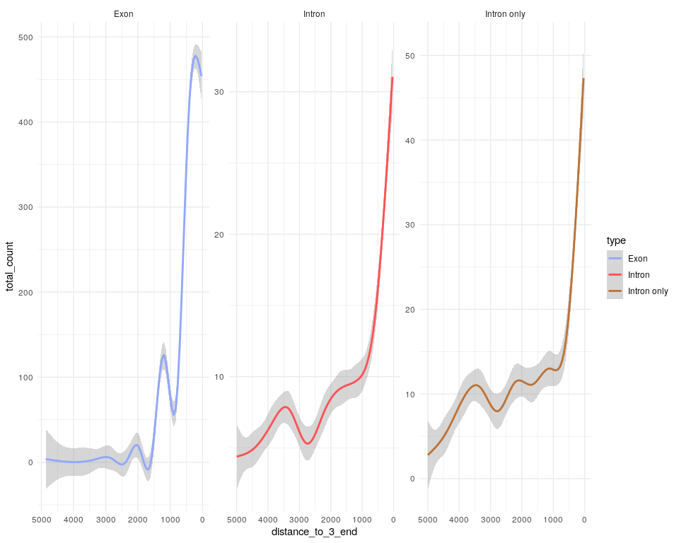<!-- -->

``` r
  
p_enrich<-ggplot(combined_sum, aes(x=distance_to_3_end, y=scaled_count,col=type)) + 
  geom_smooth()+
  #scale_y_log10() +
  scale_x_reverse(limits=c(5000,0)) +
  labs(x= "Distance to 3 prime end" ,
       y= "Counts per position per million",
       colour="")+
  scale_colour_manual(values=inex_colors,limits=force)+
  theme(legend.position = c(0.3,0.7),
        legend.background = element_blank())
  

p_enrich
```

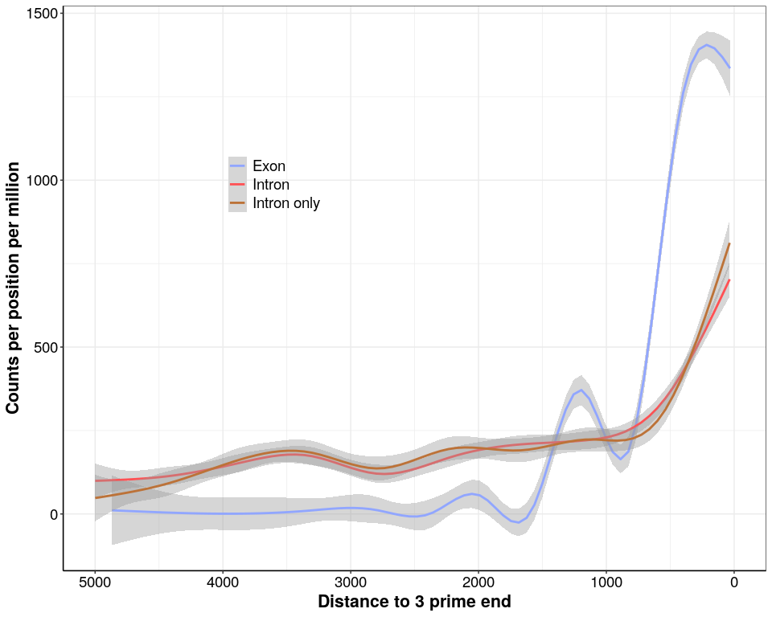<!-- -->

``` r
ggsave(p_enrich,
       device = "pdf",
       path = fig_path,
       width = 180,
       height=100,
       units = "mm",
       filename = "enrich_plot.pdf"
       )
```

#### 11. check bam coverage for genes with high intron and exon expression

``` r
top_genes_inex<-df_rank %>% 
  filter(!(is.na(external_gene_name))) %>% 
  filter(!(is.na(chromosome_name))) %>% 
  filter(exon_rank<19500 & intron_rank> 15500) %>% 
  arrange(desc(exon_rank)) %>% 
  unique() %>% 
  slice_max(exon_rank,n=20)

colnames(exon)<-paste0(colnames(exon),"_Exon")
colnames(intron)<-paste0(colnames(intron),"_Intron")


full_mat<-list(rownames_to_column(as.data.frame(exon),var="Gene_ID"),rownames_to_column(as.data.frame(intron),var="Gene_ID")) %>% 
  plyr::join_all() %>% 
  column_to_rownames(var="Gene_ID") %>% 
  as.data.frame() %>% 
  as.matrix() 

full_mat[is.na(full_mat)]<-0

inex_mat<-full_mat[,17:32]+full_mat[,1:16]
colnames(inex_mat)<-paste0(str_split(colnames(inex_mat),pattern = "_",simplify = T)[,1],"_Both")

full_mat <-list(rownames_to_column(as.data.frame(inex_mat),var="Gene_ID"),rownames_to_column(as.data.frame(full_mat),var="Gene_ID")) %>% 
  plyr::join_all() %>% 
  column_to_rownames(var="Gene_ID") %>% 
  as.data.frame() %>% 
  as.matrix() 


top_genes_mat<-full_mat[top_genes_inex$ENSEMBL,] %>% 
  t() %>% 
  as.data.frame() %>% 
  rownames_to_column(var="Sample") %>% 
  mutate(type=str_split(Sample,pattern = "_",simplify = T)[,2])
```

### 12. plot coverage for most highly expressed exons and introns

``` r
source("/data/home/wange/ATAC/Coverage_Plot_functions_V1.R")

gtf_file<-"/data/share/htp/prime-seq_Paper/genomes/Hsap/gencode.v35.primary_assembly.annotation.gtf"

gtf<-rtracklayer::import.gff2(gtf_file)
# 
# GV_gene_mod<-makeGviz_geneModel_from_gencode(gtf)
# 
# saveRDS(GV_gene_mod,"/data/share/htp/prime-seq_Paper/genomes/Hsap/gencode.v35.primary_assembly.annotation.gtf.genemodels_Geneviz.rds")

GV_gene_mod<-readRDS("/data/share/htp/prime-seq_Paper/genomes/Hsap/gencode.v35.primary_assembly.annotation.gtf.genemodels_Geneviz.rds")


annot.colors <- list("introns"="#ff5154","exons"="#91a6ff")


bam_files<-"/data/share/htp/prime-seq_Paper/Fig_beads_columns/zUMIs/HEK/Bulk_opt_lysis_test_2_HEK.filtered.Aligned.GeneTagged.sorted.bam"

inex<-rev(c("introns","exons"))
b.inf <-data.frame(bamfile=c(paste(gsub(x = bam_files,pattern=".bam",replacement = ""),inex,"bam",sep=".")),cond1=inex,cond2=rep("HEK",times=2))
gene.models<- GV_gene_mod # genemodels from makeGviz_geneModel_from_gencode
gen="hg38" # genome
type="RNA" # sequencing type RNA-seq or ATAC-seq


# for (i in 1:20){
# # plotting range 
#   PRange <- gtf %>%
#     as.tibble %>% 
#     mutate(ENSG=str_split_fixed(gene_id,
#                     pattern = "[.]",
#                     n = 2)[, 1]) %>% 
#     filter(ENSG %in% top_genes_inex$ENSEMBL[i]) %>% 
#     group_by(seqnames, strand, gene_id) %>%
#     summarize(start = min(start), end = max(end)) %>%
#     plyranges::as_granges()
# 
# print(top_genes_inex$external_gene_name[i])
# print(top_genes_inex$chromosome_name[i])
# print(length(PRange)>0)
# if(length(PRange)>0){
# 
# figure.name1 = paste0("coveragePlots/Intron_Exon_mapping_",top_genes_inex$ensembl_gene_id_version[i],".pdf")
# 
# 
# 
# Plot_Coverage(PRange=PRange,
#               annot.colors=annot.colors,
#               b.inf=b.inf,
#               gene.models=gene.models,
#               figure.name=figure.name1,
#               gen=gen,
#               type=type,
#               pdf=T,
#               title=top_genes_inex$external_gene_name[i],
#               extend.range=2e4,
#               ymax=(sum(top_genes_mat[top_genes_mat$type=="Exon",top_genes_inex$ENSEMBL[i]])/4)## set y axis for coverage plot to sum of exon counts
#               )
# 
# 
# }
# }
# 
# 
# 
# for (i in 1:20){
# 
# figure.name2 = paste0("coveragePlots/Intron_Exon_expression_",top_genes_inex$ensembl_gene_id_version[i],".pdf")
# p.exp<-top_genes_mat %>% 
#   dplyr::select(c(type,top_genes_inex$ENSEMBL[i])) %>% 
#   rename("Ensembl"=top_genes_inex$ENSEMBL[i]) %>% 
#   filter(type!="Both")%>% 
#   ggplot(aes(y=Ensembl,x=type,col=type))+
#   geom_boxplot(show.legend = F)+
#   ggbeeswarm::geom_beeswarm(aes(col=type),show.legend = F)+
#   facet_wrap(~type,scale="free_x",nrow = 2)+
#   theme(axis.text.x = element_blank(),
#         axis.ticks.x= element_blank())+
#   labs(x="",y=paste0("UMIs (",top_genes_inex$external_gene_name[i],")"))+
#   scale_color_manual(values=inex_colors,limits=force) 
# 
# ggsave(plot = p.exp,device = "pdf",filename = figure.name2,width=2,height=4,scale=1.5)
# }
```

### 12. Export plot for ENAH

``` r
i=8
 PRange <- gtf %>%
    as.tibble %>% 
    mutate(ENSG=str_split_fixed(gene_id,
                    pattern = "[.]",
                    n = 2)[, 1]) %>% 
    filter(ENSG %in% top_genes_inex$ENSEMBL[i]) %>% 
    group_by(seqnames, strand, gene_id) %>%
    summarize(start = min(start), end = max(end)) %>%
    plyranges::as_granges()

 
figure.name1 = paste0("coveragePlots/Intron_Exon_mapping_",top_genes_inex$ensembl_gene_id_version[i],".pdf")
 
Plot_Coverage(PRange=PRange,
              annot.colors=annot.colors,
              b.inf=b.inf,
              gene.models=gene.models,
              figure.name=figure.name1,
              gen=gen,
              type=type,
              pdf=F,
              title=top_genes_inex$external_gene_name[i],
              extend.range=2e4,
              ymax=400
              )
```

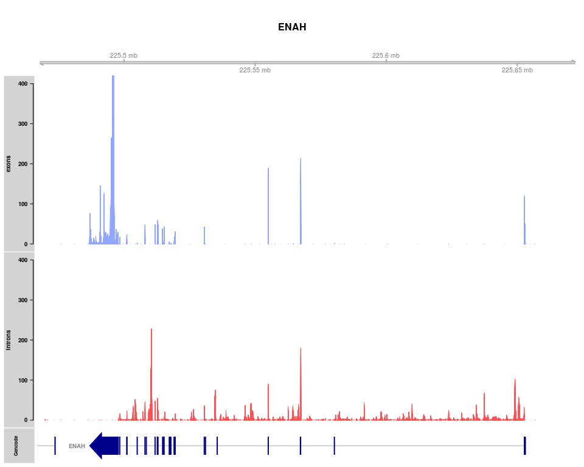<!-- -->

``` r

figure.name2 = paste0("coveragePlots/Intron_Exon_expression_",top_genes_inex$ensembl_gene_id_version[i],".pdf")

p.exp<-top_genes_mat %>%
  dplyr::select(c(type,top_genes_inex$ENSEMBL[i])) %>%
  dplyr::rename("Ensembl"=top_genes_inex$ENSEMBL[i]) %>%
  filter(type!="Both")%>%
  ggplot(aes(y=Ensembl,x=type,col=type))+
  geom_boxplot(show.legend = F)+
  ggbeeswarm::geom_beeswarm(aes(col=type),show.legend = F)+
  facet_wrap(~type,scale="free_x",nrow = 2)+
  theme(axis.text.x = element_blank(),
        axis.ticks.x= element_blank())+
  labs(x="",y=paste0("UMIs (",top_genes_inex$external_gene_name[i],")"))+
  scale_color_manual(values=inex_colors,limits=force)
p.exp
```

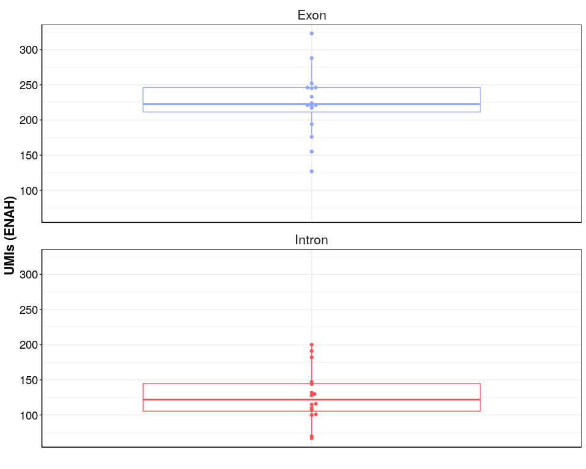<!-- -->

## `R` Session Info

``` r
sessionInfo()
#> R version 4.1.0 (2021-05-18)
#> Platform: x86_64-pc-linux-gnu (64-bit)
#> Running under: Devuan GNU/Linux 3 (beowulf)
#> 
#> Matrix products: default
#> BLAS:   /usr/lib/x86_64-linux-gnu/openblas/libblas.so.3
#> LAPACK: /usr/lib/x86_64-linux-gnu/libopenblasp-r0.3.5.so
#> 
#> locale:
#>  [1] LC_CTYPE=en_US.UTF-8       LC_NUMERIC=C              
#>  [3] LC_TIME=en_US.UTF-8        LC_COLLATE=en_US.UTF-8    
#>  [5] LC_MONETARY=en_US.UTF-8    LC_MESSAGES=en_US.UTF-8   
#>  [7] LC_PAPER=en_US.UTF-8       LC_NAME=C                 
#>  [9] LC_ADDRESS=C               LC_TELEPHONE=C            
#> [11] LC_MEASUREMENT=en_US.UTF-8 LC_IDENTIFICATION=C       
#> 
#> attached base packages:
#>  [1] grid      parallel  stats4    stats     graphics  grDevices utils    
#>  [8] datasets  methods   base     
#> 
#> other attached packages:
#>  [1] biomaRt_2.48.3       Gviz_1.36.2          GenomicRanges_1.44.0
#>  [4] GenomeInfoDb_1.28.4  IRanges_2.26.0       S4Vectors_0.30.2    
#>  [7] BiocGenerics_0.38.0  ComplexUpset_1.3.1   ggbeeswarm_0.6.0    
#> [10] ggsci_2.9            cowplot_1.1.1        forcats_0.5.1       
#> [13] stringr_1.4.0        dplyr_1.0.7          purrr_0.3.4         
#> [16] readr_2.1.0          tidyr_1.1.4          tibble_3.1.6        
#> [19] ggplot2_3.3.5        tidyverse_1.3.1     
#> 
#> loaded via a namespace (and not attached):
#>   [1] readxl_1.3.1                backports_1.4.0            
#>   [3] Hmisc_4.6-0                 systemfonts_1.0.3          
#>   [5] BiocFileCache_2.0.0         plyr_1.8.6                 
#>   [7] lazyeval_0.2.2              splines_4.1.0              
#>   [9] BiocParallel_1.26.2         digest_0.6.28              
#>  [11] ensembldb_2.16.4            htmltools_0.5.2            
#>  [13] fansi_0.5.0                 magrittr_2.0.1             
#>  [15] checkmate_2.0.0             memoise_2.0.1              
#>  [17] BSgenome_1.60.0             cluster_2.1.2              
#>  [19] tzdb_0.2.0                  Biostrings_2.60.2          
#>  [21] modelr_0.1.8                matrixStats_0.61.0         
#>  [23] vroom_1.5.6                 prettyunits_1.1.1          
#>  [25] jpeg_0.1-9                  colorspace_2.0-2           
#>  [27] blob_1.2.2                  rvest_1.0.2                
#>  [29] rappdirs_0.3.3              textshaping_0.3.6          
#>  [31] haven_2.4.3                 xfun_0.28                  
#>  [33] crayon_1.4.2                RCurl_1.98-1.5             
#>  [35] jsonlite_1.7.2              VariantAnnotation_1.38.0   
#>  [37] survival_3.2-13             glue_1.5.0                 
#>  [39] gtable_0.3.0                zlibbioc_1.38.0            
#>  [41] XVector_0.32.0              DelayedArray_0.18.0        
#>  [43] plyranges_1.12.1            scales_1.1.1               
#>  [45] DBI_1.1.1                   Rcpp_1.0.7                 
#>  [47] isoband_0.2.5               viridisLite_0.4.0          
#>  [49] progress_1.2.2              htmlTable_2.3.0            
#>  [51] foreign_0.8-81              bit_4.0.4                  
#>  [53] Formula_1.2-4               htmlwidgets_1.5.4          
#>  [55] httr_1.4.2                  RColorBrewer_1.1-2         
#>  [57] ellipsis_0.3.2              farver_2.1.0               
#>  [59] pkgconfig_2.0.3             XML_3.99-0.8               
#>  [61] nnet_7.3-16                 dbplyr_2.1.1               
#>  [63] here_1.0.1                  utf8_1.2.2                 
#>  [65] labeling_0.4.2              tidyselect_1.1.1           
#>  [67] rlang_0.4.12                AnnotationDbi_1.54.1       
#>  [69] munsell_0.5.0               cellranger_1.1.0           
#>  [71] tools_4.1.0                 cachem_1.0.6               
#>  [73] cli_3.1.0                   generics_0.1.1             
#>  [75] RSQLite_2.2.8               broom_0.7.10               
#>  [77] evaluate_0.14               fastmap_1.1.0              
#>  [79] ragg_1.2.0                  yaml_2.2.1                 
#>  [81] knitr_1.36                  bit64_4.0.5                
#>  [83] fs_1.5.0                    KEGGREST_1.32.0            
#>  [85] AnnotationFilter_1.16.0     nlme_3.1-153               
#>  [87] xml2_1.3.2                  compiler_4.1.0             
#>  [89] rstudioapi_0.13             beeswarm_0.4.0             
#>  [91] filelock_1.0.2              curl_4.3.2                 
#>  [93] png_0.1-7                   reprex_2.0.1               
#>  [95] stringi_1.7.4               highr_0.9                  
#>  [97] GenomicFeatures_1.44.2      lattice_0.20-45            
#>  [99] ProtGenerics_1.24.0         Matrix_1.3-4               
#> [101] vctrs_0.3.8                 pillar_1.6.4               
#> [103] lifecycle_1.0.1             data.table_1.14.2          
#> [105] bitops_1.0-7                patchwork_1.1.1            
#> [107] rtracklayer_1.52.1          R6_2.5.1                   
#> [109] BiocIO_1.2.0                latticeExtra_0.6-29        
#> [111] gridExtra_2.3               vipor_0.4.5                
#> [113] dichromat_2.0-0             MASS_7.3-54                
#> [115] assertthat_0.2.1            SummarizedExperiment_1.22.0
#> [117] rprojroot_2.0.2             rjson_0.2.20               
#> [119] withr_2.4.2                 GenomicAlignments_1.28.0   
#> [121] Rsamtools_2.8.0             GenomeInfoDbData_1.2.6     
#> [123] mgcv_1.8-38                 hms_1.1.1                  
#> [125] rpart_4.1-15                rmarkdown_2.11             
#> [127] MatrixGenerics_1.4.3        biovizBase_1.40.0          
#> [129] Biobase_2.52.0              lubridate_1.8.0            
#> [131] base64enc_0.1-3             restfulr_0.0.13
```
