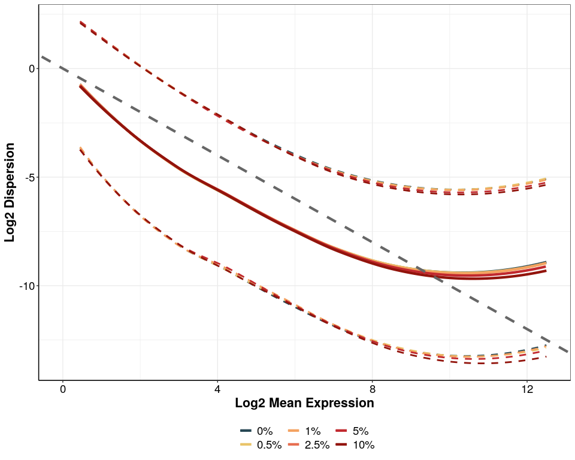
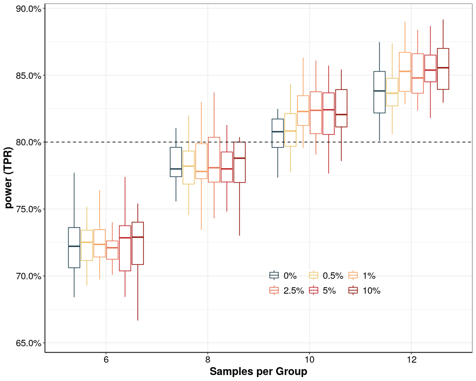

## Purpose:

Measure impact of contamination on power to detect DE in power
simulations

``` r
## load libraries
library(powsimR)
library(tidyverse)
library(stringr)
library(cowplot)
library(edgeR)
library(strex)
library(MetBrewer)

### all necessary custom functions are in the following scripts
source(paste0(here::here(),"/0_Scripts/custom_functions.R"))
source(paste0(here::here(),"/0_Scripts/powsimR_EstimateSpike_modified.R"))
source(paste0(here::here(),"/0_Scripts/helper_functions.R"))

## plotting options
theme_pub <-
  theme_bw() + theme(
    plot.title = element_text(hjust = 0.5,
                              size = 18, face = "bold"),
    axis.text = element_text(colour = "black", size = 14),
    axis.title = element_text(size = 16, face = "bold"),
    legend.text = element_text(size = 14),
    legend.position = "right",
    axis.line.x = element_line(colour = "black"),
    axis.line.y = element_line(colour = "black"),
    strip.background = element_blank(),
    strip.text = element_text(size = 16)
  )

theme_set(theme_pub)

#prevent scientific notation
options(scipen = 999)

fig_path <- paste0(here::here(),"/6_additional_analysis/")
## colours
method_cols <- c("#008080", "gray70")
names(method_cols) <- c("prime-seq", "TruSeq")
```

``` r
prime_inex <-readRDS(
    paste0(here::here(),"/2_power_simulation/prime-seq.dgecounts.rds")
  )$umicount$inex$downsampling$downsampled_10000000 %>% as.matrix()
prime_inex <-prime_inex[grep(rownames(prime_inex), pattern = "ERCC*", invert = T), ]
prime_inex <- remove_Geneversion(as.matrix(prime_inex))
prime_inex <-
  prime_inex[whichgenes_reproducible(prime_inex,
                                     exprcutoff = 1,
                                     reproducecutoff = 0.25), ]
head(prime_inex)
#>                 ACGTATTGTCCA CAGCGGAACTTA CATCAACTCGAA CCACGTAAGAGG
#> ENSG00000000003          251          238          255          268
#> ENSG00000000005            3            2            1            3
#> ENSG00000000419          477          461          514          427
#> ENSG00000000457           95          111          108          106
#> ENSG00000000460           70           66           78           75
#> ENSG00000000938           24           16           15           20
#>                 CCTAACCTACAA GTAGGCGCATGA TCCATACGCGAA TGTTATGGCCAA
#> ENSG00000000003          209          247          257          244
#> ENSG00000000005            3            3            7            4
#> ENSG00000000419          555          345          518          486
#> ENSG00000000457           90           86          114          121
#> ENSG00000000460           85           60           83           75
#> ENSG00000000938           15           13           19           25
ObsCounts <- prime_inex
```

## Run Powsim

``` r
AmbProp<-c(0,0.005,0.01,0.025,0.05,0.1)


# parameters to be handed to powsimR: fixed

# input_mat<-"/data/share/htp/prime-seq_Paper/Fig_maqc_comparison/Analysis/UHRR_Comparison/prime_seq_noCont.rds"
# cores<- 10 # cores to use
# nsims<- 20 # number of simulations
# p_DE<- 0.1 # fraction of genes to be simulted as DE
# n_sample<- "6,8,10,12" # vector specifying the number of samples to simulate
# delta_val<- 1 # LFC cutoff for genes to be deemed biologically important
# ngenes=20000
# outdir="/data/share/htp/prime-seq_Paper/Fig_maqc_comparison/Analysis/UHRR_Comparison/contamination_simulations/"

# for (i in AmbProp){
# 
# ## start slurm job 
# 
#   system(paste0("sbatch -c ",cores,
#                 " -J ",paste0("cont",i),
#                 " --wrap '/opt/bin/Rscript ",
#                 "/data/share/htp/prime-seq_Paper/Fig_maqc_comparison/Analysis/UHRR_Comparison/Run_powsim_with_contamination.R",
#                 " --input_mat ",input_mat,
#                 " --cores ",cores,
#                 " --nsims ",nsims,
#                 " --p_DE ",p_DE,
#                 " --n_sample ",n_sample,
#                 " --ngenes ", ngenes,
#                 " --delta_val ",delta_val,
#                 " --outdir ",outdir,
#                 " --ambprop ",i,
#                 "'"))
# }
```

``` r
cont_cols<-c("#264653", "#e9c46a", "#f4a261", "#e76f51", "#c1292e", "#92140c")
names(cont_cols)<-AmbProp

for (i in AmbProp[-4]) {

evalderes<-readRDS(paste0(fig_path,"/contamination_simulations/",i,".powsim.estparam.Rds"))


mdisp<-Get_Mean_Disp(evalderes)


meanvsdisp.dat<-mdisp$meanvsdisp.dat
meanvsdisp.dat$Cont<-i

meanvsdisp.fdat<-mdisp$meanvsdisp.fdat
meanvsdisp.fdat$Cont<-i

cdisp<-mdisp$cdisp
cdisp$Cont<-i

if(!(exists("meanvsdisp.dat.all"))){
  
  meanvsdisp.dat.all<-meanvsdisp.dat
  meanvsdisp.fdat.all<-meanvsdisp.fdat
  cdisp.all<-cdisp
  
}else{
  meanvsdisp.dat.all<-rbind(meanvsdisp.dat,meanvsdisp.dat.all)
  meanvsdisp.fdat.all<-rbind(meanvsdisp.fdat,meanvsdisp.fdat.all)
  cdisp.all<-rbind(cdisp.all,cdisp)

}
 
 }


Fig_mean_disp <- ggplot2::ggplot(data = meanvsdisp.dat.all,
                                 ggplot2::aes_(
                                   x = quote(Mean),
                                   y = quote(Dispersion),
                                   col = quote(factor(Cont))
                                 )) +
  ggplot2::geom_line(
    data = meanvsdisp.fdat.all,
    ggplot2::aes_(
      x = quote(Mean),
      y = quote(Dispersion),
      col = quote(factor(Cont))
    ),
    linetype = 1,
    size = 1.5
  ) +
  ggplot2::geom_line(
    data = meanvsdisp.fdat.all,
    ggplot2::aes_(
      x = quote(Mean),
      y = quote(Lower),
      col = quote(factor(Cont))
    ),
    linetype = 2,
    size = 1
  ) +
  ggplot2::geom_line(
    data = meanvsdisp.fdat.all,
    ggplot2::aes_(
      x = quote(Mean),
      y = quote(Upper),
      col = quote(factor(Cont))
    ),
    linetype = 2,
    size = 1
  ) +
  ggplot2::geom_abline(
    intercept = 0,
    slope = -1,
    linetype = 2,
    colour = "grey40",
    size = 1.5
  ) +
  labs(x = "Log2 Mean Expression",
       y = "Log2 Dispersion", colour = "") +
  theme(legend.position = "bottom") +
  scale_x_continuous(limits = c(0, 12.5)) +
  scale_colour_manual(
    values = cont_cols,
    labels = c("0%", "0.5%", "1%", "2.5%", "5%", "10%"),
    breaks = c(AmbProp)
  )

Fig_mean_disp
```

<!-- -->

``` r


for (i in AmbProp) {

evalderes<-readRDS(paste0(fig_path,"/contamination_simulations/",i,".powsim.evalderes.Rds"))
  
power_df<-getEvalDE_df_marginal(evalderes,method = "prime-seq",count_type = "inex")%>% 
  separate(col = "Var1",sep = " vs ",into = c("Var1","group2"),remove=T) %>% 
  mutate(Var1=as.numeric(Var1),
         group2=NULL,
         Cont=i)

if (!(exists("power_df.all"))){
power_df.all<-power_df
}else{
 power_df.all<-bind_rows(power_df.all,power_df) 
}

}

power_df.all$Cont<-factor(power_df.all$Cont,levels=AmbProp)

## Plot

## FDR and TPR cutoffs for plotting
refval <- data.frame(L1 = c("FDR", "TPR"), ref = c(evalderes$alpha.nominal, 0.8))


p.all<-ggplot(data = subset(power_df.all,L1%in%c("TPR") ) ,
                      aes(x = factor(Var1),
                      y = value,
                      colour = Cont)) +
  geom_boxplot(outlier.shape = NA)+
  geom_hline(data = subset(refval,L1=="TPR"),
             aes(yintercept = ref),
             linetype="dashed",
             color='black')+
  scale_colour_manual(values=cont_cols,labels=c("0%","0.5%","1%","2.5%","5%","10%"),breaks=c(AmbProp))+
  labs(x = "Samples per Group", y = "power (TPR)" , colour="") +
  scale_y_continuous(labels = scales::percent_format(accuracy = 0.1)) +
  theme(legend.position = c(0.65,0.2),
        legend.direction = "horizontal",
        legend.background = element_blank())+
  guides(colour=guide_legend(byrow = T))

p.all
```

<!-- -->

``` r
ggsave(p.all,
       device = "pdf",
       path = fig_path,
       width = 130,
       height=130,
       units = "mm",
       filename = "Contamination_Sim.pdf"
       )
```
