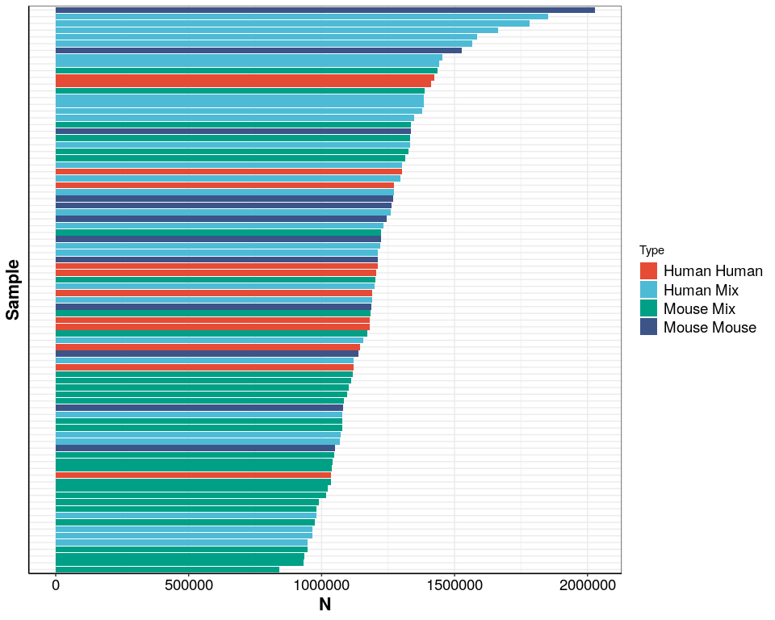
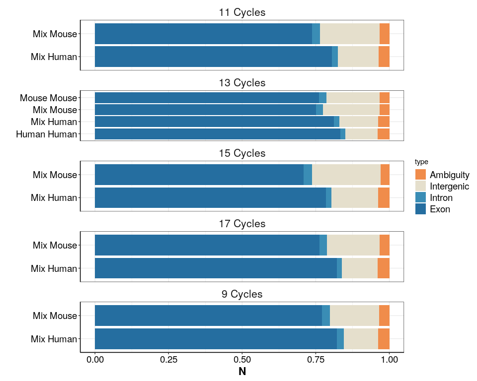
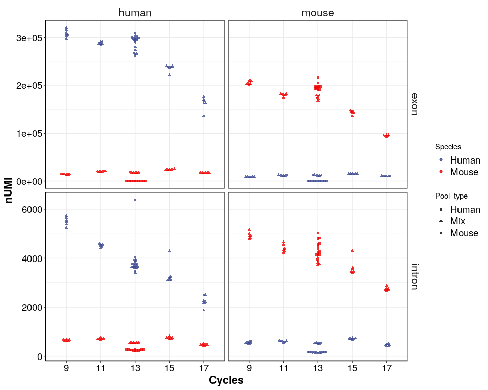
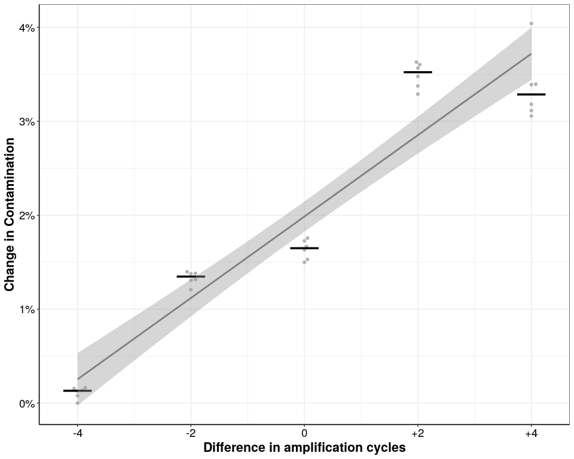

## Purpose:

measure cross-contamination and how it depends on cycles

``` r
library(tidyverse)
library(readxl)
library(tidyverse)
library(cowplot)
library(ggsci)

## all necessary custom functions are in the following script
source(paste0(here::here(),"/0_Scripts/custom_functions.R"))

theme_pub <- theme_bw() + theme(
                                     plot.title = element_text(hjust = 0.5, size=18, face="bold"),
                                     axis.text = element_text(colour="black", size=14), 
                                     axis.title=element_text(size=16,face="bold"), 
                                     legend.text=element_text(size=14),
                                     legend.position="right",
                                     axis.line.x = element_line(colour = "black"), 
                                     axis.line.y = element_line(colour = "black"),
                                     strip.background=element_blank(), 
                                     strip.text=element_text(size=16))  

theme_set(theme_pub)

## paths
fig_path<-here::here()
data_path<-str_split(string = fig_path,pattern = "/analysis",simplify = T)[,1]

## Feature Colours

feat_cols<-c("#F08C4B", "#E5DFCC", "#556f44", "#9dc183", "#4D8C57", "#3A8DB5", "#256EA0","dodgerblue4","#256EA0","#AA4586","grey70")

names(feat_cols)<-c("Ambiguity","Intergenic","Ribosomal","Mitochondrial","lncRNA","Intron","Coding","Intragenic","Exon","MultiMapped","Unmapped")


fig_path <- paste0(here::here(),"/6_additional_analysis/")
```

``` r
info<-readRDS(paste0(fig_path,"/prime-seq_rev_CrossCont.rds"))

features<-read.table(
  file = paste0(fig_path,"/CrossCont.readspercell.txt"),
           sep="\t",
  header = T)  %>% 
  inner_join(info,by=c("RG"="BC")) %>% 
  mutate(type=as.factor(if_else(is.na(type),"MultiMapped",type))
         )
```

``` r
features$type<-factor(features$type,levels = c("Unmapped","Ambiguity","Intergenic","MultiMapped","Intron","Exon"))

ggplot(features)+
  geom_col(aes(x=reorder(Well,N),y=N,fill=paste(Species,Pool_type)))+
  coord_flip()+
  theme(axis.text.y = element_blank(),
        axis.ticks.y = element_blank())+
  labs(x="Sample",fill="Type")+
  ggsci::scale_fill_npg()
```

<!-- -->

``` r

features_mapped<-features %>% 
  filter(!(type %in% c("Unmapped","MultiMapped")))

ggplot(features_mapped)+
  geom_col(aes(x=factor(paste(Pool_type,Species)),y=N,fill=type),position=position_fill())+
  coord_flip()+
  scale_fill_manual(values=feat_cols,limits = force)+
  facet_wrap(~paste(Cycles,"Cycles"),scales="free_y",ncol = 1)+
  labs(x="")
```

<!-- -->

## Extract count tables (with MultiMapping; primary hit: yes)

### Get coding Genes for human and mouse

``` r
ensembl_human <- biomaRt::useMart("ensembl", dataset ="hsapiens_gene_ensembl", host="uswest.ensembl.org") 

biotype_human <- biomaRt::getBM(attributes=c("ensembl_gene_id","ensembl_gene_id_version","gene_biotype","external_gene_name","chromosome_name"),
                 mart=ensembl_human )%>% 
  mutate(gene_biotype2=case_when(grepl(gene_biotype,pattern="*pseudogene")~ "pseudogene",
                            grepl(gene_biotype,pattern="IG*")~ "protein coding",
                            grepl(gene_biotype,pattern="TR*")~ "protein coding",
                            grepl(gene_biotype,pattern="MT*")~ "MT",
                            grepl(gene_biotype,pattern="^s")~ "small RNA",
                            grepl(gene_biotype,pattern="ribozyme")~ "other",
                           gene_biotype=="misc_RNA"~ "other",
                           gene_biotype=="protein_coding"~ "protein coding",
                           T~gene_biotype),
         gene_biotype3=case_when(grepl(external_gene_name,pattern="RPS*")~ "ribosomal",
                                 grepl(external_gene_name,pattern="RPL*")~ "ribosomal",
                                 grepl(chromosome_name,pattern="MT")~ "mitochondrial",
                                 grepl(external_gene_name,pattern="rRNA")~ "rRNA",
                           T~gene_biotype2))

coding_human<-biotype_human %>% 
  filter(gene_biotype%in% c("protein_coding","lncRNA"))
###
ensembl_mouse <- biomaRt::useMart("ensembl", dataset ="mmusculus_gene_ensembl", host="uswest.ensembl.org") 

biotype_mouse <- biomaRt::getBM(attributes=c("ensembl_gene_id","ensembl_gene_id_version","gene_biotype","external_gene_name","chromosome_name"),
                 mart=ensembl_mouse )

coding_mouse<-biotype_mouse %>% 
  filter(gene_biotype%in% c("protein_coding","lncRNA"))

coding<-c(coding_human$ensembl_gene_id,coding_mouse$ensembl_gene_id)
```

``` r
dge_list<-readRDS(paste0(fig_path, "/CrossCont.dgecounts.rds"))

### UMI counts
count_type<-c("intron","exon")
species<-c("human","mouse")

## make function to extract counts
get_summary_per_Species<-function(dge_list,species,count_type,UMI=T){
for (i in count_type){
  for(j in species){
     if(UMI){
       mat<- as.matrix(dge_list$umicount[[i]]$downsampling$downsampled_750000) %>% 
         remove_Geneversion()
       mat<-mat[whichgenes_reproducible(exprtable = mat,reproducecutoff = 0.25,exprcutoff = 10),]
       mat<-mat[which(rownames(mat)%in%coding),]
     }else{
      mat<- as.matrix(dge_list$readcount[[i]]$downsampling$downsampled_750000) %>% 
         remove_Geneversion()
      mat<-mat[whichgenes_reproducible(exprtable = mat,reproducecutoff = 0.25,exprcutoff = 10),]
      mat<-mat[which(rownames(mat)%in%coding),]
       }
if(j=="human"){
  spec_mat<- mat[grep("ENSG",row.names(mat)),]
}else {
  spec_mat<- mat[grep("ENSMUS",row.names(mat)),]
}

if(!(exists("count_df")))  {
count_df<- data.frame(BC=colnames(spec_mat),
                      mapping=j,
                      count_type=i,
                      nUMI=colSums(spec_mat),
                      nGene=colSums(spec_mat>1))
}else {
count_df<- rbind(count_df,
                 data.frame(BC=colnames(spec_mat),
                            mapping=j,
                            count_type=i,
                            nUMI=colSums(spec_mat),
                            nGene=colSums(spec_mat>1))
                 )
}
  }
}
  return(count_df)
}

df<-get_summary_per_Species(dge_list = dge_list,species = species,UMI=T,count_type = count_type)

count_df_inf<- dplyr::left_join(df, info)

a<-ggplot(data=count_df_inf,aes(y=nUMI,x=factor(Cycles),colour=Species,shape=Pool_type))+
  ggbeeswarm::geom_beeswarm(alpha = 0.8)+
  facet_grid(count_type~mapping,scales = "free_y")+
  scale_colour_aaas()+
  labs(x="Cycles")

a
```

<!-- -->

### Plot Contamination

``` r
count_df_inf2<-count_df_inf %>% 
  group_by(BC) %>% 
  mutate(nUMI_total=sum(nUMI),
         nGene_total=sum(nGene)) %>% 
  pivot_wider(names_from = c("mapping","count_type"),values_from = c("nUMI","nGene")) %>% 
  mutate(perc_mouse_umi=(nUMI_mouse_exon+nUMI_mouse_intron)/(nUMI_total)*100,
         perc_mouse_umi_ex=(nUMI_mouse_exon)/(nUMI_mouse_exon)*100,
         perc_mouse_Gene=(nGene_mouse_exon+nGene_mouse_intron)/(nGene_total)*100,
         nGene_m=nGene_mouse_exon+nGene_mouse_intron,
         nGene_h=nGene_human_exon+nGene_human_intron
         ) %>% 
  mutate(perc_contamination=if_else(Species=="Human",perc_mouse_umi,100-perc_mouse_umi),
         perc_contamination_gene=if_else(Species=="Human",perc_mouse_Gene,100-perc_mouse_Gene),
         nGene_cont=if_else(Species=="Human",nGene_m,nGene_h),
         nGene_endo=nGene_total-nGene_cont,
         Pool_type=if_else(Pool_type=="Mix",Pool_type,"individual"),
         Condition=paste(Species,Pool_type))
```

## Plot relative Contamination by cycle number

``` r
count_df_inf_ex<-count_df_inf %>% 
  filter(count_type=="exon") %>% 
  filter(Pool_type=="Mix") %>% 
  group_by(BC) %>% 
  mutate(nUMI_total=sum(nUMI),
         nGene_total=sum(nGene)) %>% 
  pivot_wider(names_from = c("mapping"),values_from = c("nUMI","nGene")) %>% 
  mutate(perc_mouse_umi=(nUMI_mouse)/(nUMI_total)*100,
         perc_mouse_Gene=(nGene_mouse)/(nGene_total)*100,
         nGene_m=nGene_mouse,
         nGene_h=nGene_human
         ) %>% 
  mutate(perc_contamination=if_else(Species=="Human",perc_mouse_umi,100-perc_mouse_umi),
         perc_contamination_gene=if_else(Species=="Human",perc_mouse_Gene,100-perc_mouse_Gene),
         nGene_cont=if_else(Species=="Human",nGene_m,nGene_h),
         nGene_endo=nGene_total-nGene_cont,
         Condition=paste(Species,Pool_type))


rel_cont<-count_df_inf_ex %>% 
  group_by(BC,Species,Cycles) %>%
  summarize(perc_contamination=mean(perc_contamination))%>% 
  group_by(Species) %>% 
  mutate(delta_perc_contamination=perc_contamination-min(perc_contamination))  


p.cont_cycle<-ggplot(subset(rel_cont,Species=="Human"),aes(y=delta_perc_contamination,x=Cycles))+
  ggbeeswarm::geom_beeswarm(show.legend = F,col="grey70")+
  stat_summary(show.legend = F,fun="median",width=0.5,geom="crossbar")+
  geom_smooth(method="lm",show.legend = F,col="grey50")+
  ylab("Change in Contamination")+
  xlab("Difference in amplification cycles")+
  labs(col="")+
  scale_colour_aaas()+
  scale_x_continuous(breaks=c(9,11,13,15,17),labels = c("-4","-2","0","+2","+4"))+
  scale_y_continuous(labels=paste0(c(0,1,2,3,4),"%"))

p.cont_cycle
```

<!-- -->

``` r
ggsave(p.cont_cycle,
       device = "pdf",
       path = fig_path,
       width = 130,
       height=130,
       units = "mm",
       filename = "Contamination_cycle.pdf"
       )
```

## `R` Session Info

``` r
sessionInfo()
#> R version 4.1.0 (2021-05-18)
#> Platform: x86_64-pc-linux-gnu (64-bit)
#> Running under: Devuan GNU/Linux 3 (beowulf)
#> 
#> Matrix products: default
#> BLAS:   /usr/lib/x86_64-linux-gnu/openblas/libblas.so.3
#> LAPACK: /usr/lib/x86_64-linux-gnu/libopenblasp-r0.3.5.so
#> 
#> locale:
#>  [1] LC_CTYPE=en_US.UTF-8       LC_NUMERIC=C              
#>  [3] LC_TIME=en_US.UTF-8        LC_COLLATE=en_US.UTF-8    
#>  [5] LC_MONETARY=en_US.UTF-8    LC_MESSAGES=en_US.UTF-8   
#>  [7] LC_PAPER=en_US.UTF-8       LC_NAME=C                 
#>  [9] LC_ADDRESS=C               LC_TELEPHONE=C            
#> [11] LC_MEASUREMENT=en_US.UTF-8 LC_IDENTIFICATION=C       
#> 
#> attached base packages:
#> [1] stats     graphics  grDevices utils     datasets  methods   base     
#> 
#> other attached packages:
#>  [1] Matrix_1.3-4    ggsci_2.9       cowplot_1.1.1   readxl_1.3.1   
#>  [5] forcats_0.5.1   stringr_1.4.0   dplyr_1.0.7     purrr_0.3.4    
#>  [9] readr_2.1.0     tidyr_1.1.4     tibble_3.1.6    ggplot2_3.3.5  
#> [13] tidyverse_1.3.1
#> 
#> loaded via a namespace (and not attached):
#>  [1] nlme_3.1-153           bitops_1.0-7           fs_1.5.0              
#>  [4] lubridate_1.8.0        bit64_4.0.5            filelock_1.0.2        
#>  [7] progress_1.2.2         httr_1.4.2             rprojroot_2.0.2       
#> [10] GenomeInfoDb_1.28.4    tools_4.1.0            backports_1.4.0       
#> [13] utf8_1.2.2             R6_2.5.1               vipor_0.4.5           
#> [16] mgcv_1.8-38            DBI_1.1.1              BiocGenerics_0.38.0   
#> [19] colorspace_2.0-2       withr_2.4.2            prettyunits_1.1.1     
#> [22] tidyselect_1.1.1       curl_4.3.2             bit_4.0.4             
#> [25] compiler_4.1.0         textshaping_0.3.6      cli_3.1.0             
#> [28] rvest_1.0.2            Biobase_2.52.0         xml2_1.3.2            
#> [31] labeling_0.4.2         scales_1.1.1           rappdirs_0.3.3        
#> [34] systemfonts_1.0.3      digest_0.6.28          rmarkdown_2.11        
#> [37] XVector_0.32.0         pkgconfig_2.0.3        htmltools_0.5.2       
#> [40] dbplyr_2.1.1           fastmap_1.1.0          highr_0.9             
#> [43] rlang_0.4.12           rstudioapi_0.13        RSQLite_2.2.8         
#> [46] farver_2.1.0           generics_0.1.1         jsonlite_1.7.2        
#> [49] RCurl_1.98-1.5         magrittr_2.0.1         GenomeInfoDbData_1.2.6
#> [52] ggbeeswarm_0.6.0       Rcpp_1.0.7             munsell_0.5.0         
#> [55] S4Vectors_0.30.2       fansi_0.5.0            lifecycle_1.0.1       
#> [58] stringi_1.7.4          yaml_2.2.1             zlibbioc_1.38.0       
#> [61] BiocFileCache_2.0.0    grid_4.1.0             blob_1.2.2            
#> [64] parallel_4.1.0         crayon_1.4.2           lattice_0.20-45       
#> [67] splines_4.1.0          Biostrings_2.60.2      haven_2.4.3           
#> [70] hms_1.1.1              KEGGREST_1.32.0        knitr_1.36            
#> [73] pillar_1.6.4           biomaRt_2.48.3         stats4_4.1.0          
#> [76] reprex_2.0.1           XML_3.99-0.8           glue_1.5.0            
#> [79] evaluate_0.14          modelr_0.1.8           vctrs_0.3.8           
#> [82] png_0.1-7              tzdb_0.2.0             cellranger_1.1.0      
#> [85] gtable_0.3.0           assertthat_0.2.1       cachem_1.0.6          
#> [88] xfun_0.28              broom_0.7.10           ragg_1.2.0            
#> [91] beeswarm_0.4.0         AnnotationDbi_1.54.1   memoise_2.0.1         
#> [94] IRanges_2.26.0         ellipsis_0.3.2         here_1.0.1
```
