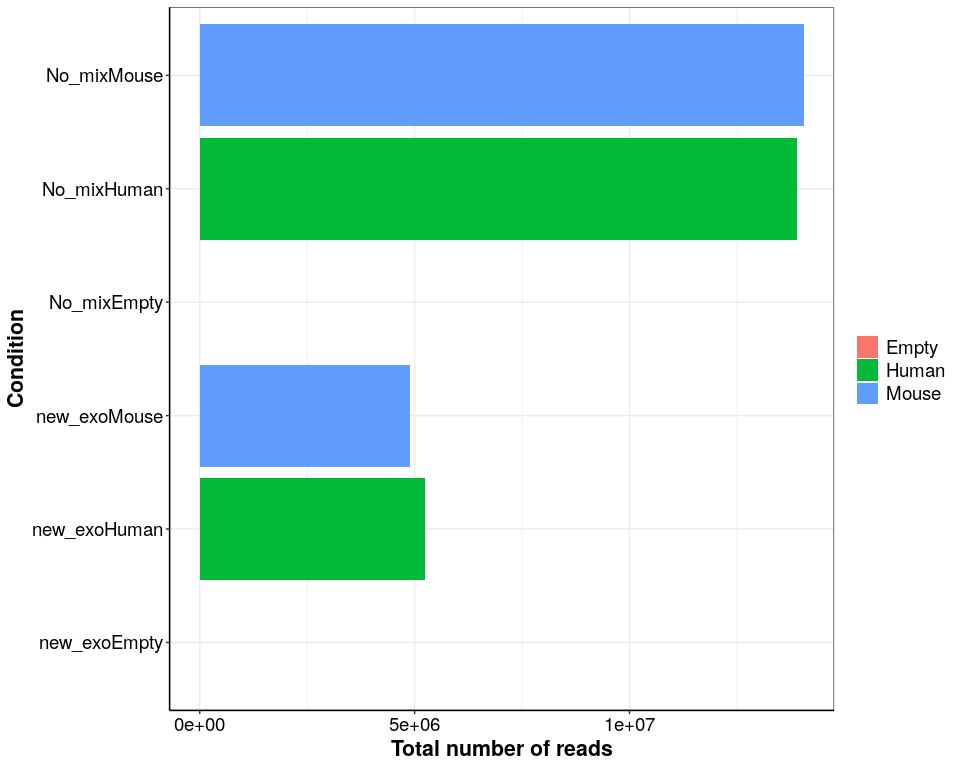
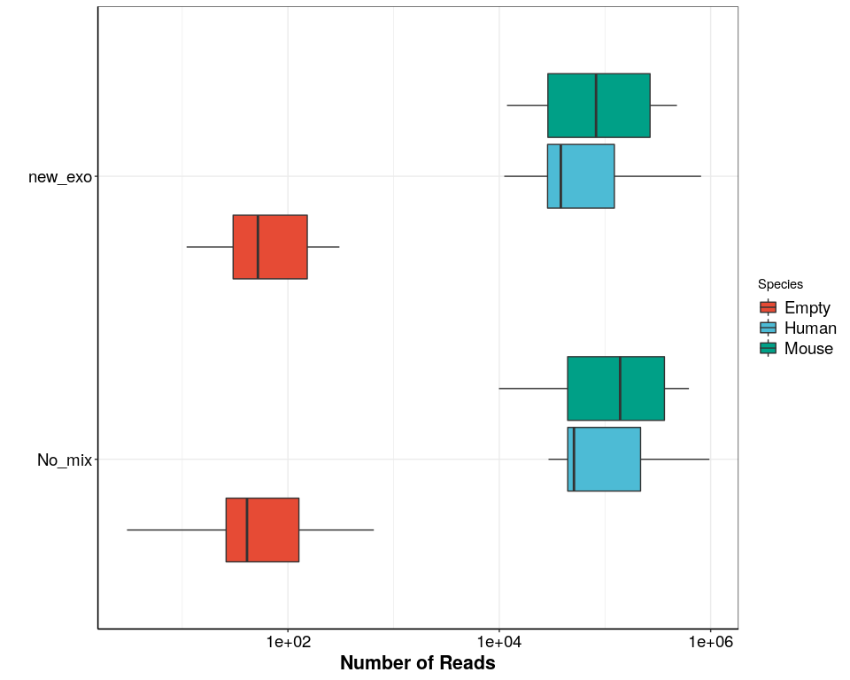
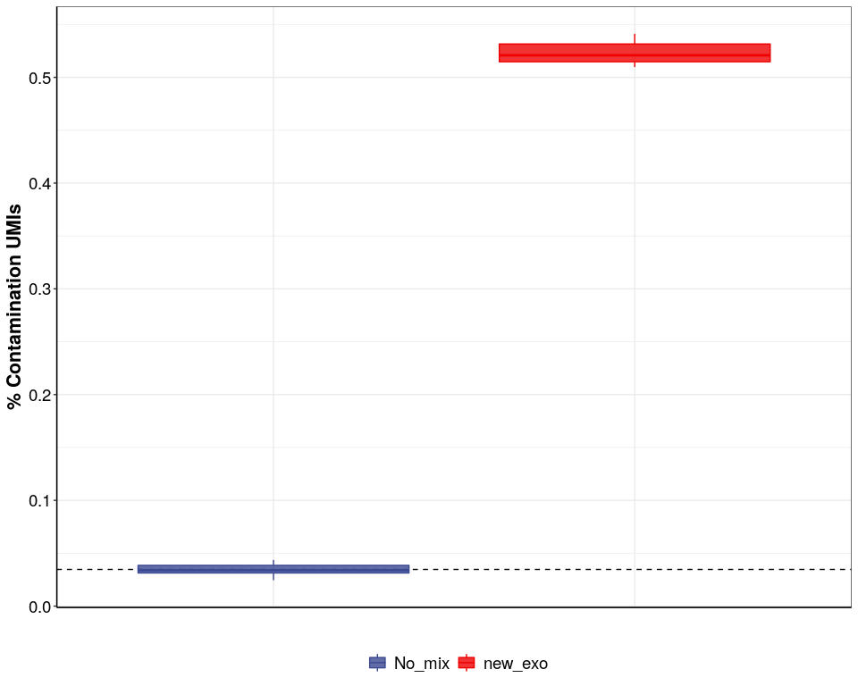

## Purpose:

measure cross contamination in different steps of the protocol and how
it

### 1. Load data and packages

``` r
library(tidyverse)
library(readxl)
library(tidyverse)
library(cowplot)
library(ggsci)

## all necessary custom functions are in the following script
source(paste0(here::here(),"/0_Scripts/custom_functions.R"))

theme_pub <- theme_bw() + theme(
                                     plot.title = element_text(hjust = 0.5, size=18, face="bold"),
                                     axis.text = element_text(colour="black", size=14), 
                                     axis.title=element_text(size=16,face="bold"), 
                                     legend.text=element_text(size=14),
                                     legend.position="right",
                                     axis.line.x = element_line(colour = "black"), 
                                     axis.line.y = element_line(colour = "black"),
                                     strip.background=element_blank(), 
                                     strip.text=element_text(size=16))  

theme_set(theme_pub)

## paths

fig_path <- paste0(here::here(),"/6_additional_analysis/")

## Feature Colours

feat_cols<-c("#F08C4B", "#E5DFCC", "#556f44", "#9dc183", "#4D8C57", "#3A8DB5", "#256EA0","dodgerblue4","#256EA0","#2A1E5C","grey70","#A53F2B")

names(feat_cols)<-c("Ambiguity","Intergenic","Ribosomal","Mitochondrial","lncRNA","Intron","Coding","Intragenic","Exon","MultiMapped","Unmapped","ERCC")
```

``` r
info<-readRDS(paste0(fig_path,"/prime-seq_SM2.Rds")) 

features<-read.table(
  file = paste0(fig_path,"/SM2_nomult.readspercell.txt"),
           sep="\t",
  header = T)  %>% 
  inner_join(info,by=c("RG"="XC")) %>% 
  mutate(type=if_else(is.na(type),"MultiMapped",type),
         type=as.factor(if_else(type=="User","ERCC",type)))
```

``` r
features$type<-factor(features$type,levels = c("Unmapped","Ambiguity","Intergenic","MultiMapped","ERCC","Intron","Exon"))


ggplot(features)+
  geom_col(aes(x=Condition3,y=N,fill=Species))+
  coord_flip()+
  labs(x="Condition",fill="",y="Total number of reads")
```

<!-- -->

``` r
ggplot(features)+
  geom_boxplot(aes(x=Condition2,y=N,fill=Species))+
  coord_flip()+
  labs(x="",y="Number of Reads",fill="Species")+
  ggsci::scale_fill_npg()+
  scale_y_log10()
```

<!-- -->

``` r

ggplot(features)+
  geom_col(aes(x=Condition2,y=N,fill=type),position="fill")+
  coord_flip()+
  scale_fill_manual(values=feat_cols,limits = force)+
  labs(x="")+
  facet_wrap(~Species,scales="free",ncol = 1)
```

<!-- -->

``` r
features %>% 
  group_by(Condition2) %>% 
  summarize(Total_per_pool=sum(N),
            Total_empty=sum(N[Species=="Empty"]),
            fraction_empty=Total_empty/Total_per_pool) %>% 
  ggplot()+
  geom_point(aes(x=Condition2,y=fraction_empty),size=3,col="#114B5F")+
  coord_flip()+
  scale_fill_npg()+
  scale_y_continuous(labels = scales::percent)+
  theme(axis.text.x = element_text(angle=45,hjust=1))+
  labs(x="",y="percent of reads in empty well")
```

<!-- -->

### 3. Extract count tables (with MultiMapping; primary hit: yes)

#### Get coding Genes for human and mouse

``` r
ensembl_human <- biomaRt::useMart("ensembl", dataset ="hsapiens_gene_ensembl", host="uswest.ensembl.org") 

biotype_human <- biomaRt::getBM(attributes=c("ensembl_gene_id","ensembl_gene_id_version","gene_biotype","external_gene_name","chromosome_name"),
                 mart=ensembl_human )%>% 
  mutate(gene_biotype2=case_when(grepl(gene_biotype,pattern="*pseudogene")~ "pseudogene",
                            grepl(gene_biotype,pattern="IG*")~ "protein coding",
                            grepl(gene_biotype,pattern="TR*")~ "protein coding",
                            grepl(gene_biotype,pattern="MT*")~ "MT",
                            grepl(gene_biotype,pattern="^s")~ "small RNA",
                            grepl(gene_biotype,pattern="ribozyme")~ "other",
                           gene_biotype=="misc_RNA"~ "other",
                           gene_biotype=="protein_coding"~ "protein coding",
                           T~gene_biotype),
         gene_biotype3=case_when(grepl(external_gene_name,pattern="RPS*")~ "ribosomal",
                                 grepl(external_gene_name,pattern="RPL*")~ "ribosomal",
                                 grepl(chromosome_name,pattern="MT")~ "mitochondrial",
                                 grepl(external_gene_name,pattern="rRNA")~ "rRNA",
                           T~gene_biotype2))

coding_human<-biotype_human %>% 
  filter(gene_biotype%in% c("protein_coding","lncRNA"))
###
ensembl_mouse <- biomaRt::useMart("ensembl", dataset ="mmusculus_gene_ensembl", host="uswest.ensembl.org") 

biotype_mouse <- biomaRt::getBM(attributes=c("ensembl_gene_id","ensembl_gene_id_version","gene_biotype","external_gene_name","chromosome_name"),
                 mart=ensembl_mouse )

coding_mouse<-biotype_mouse %>% 
  filter(gene_biotype%in% c("protein_coding","lncRNA"))
```

``` r
dge_list<-readRDS("/data/share/htp/prime-seq_Paper/Fig_CrossCont/zUMIs/SM2_nomulti/zUMIs_output/expression/SM2_nomult.dgecounts.rds")
## add ERCCs to coding genes
coding<-c(coding_human$ensembl_gene_id,coding_mouse$ensembl_gene_id,grep(rownames(dge_list$umicount$exon$all),
                                                                         pattern = "^ERCC-",
                                                                         value = T))


### UMI counts
count_type<-c("intron","exon")
species<-c("human","mouse","ERCC")

## make function to extract counts
get_summary_per_Species<-function(dge_list,species,count_type,UMI=T){
for (i in count_type){
  for(j in species){
     if(UMI){
       mat<- as.matrix(dge_list$umicount[[i]]$downsampling$downsampled_250000) %>% 
         remove_Geneversion()
       mat<-mat[whichgenes_reproducible(exprtable = mat,reproducecutoff = 0.25,exprcutoff = 10),]
       mat<-mat[which(rownames(mat)%in%coding),]
     }else{
      mat<- as.matrix(dge_list$readcount[[i]]$downsampling$downsampled_250000) %>% 
         remove_Geneversion()
      mat<-mat[whichgenes_reproducible(exprtable = mat,reproducecutoff = 0.25,exprcutoff = 10),]
      mat<-mat[which(rownames(mat)%in%coding),]
       }
if(j=="human"){
  spec_mat<- mat[grep("ENSG",row.names(mat)),]
}else{if(j == "mouse") {
  spec_mat<- mat[grep("ENSMUS",row.names(mat)),]
}else {
  spec_mat<- mat[grep("^ERCC-",row.names(mat)),]
}}
    

if(!(exists("count_df")))  {
count_df<- data.frame(BC=colnames(spec_mat),
                      mapping=paste0(j,"_mapping"),
                      count_type=i,
                      nUMI=colSums(spec_mat),
                      nGene=colSums(spec_mat>1))
}else {
count_df<- rbind(count_df,
                 data.frame(BC=colnames(spec_mat),
                            mapping=paste0(j,"_mapping"),
                            count_type=i,
                            nUMI=colSums(spec_mat),
                            nGene=colSums(spec_mat>1))
                 )
}
  }
}
  return(count_df)
}

df<-get_summary_per_Species(dge_list = dge_list,species = species,UMI=T,count_type = count_type)

count_df_inf<- dplyr::inner_join(df, info,by=c("BC"="XC")) %>% 
  filter(!(mapping=="ERCC_mapping"&count_type=="intron"))

a<-ggplot(data=count_df_inf,aes(y=nUMI,x=Condition2,colour=Species))+
  ggbeeswarm::geom_beeswarm(alpha = 0.8,groupOnX = T,dodge.width = 0.5)+
  facet_wrap(count_type~mapping,scales="free")+
  scale_colour_aaas()+
  coord_flip()

a
```

<!-- -->

``` r
b<-ggplot(data=count_df_inf,aes(y=nUMI,x=Condition2,colour=Species))+
  stat_summary(fun.data = "mean_se",position=position_dodge(width = 0.5))+
  facet_grid(mapping~count_type,scales="free")+
  scale_colour_aaas()+
  coord_flip()+
  labs(x="")

b
```

<!-- -->

### 4. Plot Contamination

``` r
count_df_inf2<-count_df_inf %>% 
  filter(!(mapping=="ERCC_mapping")) %>% 
  group_by(BC) %>% 
  mutate(nUMI_total=sum(nUMI),
         nGene_total=sum(nGene)) %>% 
  pivot_wider(names_from = c("mapping","count_type"),values_from = c("nUMI","nGene")) %>% 
  mutate(perc_mouse_umi=(nUMI_mouse_mapping_exon+nUMI_mouse_mapping_intron)/(nUMI_total)*100,
         perc_mouse_Gene=(nGene_mouse_mapping_exon+nGene_mouse_mapping_intron)/(nGene_total)*100,
         nGene_m=nGene_mouse_mapping_exon+nGene_mouse_mapping_intron,
         nGene_h=nGene_human_mapping_exon+nGene_human_mapping_intron
         ) %>% 
  mutate(perc_contamination=if_else(Species=="Human",perc_mouse_umi,100-perc_mouse_umi),
         perc_contamination_gene=if_else(Species=="Human",perc_mouse_Gene,100-perc_mouse_Gene),
         nGene_cont=if_else(Species=="Human",nGene_m,nGene_h),
         nGene_endo=nGene_total-nGene_cont) %>% 
  filter(Species=="Human")


c<-ggplot(data=count_df_inf2,aes(y=perc_contamination,x=Condition2,colour=Condition2))+
  geom_boxplot(alpha = 0.8,show.legend = F)+
  ylab("% Contamination UMIs")+
  xlab("")+
  labs(col="")+
  scale_colour_aaas()+
  coord_flip()

c
```

<!-- -->

``` r

mean_nomix<-count_df_inf2 %>% 
  filter(Condition2=="No_mix") %>% 
  group_by(Condition2,Species) %>% 
  summarise(average_cont=mean(perc_contamination))

d<-ggplot(data=count_df_inf2,aes(y=perc_contamination,x=Condition2,fill=Condition2,col=Condition2))+
  geom_hline(data=mean_nomix,aes(yintercept =average_cont),linetype="dashed")+
  geom_boxplot(alpha = 0.8)+
  ylab("% Contamination UMIs")+
  xlab("")+
  labs(fill="",col="")+
  scale_fill_aaas()+
  scale_colour_aaas()+
  theme(axis.text.x = element_blank(),
        axis.ticks.x = element_blank(),
  legend.position="bottom")

d
```

<!-- -->

``` r
p.cont<-  ggplot(count_df_inf2,aes(y=perc_contamination,x=Condition2,col=Condition2))+
  stat_summary(alpha = 0.8,show.legend = F,fun = "median",geom = "crossbar",width=0.5)+
  ggbeeswarm::geom_beeswarm(show.legend=F,col="grey50")+
  ylab("Contaminating UMIs")+
  xlab("")+
  labs(fill="",col="")+
  scale_x_discrete(breaks = c("No_mix", "new_exo"),
                        labels = c("Individual", "Pooled"))+
  scale_colour_manual(breaks = c("No_mix", "new_exo"),
                        labels = c("Individual", "Pooled"),
                      values = c("#82B0D7","#458C77","#6B4E71"))+
  scale_y_continuous(breaks=c(0.0,0.1,0.2,0.3,0.4,0.5),
                     labels = paste0(c(0.0,0.1,0.2,0.3,0.4,0.5),"%"))
  

p.cont
```

<!-- -->

### 5. Gene wise contamination

``` r
mat<- as.matrix(dge_list$umicount[["exon"]]$downsampling$downsampled_250000) %>% 
         remove_Geneversion()
mat<-mat[whichgenes_reproducible(exprtable = mat,reproducecutoff = 0.25,exprcutoff = 10),]
#mat<-mat[which(rownames(mat)%in%coding),]

Total_counts_per_pool<- mat %>% 
  t() %>% 
  as.data.frame() %>% 
  rownames_to_column(var="XC") %>% 
  left_join(info) %>% 
  group_by(Species,Condition2,Library) %>% 
  summarize(across(starts_with("E"),sum)) %>% 
  ungroup() %>% 
  pivot_longer(cols = starts_with("E"),names_to = "ENSEMBL",values_to = "count") %>% 
  mutate(Genome=if_else(grepl(ENSEMBL,pattern = "ENSG"),"hg38","mm10")) %>% 
  group_by(Genome,Species,Condition2,Library) %>% 
  summarize(Total=sum(count)) %>% 
  pivot_wider(names_from = "Genome",names_prefix = "counts_",values_from = Total) %>% 
  mutate(contamination_counts=if_else(Species=="Human",counts_mm10,counts_hg38),
         endogenous_counts=if_else(Species!="Human",counts_mm10,counts_hg38),
         counts_mm10=NULL,
         counts_hg38=NULL)

info<-Total_counts_per_pool %>% 
  group_by(Library) %>% 
  mutate(Total_pool_endo=sum(endogenous_counts),
         Total_pool_cont=sum(contamination_counts)) %>% 
  right_join(info)
```

``` r
raw_counts_per_type<-mat %>% 
  t() %>% 
  as.data.frame() %>% 
  rownames_to_column(var="XC") %>% 
  left_join(info) %>% 
  filter(Species!="Empty") %>% 
  filter(Condition2!="No_mix") %>% 
  group_by(Library,Species,contamination_counts,
           endogenous_counts,Total_pool_endo,Total_pool_cont,Condition2) %>% 
  summarize(across(starts_with("ENSG"),sum),
            across(starts_with("ENSMUS"),sum)) %>% 
  filter(!(is.na(Library))) %>% 
  ungroup() %>% 
  pivot_longer(cols=starts_with("ENS"),names_to="ensembl_gene_id",values_to = "count") %>% 
  pivot_wider(names_from = c(Species),
              values_from = c(count,contamination_counts,endogenous_counts)) 


raw_counts_per_type2<-raw_counts_per_type  %>% 
  mutate(Genome=if_else(grepl(ensembl_gene_id,pattern="ENSG"),"hg38","mm10")) %>% 
  mutate(endo=case_when(Genome=="hg38"~ count_Human,
                        Genome!="hg38"~ count_Mouse),
         cont=case_when(Genome=="hg38"~ count_Mouse,
                        Genome!="hg38"~ count_Human)
         ) %>% 
  dplyr::select(-c(contamination_counts_Human,contamination_counts_Mouse,endogenous_counts_Human,
                   endogenous_counts_Mouse)) %>% 
  mutate(Abundance=endo/Total_pool_endo,
         Contamination=cont/(Total_pool_endo),
         cont_ratio_per_gene=(cont+0.01)/(endo+0.01),
         cont_ratio_global=log2((Contamination/Abundance)+1))


p.cont_cor<-ggplot(raw_counts_per_type2)+
  geom_abline(intercept = 0,slope = 1)+
  ggpointdensity::geom_pointdensity(aes(endo,cont),alpha=0.5)+
  labs(x="Endogenous counts",
       y="Contamination counts",
       colour="")+
  scale_y_log10()+
  scale_x_log10()+
  facet_grid(Genome~Condition2,scales = "free")

p.cont_cor
```

<!-- -->

``` r

p.cont.smooth <- ggplot(raw_counts_per_type2)+
  geom_abline(intercept = 0,slope = 1)+
  geom_smooth(aes(x=endo,y=cont,colour=Condition2))+
  labs(x="Endogenous counts",
       y="Contamination counts",
       colour="")+
  scale_y_log10()+
  scale_x_log10()+
facet_grid(~Genome,scales="free")

p.cont.smooth
```

<!-- -->

``` r
p.cont_dens<-ggplot(raw_counts_per_type2)+
  geom_density(aes(cont_ratio_per_gene,colour=Genome),alpha=0.5)+
  scale_x_log10()+
  labs(x="Contamination Ratio \n Contaminating/Endogenous")+
  facet_wrap(Condition2~.,ncol=2)

p.cont_dens
```

<!-- -->

``` r
raw_counts_per_type3<-raw_counts_per_type2 %>% 
  filter(cont_ratio_per_gene<1) %>% 
  group_by(Condition2) %>% 
  mutate(expression_bin=as.factor(cut_number(endo,n = 10,labels=F))) %>% 
  group_by(Condition2,expression_bin) %>% 
  mutate(genes_per_bin=n(),
         mean_endo_per_bin=mean(endo))


table(raw_counts_per_type3$Condition2,raw_counts_per_type3$expression_bin)
#>          
#>              1    2    3    4    5    6    7    8    9   10
#>   No_mix     0    0    0    0    0    0    0    0    0    0
#>   new_exo 1832 2359 1326 1563 1840 1712 1675 1726 1748 1737

p.cont_box<-ggplot(raw_counts_per_type3)+
  geom_boxplot(aes(x=Condition2,y=cont_ratio_per_gene,colour=Genome),alpha=0.5)+
  scale_y_log10(labels=scales::percent)+
  coord_flip()

p.cont_box
```

<!-- -->

``` r


p.cont_box2<-ggplot(raw_counts_per_type3)+
  stat_summary(aes(x=expression_bin,y=cont_ratio_per_gene,colour=Condition2),fun.data = "mean_se",alpha=0.5,outlier.shape = NA)+
  scale_y_continuous(labels=scales::percent)+
  theme(legend.position = "top")+
  facet_grid(~Genome)

p.cont_box2
```

<!-- -->

``` r
p.ex_bin<-ggplot(raw_counts_per_type3)+
  geom_boxplot(aes(x=expression_bin,y=mean_endo_per_bin,colour=Condition2),alpha=0.5)+
  scale_y_log10()+
  theme(legend.position = "none")+
  facet_grid(~Genome)

p.ex_bin
```

<!-- -->

``` r
plot_grid(p.cont_box2,p.ex_bin,ncol=1,axis="lr",align="hv",rel_heights = c(1,0.75))
```

<!-- -->

``` r
p.cont_exp_all<-ggplot(raw_counts_per_type3)+
  geom_point(aes(x=endo,y=cont_ratio_per_gene,colour=Condition2),alpha=0.5)+
  scale_x_log10()+
  scale_y_log10(labels=scales::percent)+
  facet_grid(Genome~Condition2)+
  theme(legend.position = "none")

p.cont_exp_all
```

<!-- -->

### 6. Correlation of expression and contamination

``` r
raw_counts_per_type_h<-raw_counts_per_type2 %>% 
  filter(Genome=="hg38") %>% 
  filter(Condition2%in%c("new_exo")) %>% 
  filter(cont_ratio_per_gene<1) %>% 
  mutate(expression_bin=as.factor(cut_number(endo,n = 10,labels=F))) %>% 
  group_by(Condition2,expression_bin) %>% 
  mutate(genes_per_bin=n(),
         mean_endo_per_bin=mean(endo))

p.cont_cor<-ggplot(raw_counts_per_type_h,aes(endo,cont))+
  geom_abline(intercept = 0,slope = 1)+
  geom_point(aes(colour=cont_ratio_per_gene))+
  geom_smooth(col="grey50")+
  labs(x="hg38 counts in Human samples",
       y="hg38 counts in Mouse samples",
       colour="Contamination")+
  scale_y_log10(limits=c(1,10000))+
  scale_x_log10(limits=c(1,10000))+
  scale_colour_gradient2(labels=scales::percent_format(accuracy = 0.01),midpoint = -1.3,low="blue",mid="purple",high="red",trans="log10")+
  theme(legend.position = c(0.2,0.7),
        legend.background = element_blank())

p.cont_cor
```

<!-- -->

### 7. Export data

``` r
ggsave(p.cont,
       device = "pdf",
       path = fig_path,
       width = 130,
       height=130,
       units = "mm",
       filename = "Contamination_by_step.pdf"
       )

ggsave(p.cont_cor,
       device = "pdf",
       path = fig_path,
       width = 130,
       height=130,
       units = "mm",
       filename = "Contamination_per_Gene.pdf"
       )
```

## `R` Session Info

``` r
sessionInfo()
#> R version 4.1.0 (2021-05-18)
#> Platform: x86_64-pc-linux-gnu (64-bit)
#> Running under: Devuan GNU/Linux 3 (beowulf)
#> 
#> Matrix products: default
#> BLAS:   /usr/lib/x86_64-linux-gnu/openblas/libblas.so.3
#> LAPACK: /usr/lib/x86_64-linux-gnu/libopenblasp-r0.3.5.so
#> 
#> locale:
#>  [1] LC_CTYPE=en_US.UTF-8       LC_NUMERIC=C              
#>  [3] LC_TIME=en_US.UTF-8        LC_COLLATE=en_US.UTF-8    
#>  [5] LC_MONETARY=en_US.UTF-8    LC_MESSAGES=en_US.UTF-8   
#>  [7] LC_PAPER=en_US.UTF-8       LC_NAME=C                 
#>  [9] LC_ADDRESS=C               LC_TELEPHONE=C            
#> [11] LC_MEASUREMENT=en_US.UTF-8 LC_IDENTIFICATION=C       
#> 
#> attached base packages:
#> [1] stats     graphics  grDevices utils     datasets  methods   base     
#> 
#> other attached packages:
#>  [1] Matrix_1.3-4    ggsci_2.9       cowplot_1.1.1   readxl_1.3.1   
#>  [5] forcats_0.5.1   stringr_1.4.0   dplyr_1.0.7     purrr_0.3.4    
#>  [9] readr_2.1.0     tidyr_1.1.4     tibble_3.1.6    ggplot2_3.3.5  
#> [13] tidyverse_1.3.1
#> 
#> loaded via a namespace (and not attached):
#>  [1] nlme_3.1-153           bitops_1.0-7           fs_1.5.0              
#>  [4] lubridate_1.8.0        bit64_4.0.5            filelock_1.0.2        
#>  [7] progress_1.2.2         httr_1.4.2             rprojroot_2.0.2       
#> [10] GenomeInfoDb_1.28.4    tools_4.1.0            backports_1.4.0       
#> [13] utf8_1.2.2             R6_2.5.1               vipor_0.4.5           
#> [16] mgcv_1.8-38            DBI_1.1.1              BiocGenerics_0.38.0   
#> [19] colorspace_2.0-2       withr_2.4.2            prettyunits_1.1.1     
#> [22] tidyselect_1.1.1       curl_4.3.2             bit_4.0.4             
#> [25] compiler_4.1.0         textshaping_0.3.6      cli_3.1.0             
#> [28] rvest_1.0.2            Biobase_2.52.0         xml2_1.3.2            
#> [31] labeling_0.4.2         scales_1.1.1           rappdirs_0.3.3        
#> [34] systemfonts_1.0.3      digest_0.6.28          rmarkdown_2.11        
#> [37] XVector_0.32.0         pkgconfig_2.0.3        htmltools_0.5.2       
#> [40] dbplyr_2.1.1           fastmap_1.1.0          highr_0.9             
#> [43] rlang_0.4.12           rstudioapi_0.13        RSQLite_2.2.8         
#> [46] farver_2.1.0           generics_0.1.1         jsonlite_1.7.2        
#> [49] RCurl_1.98-1.5         magrittr_2.0.1         GenomeInfoDbData_1.2.6
#> [52] ggbeeswarm_0.6.0       Rcpp_1.0.7             munsell_0.5.0         
#> [55] S4Vectors_0.30.2       fansi_0.5.0            lifecycle_1.0.1       
#> [58] stringi_1.7.4          yaml_2.2.1             zlibbioc_1.38.0       
#> [61] BiocFileCache_2.0.0    grid_4.1.0             blob_1.2.2            
#> [64] parallel_4.1.0         crayon_1.4.2           lattice_0.20-45       
#> [67] splines_4.1.0          Biostrings_2.60.2      haven_2.4.3           
#> [70] hms_1.1.1              KEGGREST_1.32.0        knitr_1.36            
#> [73] pillar_1.6.4           biomaRt_2.48.3         stats4_4.1.0          
#> [76] reprex_2.0.1           XML_3.99-0.8           glue_1.5.0            
#> [79] evaluate_0.14          modelr_0.1.8           vctrs_0.3.8           
#> [82] png_0.1-7              tzdb_0.2.0             cellranger_1.1.0      
#> [85] gtable_0.3.0           assertthat_0.2.1       cachem_1.0.6          
#> [88] xfun_0.28              broom_0.7.10           ragg_1.2.0            
#> [91] ggpointdensity_0.1.0   beeswarm_0.4.0         AnnotationDbi_1.54.1  
#> [94] memoise_2.0.1          IRanges_2.26.0         ellipsis_0.3.2        
#> [97] here_1.0.1
```
