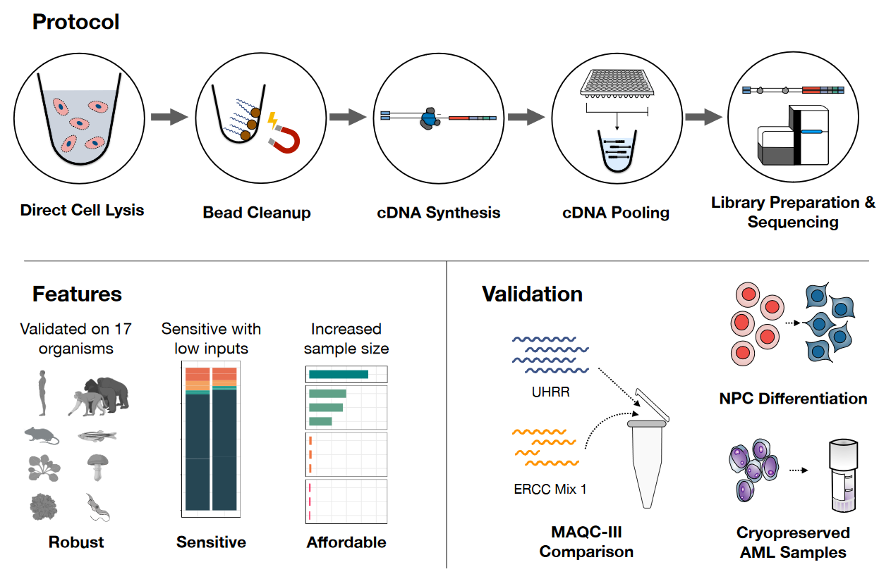
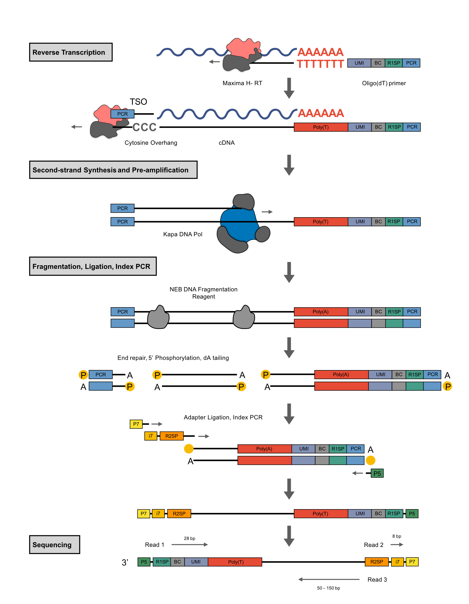

<!-- README.md is generated from README.Rmd. Please edit that file -->

```{r, echo = FALSE}
knitr::opts_chunk$set(
  collapse = TRUE,
  comment = "#>",
  fig.path = "README-"
)
```

# prime-seq


This repository contains scripts used for the analysis performed in our manuscript
  
**prime-seq, efficient and powerful bulk RNA-sequencing**

Aleksandar Janjic, Lucas E. Wange, Johannes W. Bagnoli, Johanna Geuder, Phong Nguyen, Daniel Richter, Beate Vieth, Christoph Ziegenhain, Binje Vick, Ines Hellmann, Wolfgang Enard

For the full prime-seq protocol please visit [protocols.io](https://www.protocols.io/view/prime-seq-s9veh66).

# 

prime-seq is a simple RNA-seq workflow that goes from lysate to sequencing library in no time. We benchmarked it's performance against the MAQC-III study using power analysis and showed that it captures known biological differences in a differentiation experiment.

The Data necessary to reproduce this analysis can be found at ArrayExpress:

| Accession    | Dataset              |
|--------------|----------------------|
| E-MTAB-10140 | Beads_Columns_tissue |
| E-MTAB-10138 | Beads_Columns_PBMC   |
| E-MTAB-10142 | Beads_Columns_HEK    |
| E-MTAB-10141 | gDNA_priming         |
| E-MTAB-10139 | UHRR                 |
| E-MTAB-10133 | iPSC                 |
| E-MTAB-10175 | AML                  |


## Preprocessing
All RNA-seq data was adapter trimmed with [cutadapt](https://cutadapt.readthedocs.io/en/stable/) and preprocessed with [zUMIs](https://github.com/sdparekh/zUMIs/) (Parekh et al., 2017).

## 1. Figure: RNA isolation

To test the impact of different RNA isolation methods on gene expression we performed prime-seq on three types of input. RNA was isolated from HEK cells, human PBMCs and mouse striatal Tissue with either Columns or SPRI beads. R Notebooks for this analysis can be found [here](1_RNA_isolation/).

Markdown [Lysis features](1_RNA_isolation/Lysis_features.md)  
Markdown [Lysis sensitivity](1_RNA_isolation/Lysis_sensitivity.md)  
Markdown [Lysis costs](1_RNA_isolation/Lysis_prices.md)  
Markdown [Lysis DE](1_RNA_isolation/Lysis_GC_length.md) 

## 2. Figure: power simulations

To benchmark prime-seq we compared it to a gold standard data set from the MAQC consortium using [`powsimR`](https://github.com/bvieth/powsimR). R Notebooks for this analysis can be found [here](2_power_simulation/).

## 3. Figure: proof of concept, AML and iPSC to NPC

We used prime-seq on many different types of samples already, here we show two examples. The first data set consists of 96 archival AML PDX samples that were sampled using biopsy punching. We show that the biological differences between the patients and AML types can be measured accurately using our method. In a second dataset we compared neuronal differentiation of five iPS cell lines that we generated [previously](https://www.nature.com/articles/s41598-021-82883-0) (Geuder et al. 2021). R Notebooks for this analysis can be found [here](3_proof_of_principle/).

## 4. Figure: Budget vs. Power
Finally we showed the impact of per sample costs on power to detect differentially expressed genes. By enabling the study of many more biological replicates with a fixed budget compared to Illuminas TruSeq kit, prime-seq leverages the full power of bulk RNA-seq. R Notebooks for this analysis can be found [here](4_budget/).

## 5. Supplementary Figures

Scripts for the analysis of the gDNA contamination experiment as well as the comparison of 1000 vs. 10000 cells are [here](5_supplementary_Figs/).

## 6. Molecular Workflow of prime-seq

This schematic outlines the detailed molecular workflow from isolated RNA to sequencing library.

# 


## `R` Session Info

```{r}
sessionInfo()
```