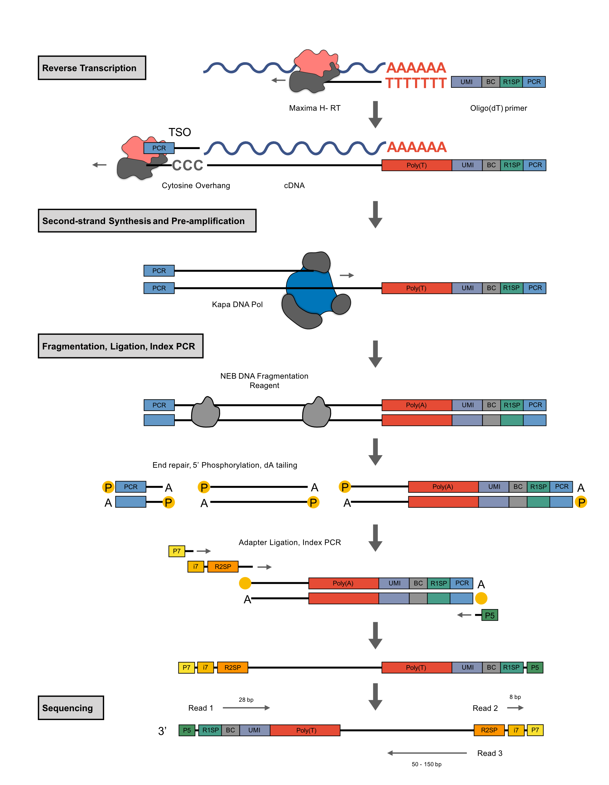

<!-- README.md is generated from README.Rmd. Please edit that file -->

# prime-seq

[](https://zenodo.org/badge/latestdoi/332821121)

This repository contains scripts used for the analysis performed in our
manuscript

**prime-seq, efficient and powerful bulk RNA-sequencing**

Aleksandar Janjic, Lucas E. Wange, Johannes W. Bagnoli, Johanna Geuder,
Phong Nguyen, Daniel Richter, Beate Vieth, Christoph Ziegenhain, Binje
Vick, Ines Hellmann, Wolfgang Enard

For the full prime-seq protocol please visit
[protocols.io](https://www.protocols.io/view/prime-seq-s9veh66).
**For the full list of 384 barcoded oligo dT primers click [here](prime-seq_E3V7_All_Barcode.txt)**

# 

prime-seq is a simple RNA-seq workflow that goes from lysate to
sequencing library in no time. We benchmarked it’s performance against
the MAQC-III study using power analysis and showed that it captures
known biological differences in a differentiation experiment.

The data necessary to reproduce this analysis can be found at
ArrayExpress:

| Accession    | Dataset                |
|--------------|------------------------|
| E-MTAB-10140 | Beads\_Columns\_tissue |
| E-MTAB-10138 | Beads\_Columns\_PBMC   |
| E-MTAB-10142 | Beads\_Columns\_HEK    |
| E-MTAB-10141 | gDNA\_priming          |
| E-MTAB-10139 | UHRR                   |
| E-MTAB-10133 | iPSC                   |
| E-MTAB-10175 | AML                    |

## Preprocessing

All RNA-seq data was adapter trimmed with
[cutadapt](https://cutadapt.readthedocs.io/en/stable/) and preprocessed
with [zUMIs](https://github.com/sdparekh/zUMIs/) (Parekh et al., 2017).

## 1. Development of the prime-seq protocol

Here we summarize the different experiment previous version of prime-seq
have been used for in terms of number of samples, species and intron and
exon mapped fractions. Next we show that introns can be used for gene
expression quantification and are not derived from contaminating gDNA. R
Notebooks for this analysis can be found
[here](1_prime_seq_development/)

### 1.1 prime-seq has been used extensively and is robust with different inputs

We collected data from prime-seq experiments that were performed in the
last years during it’s development and show that prime-seq works
robustly on many different samples.

[prime-seq robustness](1_prime_seq_development/sensitivityplot.md)

### 1.2 Intronic reads in prime-seq are not derived from gDNA and can be used for expression quantification

[gDNA priming](1_prime_seq_development/gDNA_priming_analysis.md)

## 2. prime-seq performs as well as TruSeq

To benchmark prime-seq we compared it to a gold standard data set from
the MAQC consortium using
[`powsimR`](https://github.com/bvieth/powsimR). R Notebooks for this
analysis can be found [here](2_power_simulation/).

[Method sensitivity](2_power_simulation/Comp_Sensitivity.md)  
[Method correlations](2_power_simulation/Comp_correlations.md)  
[Method powsimR](2_power_simulation/Comp_powsimR.md)

## 3. Bead-based RNA extraction increases cost efficiency and throughput

To test the impact of different RNA isolation methods on gene expression
we performed prime-seq on three types of input. RNA was isolated from
HEK cells, human PBMCs and mouse striatal Tissue with either Columns or
SPRI beads. R Notebooks for this analysis can be found
[here](3_RNA_isolation/).

[Lysis features](3_RNA_isolation/Lysis_features.md)  
[Lysis sensitivity](3_RNA_isolation/Lysis_sensitivity.md)  
[Lysis costs](3_RNA_isolation/Lysis_prices.md)  
[Lysis DE](3_RNA_isolation/Lysis_GC_length.md)  
[Lysis PCA](3_RNA_isolation/Lysis_PCA.md)

### 3.x Intron counts in prime seq correlate with exon counts and show 3’ enrichment

[Intron vs. exon
expression](3_RNA_isolation/intron_exon_analysis/HEK_intron_exon.md)

### 3.1 prime-seq is sensitive and works well with 1,000 cells

[Low input sensitivity](3_RNA_isolation/Low_input_sensitivity.md)  
[Low input correlations](3_RNA_isolation/Low_input_correlations.md)

### 3.2 cross-contamination in prime-seq is low

R Notebooks for this analysis can be found
[here](6_additional_analysis/)

[cross-contamination
correlation](6_additional_analysis/prime-seq_rev_CrossCont2.md)  
[cross-contamination
cycles](6_additional_analysis/prime-seq_rev_CrossCont.md)  
[cross-contamination
simulation](6_additional_analysis/Comp_powsim_contamination.md)

## 4. Figure: proof of concept, AML and iPSC to NPC

We used prime-seq on many different types of samples already, here we
show two examples. The first data set consists of 96 archival AML PDX
samples that were sampled using biopsy punching. We show that the
biological differences between the patients and AML types can be
measured accurately using our method. In a second dataset we compared
neuronal differentiation of five iPS cell lines that we generated
[previously](https://www.nature.com/articles/s41598-021-82883-0) (Geuder
et al. 2021). R Notebooks for this analysis can be found
[here](4_proof_of_principle/).

[AML PDX
PCA](5_proof_of_principle/Analysis_of_AML_PDX_Samples_for_prime-seq.Rmd)
[iPSC to NPC differentiation](4_proof_of_principle/iPSC_figures.Rmd)

## 5. Figure: Budget vs. Power

Finally we showed the impact of per sample costs on power to detect
differentially expressed genes. By enabling the study of many more
biological replicates with a fixed budget compared to Illuminas TruSeq
kit, prime-seq leverages the full power of bulk RNA-seq. R Notebooks for
this analysis can be found [here](5_budget/).

[method costs](5_budget/Cost.Rmd)  
[power vs. budget](5_budget/powsim_vs_budget.Rmd)

## 6. Molecular Workflow of prime-seq

This schematic outlines the detailed molecular workflow from isolated
RNA to sequencing library.

# 

## `R` Session Info

``` r
sessionInfo()
#> R version 4.1.0 (2021-05-18)
#> Platform: x86_64-pc-linux-gnu (64-bit)
#> Running under: Devuan GNU/Linux 3 (beowulf)
#> 
#> Matrix products: default
#> BLAS:   /usr/lib/x86_64-linux-gnu/openblas/libblas.so.3
#> LAPACK: /usr/lib/x86_64-linux-gnu/libopenblasp-r0.3.5.so
#> 
#> locale:
#>  [1] LC_CTYPE=en_US.UTF-8       LC_NUMERIC=C              
#>  [3] LC_TIME=en_US.UTF-8        LC_COLLATE=en_US.UTF-8    
#>  [5] LC_MONETARY=en_US.UTF-8    LC_MESSAGES=en_US.UTF-8   
#>  [7] LC_PAPER=en_US.UTF-8       LC_NAME=C                 
#>  [9] LC_ADDRESS=C               LC_TELEPHONE=C            
#> [11] LC_MEASUREMENT=en_US.UTF-8 LC_IDENTIFICATION=C       
#> 
#> attached base packages:
#> [1] stats     graphics  grDevices utils     datasets  methods   base     
#> 
#> loaded via a namespace (and not attached):
#>  [1] compiler_4.1.0  magrittr_2.0.1  fastmap_1.1.0   tools_4.1.0    
#>  [5] htmltools_0.5.2 yaml_2.2.1      stringi_1.7.4   rmarkdown_2.11 
#>  [9] knitr_1.36      stringr_1.4.0   xfun_0.28       digest_0.6.28  
#> [13] rlang_0.4.12    evaluate_0.14
```
