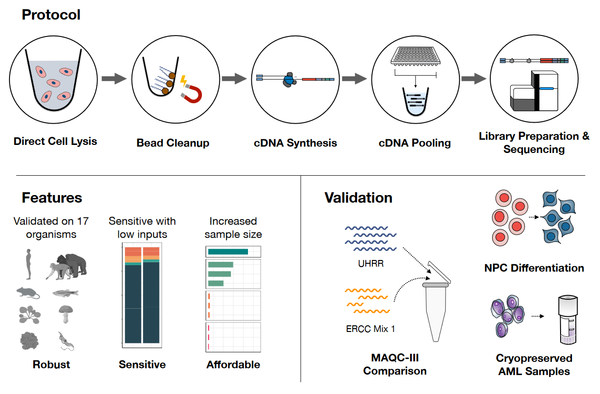

<!-- README.md is generated from README.Rmd. Please edit that file -->

# prime-seq

This repository contains scripts used for the analysis performed in our
paper

**prime-seq, efficient, and powerful bulk RNA-sequencing**

Aleksandar Janjic, Lucas E. Wange, Johannes W. Bagnoli, Johanna Geuder,
Phong Nguyen, Daniel Richter, Beate Vieth, Christoph Ziegenhain, Binje
Vick, Ines Hellmann, Wolfgang Enard

# 

Study Overview: prime-seq is a simple RNA-seq workflow that goes from
lysate to sequencing library in no time. We benchmarked it’s performance
against the MAQC-III study using power analysis and showed that it
captures know biological differences in a differentiation experiment.

The Data necessary to reproduce this analysis can be found at
ArrayExpress:

| Accession    | Dataset                |
| ------------ | ---------------------- |
| E-MTAB-10140 | Beads\_Columns\_tissue |
| E-MTAB-10138 | Beads\_Columns\_PBMC   |
| E-MTAB-10142 | Beads\_Columns\_HEK    |
| E-MTAB-10141 | gDNA\_priming          |
| E-MTAB-10139 | UHRR                   |
| E-MTAB-10133 | iPSC                   |
| E-MTAB-?     | AML                    |

## 1\. Figure: RNA isolation

## 2\. Figure: power simulations

## 3\. Figure: proof of concept, AML and iPSC to NPC

## 4\. Figure: Budget vs. Power

## 5\. Supplementary Figures

## 6\. Molecular Workflow of prime-seq

# 

## `R` Session Info

``` r
sessionInfo()
#> R version 4.0.3 (2020-10-10)
#> Platform: x86_64-pc-linux-gnu (64-bit)
#> Running under: Devuan GNU/Linux 3 (beowulf)
#> 
#> Matrix products: default
#> BLAS:   /usr/lib/x86_64-linux-gnu/atlas/libblas.so.3.10.3
#> LAPACK: /usr/lib/x86_64-linux-gnu/atlas/liblapack.so.3.10.3
#> 
#> locale:
#>  [1] LC_CTYPE=en_US.UTF-8       LC_NUMERIC=C              
#>  [3] LC_TIME=en_US.UTF-8        LC_COLLATE=en_US.UTF-8    
#>  [5] LC_MONETARY=en_US.UTF-8    LC_MESSAGES=en_US.UTF-8   
#>  [7] LC_PAPER=en_US.UTF-8       LC_NAME=C                 
#>  [9] LC_ADDRESS=C               LC_TELEPHONE=C            
#> [11] LC_MEASUREMENT=en_US.UTF-8 LC_IDENTIFICATION=C       
#> 
#> attached base packages:
#> [1] stats     graphics  grDevices utils     datasets  methods   base     
#> 
#> loaded via a namespace (and not attached):
#>  [1] compiler_4.0.3  magrittr_2.0.1  tools_4.0.3     htmltools_0.5.1
#>  [5] yaml_2.2.1      stringi_1.5.3   rmarkdown_2.6   knitr_1.30     
#>  [9] stringr_1.4.0   xfun_0.20       digest_0.6.27   rlang_0.4.10   
#> [13] evaluate_0.14
```
